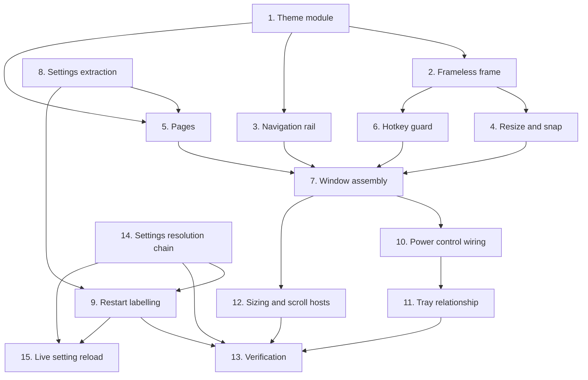

# Implementation Plan

## Overview

Built theme-first, because every colour and spacing number had to exist in one place before any widget
consumed it, and a retro-fit would have meant touching every file again. Then the frame, then the rail,
then the pages, then the settings extraction — which is last among the features because it is the one
piece with 41 tests already depending on its behaviour and the least room to be creative.

Several items are recorded as *reversals*: the crossfade was built then deleted, the cursor hit-test was
built then replaced by eight grips, the minimum size was set then lowered. Those are kept as tasks
rather than tidied away, because the reasoning is the useful part and each one is a plausible thing for
someone to re-add.

Status reconstructed from `SHELL_AND_CHAT.md` §3 and §9's phased rollout, plus `IMPROVEMENTS.md` `T2-7`
and `T4-7`. Original item IDs are preserved so each can be grepped against those documents.

## Task Dependency Graph



Task 8 precedes task 5 because the settings page is a host for the extracted widget and cannot be built
before it exists. Task 6 hangs off task 2 rather than task 7 because the guard is installed during
window construction and has to be in place before the window is ever shown — the bug it fixes fires on
the first chord press after opening.

```json
{
  "waves": [
    {
      "wave": 1,
      "tasks": ["1", "8", "14"],
      "rationale": "The theme module and the settings extraction share nothing and both gate a lot. The extraction is a pure refactor against an existing test suite, so it can proceed independently of any new widget. The resolution chain belongs here too: the restart set in task 9 exists because of it."
    },
    {
      "wave": 2,
      "tasks": ["2", "3", "9"],
      "rationale": "The frame, the rail and the restart labelling all consume wave 1 and nothing else."
    },
    {
      "wave": 3,
      "tasks": ["4", "5", "6"],
      "rationale": "Resize and snap need a real frame; the pages need both the theme and the extracted settings widget; the guard needs the window class to install itself on."
    },
    {
      "wave": 4,
      "tasks": ["7"],
      "rationale": "Assembly. The window composes the title bar, the rail, the page stack, the grips and the guard, so it lands once all five are real."
    },
    {
      "wave": 5,
      "tasks": ["10", "12"],
      "rationale": "The power wiring and the sizing work both operate on the assembled window."
    },
    {
      "wave": 6,
      "tasks": ["11"],
      "rationale": "Trimming the tray is only safe once the window genuinely hosts the actions being removed and the single-source power wiring is proven."
    },
    {
      "wave": 7,
      "tasks": ["13"],
      "rationale": "Full suite, selftest, the contrast measurements, and the manual smoke test across two monitors at different scaling."
    },
    {
      "wave": 8,
      "tasks": ["15"],
      "rationale": "Not built. Live reload needs the resolution chain in task 14 documented and the restart set from task 9 in place, because the work is classifying which of those settings are safe to swap rather than writing a reload."
    }
  ]
}
```

## Tasks

- [ ] 1. The theme module (§2)
- [ ] 1.1 Put every colour, spacing step, radius, duration and easing curve in one module
  - Values, not vibes: the shell, the panel and the overlay cannot drift apart if there is one source
  - _Requirements: 16.1, 16.14_
- [ ] 1.2 Build one stylesheet applied once on the application, rather than per-widget styling
  - Covers menus and dialogs too, which per-widget styling would miss
  - _Requirements: 16.14_
- [ ] 1.3 Add `contrast_ratio` as a pure function and assert every text-on-surface pair
  - Caught the muted text colour at 3.49:1 against a 4.5:1 requirement
  - _Requirements: 16.14_
- [ ] 1.4 Add the reduced-motion resolution: follow the system by default, allow an override
  - Verified that a zero-duration animation still emits its completion signal, because cleanup hangs
    off it and a silently non-firing signal would break the path rather than merely skip the animation
  - _Requirements: 16.2, 16.3_
- [ ] 1.5 Add `focus_visible_only` so a mouse click leaves no dotted outline
  - Applied last in construction so it catches every button including the pages', without taking the
    rail away from the keyboard
  - _Requirements: 16.15_
- [ ] 1.6 Add the no-literal-colour guard over the generated stylesheet
  - _Requirements: 16.14_

- [ ] 2. The frameless frame (`S-1`)
- [ ] 2.1 Create the package rather than one module, with a lazy attribute hook for the window class
  - A single module covering five pages plus a custom title bar becomes unreviewable fast
  - _Requirements: 1.7, 1.8_
- [ ] 2.2 Register every package module in **both** the bundler's hidden imports and the selftest list
  - The lazy hook is invisible to the static graph, which is exactly the gap that caught two modules
    in an earlier tier
  - _Requirements: 1.8_
- [ ] 2.3 Build the title bar emitting intent rather than acting on the window
  - A title bar that reached past the window to close it would bypass hide-to-tray
  - _Requirements: 5.4_
- [ ] 2.4 Hand the drag to the operating system's move loop
  - Moving the window by hand from a mouse-move handler is the obvious implementation and the wrong
    one: it loses snap entirely and has to do its own logical-to-physical conversion on every move
  - _Requirements: 2.2, 2.4_
- [ ] 2.5 Paint the window-button glyphs instead of typing them
  - The maximise character renders as a **solid white block** in the system font. Substitutes each
    fail differently: one too small against the wordmark, another a ballot box with its own metrics
  - Kept as a standard button so the whole chip stylesheet still applies to the background
  - _Requirements: 16.8, 16.9_
- [ ] 2.6 Swap to a restore glyph when maximised, so the button says what it will do next
  - _Requirements: 16.10_
- [ ] 2.7 Make the window buttons inset chips with a border and a resting background
  - The full-height transparent version was close to invisible against a near-black bar and was the
    first thing anyone remarked on
  - _Requirements: 16.11_
- [ ] 2.8 Nudge the wordmark down by the font descent and tighten the mark-to-wordmark gap
  - A label centres its line box, but an all-caps word has no descenders, so the cap heights — which
    is what the eye compares — did not line up
  - _Requirements: 16.11_
- [ ] 2.9 Add the accent divider as its own one-pixel widget rather than a border
  - The toolkit cannot put a gradient on a single border edge, and a one-sided border image does not
    render reliably across styles
  - _Requirements: 16.14_
- [ ] 2.10 Empty the title bar's own stylesheet function and move its rules into the theme
  - Two stylesheets both claiming a say over the window buttons is how the close button ends up a
    different red from the danger colour. Kept as a function so composition is unchanged
  - _Requirements: 16.14_
- [ ] 2.11 Implement close-to-tray with a one-time notification signal
  - _Requirements: 5.1, 5.2, 5.5_

- [ ] 3. Navigation rail (`S-1`)
- [ ] 3.1 Define the navigation entries as one ordered list, consumed by both the rail and the stack
  - Makes an item without a page impossible by construction rather than by vigilance
  - _Requirements: 7.1, 7.2_
- [ ] 3.2 Give each item its own page name, never an index
  - Index lookups are what break when someone reorders the list
  - _Requirements: 7.4_
- [ ] 3.3 Emit a page request on user click only; keep the programmatic path silent
  - So a page change cannot echo back into another page change
  - _Requirements: 7.5_
- [ ] 3.4 Add the configurable side, defaulting to left, with the divider facing the content
  - Every desktop application the user already has puts primary navigation on the left, reading order
    makes the left edge cheapest to scan, and a right rail conventionally holds contextual content.
    The disagreement with the brief costs one value to reverse
  - An unrecognised value resolves to left rather than producing a third layout
  - _Requirements: 7.8, 7.9, 7.10_
- [ ] 3.5 Make the selection marker a child of the rail so it can travel between items
  - Jump rather than animate when the layout has not run or the target is unchanged, so it does not
    slide in from a corner the first time the window appears
  - _Requirements: 7.11, 7.12_
- [ ] 3.6 Add the status footer with the privacy chip and the chat switch
  - _Requirements: 8.5, 8.6_
- [ ] 3.7 Fix the chip's label and vary only its indicator colour
  - A control whose text changes also changes width, and a rail that reflows on every settings change
    is its own small twitch. A colour is quicker to read than a two-letter suffix
  - _Requirements: 8.7_
- [ ] 3.8 Use the danger colour when the guard is off, not a warning colour
  - With the guard off, every question sends a screenshot of whatever is in front, including a
    password manager. The tooltip says what it means and where to change it, so it informs
  - _Requirements: 8.8, 8.9_
- [ ] 3.9 Reduce the footer to one chip and remove the rail's wordmark
  - The provider is already named on Home where there is room to say the model too; the title bar
    three pixels above already says the product name, and repeating it stole the vertical space that
    made the first item sit low
  - _Requirements: 8.10, 8.11_
- [ ] 3.10 Add `test_every_nav_item_maps_to_a_page`
  - _Requirements: 7.3_

- [ ] 4. Resize, snap, and the two reversals (`S-1`)
- [ ] 4.1 Restore the sizing, maximise and minimise style bits after the first show
  - Measured: a frameless window reads `0x96000000` against `0x96CF0000`, so the sizing bit is absent
    and the operating system has nothing to snap. Dragging worked because the move loop still ran
  - Deliberately **not** the caption bit — that one really would bring back a title bar
  - _Requirements: 2.5, 2.6, 2.7_
- [ ] 4.2 Apply the change with a frame-changed flag and read the style word back
  - Without the flag the operating system does not re-ask for the frame calculation, so the new style
    has no visible effect until the next resize
  - The write returns the **previous** style, so a legitimate call can return zero; read back instead
  - _Requirements: 2.8, 2.11_
- [ ] 4.3 Declare explicit argument and return types for every call
  - An undeclared window handle is marshalled as a 32-bit integer, truncating a 64-bit handle so the
    call fails silently against a handle that does not exist. The style read must be unsigned, or
    `0x96000000` comes back negative
  - _Requirements: 2.10_
- [ ] 4.4 Return a boolean and never raise, so the fallback is "no snap"
  - _Requirements: 2.12_
- [ ] 4.5 Verify that suppressing the returning frame is unnecessary, and pin the measurement
  - Client and window rectangles both report 400×300 with no message handling, and maximising lands
    exactly on the available geometry rather than over the taskbar. Qt already answers that message
  - _Requirements: 2.9_
- [ ] 4.6 Override the native event handler to hit-test the frame
  - **Attempted and abandoned.** Calling the base implementation from this binding crashes the process
    with an access violation on the first message the window receives. Recorded so nobody tries it
    again; if a handler is ever needed, return the unhandled result directly rather than delegating
  - _Requirements: 2.13_
- [ ] 4.7 Replace the window-level cursor hit-test with eight per-edge grips
  - The old version set the resize cursor on the **window**, which every child without its own cursor
    inherited; clearing it needed another move event over the window, and a move from the 4px gutter
    into the content lands on a child. One brush past an edge left every page with a resize cursor
  - Per-widget cursors are set on enter and restored on leave by the toolkit, with no state of ours
  - _Requirements: 3.1, 3.2, 3.3, 3.4_
- [ ] 4.8 Give the corners a target larger than the border
  - The same fix the chat panel needed, where two thin crossing strips left a corner nobody could hit
  - _Requirements: 3.5_
- [ ] 4.9 Make the grips transparent to painting but not to the mouse, and hide them when maximised
  - _Requirements: 3.6, 3.7_
- [ ] 4.10 Delete the dead hit-test helper and replace the test that still referenced it
  - It survived the refactor because one test still named it, which is how dead code persists
  - _Requirements: 3.8_
- [ ] 4.11 Keep the native corner grip as the visible affordance and the no-native-handle fallback
  - Raised last so it stays above the bottom-right grip
  - _Requirements: 2.14_

- [ ] 5. Pages (`S-2`)
- [ ] 5.1 Build Home: power card dominant, provider, hotkey, recent table, privacy card
  - The power card is dominant because "is it on?" is the question a tray-only application cannot
    answer, and it is the first thing the eye should land on
  - _Requirements: 8.1, 8.2, 8.3, 8.4_
- [ ] 5.2 Build Knowledge, Journal and Account against injected sources
  - _Requirements: 1.3_
- [ ] 5.3 Build the Settings page as a host for the extracted widget, with its own save action
  - _Requirements: 11.4_
- [ ] 5.4 Render an em dash rather than zero wherever a provider is absent or raises
  - A measured zero and an unmeasured one are different claims, and the privacy count is the most
    trust-building item on the page precisely because it is an observation
  - _Requirements: 9.1, 9.2, 9.4_
- [ ] 5.5 Never poll: refresh on page change and on an explicit refresh call only
  - _Requirements: 9.3_
- [ ] 5.6 Document each number's integration requirement, including what existing data is insufficient
  - So a blank number is honestly blank rather than mysteriously blank
  - _Requirements: 9.5_
- [ ] 5.7 Record the pages deliberately not built, with reasons
  - A log viewer is a lot of interface for something used a handful of times and the file manager
    already serves it; a memory browser would weaken the plain-Markdown contract rather than
    strengthen it; a chart dashboard would be decoration pretending to be information
  - _Requirements: 8.12_
- [ ] 5.8 Ignore unknown page names and swallow a page's refresh exception
  - Both are reachable from signals, and a typo in a tray action must not take the window down
  - _Requirements: 7.6, 7.7_

- [ ] 6. The push-to-talk chord guard (`T2-7` follow-up)
- [ ] 6.1 Install a do-nothing shortcut on the configured chord
  - Reported as "the push-to-talk listens and then pauses". Two correct decisions meeting badly: the
    global hook is deliberately non-suppressing, because the library's flag is all-or-nothing and
    would block every key on the system; and the toolkit's button base activates on Space **without
    looking at modifiers**, so a focused button treats the chord as a click
  - Three measured consequences, all real: the power control paused Nimbus at the moment the user
    asked it to listen, a folder button opened the file manager, a navigation item changed page
  - _Requirements: 6.1, 6.2, 6.3_
- [ ] 6.2 Use a shortcut rather than an application-wide event filter
  - The toolkit's shortcut map runs **before** the key event reaches the focus widget, which is the
    only place this can be stopped cleanly. The slot does nothing on purpose: the global hook already
    handles the chord and this window must not become a second push-to-talk path
  - _Requirements: 6.5, 6.6_
- [ ] 6.3 Build the guard from the configured chord, falling back to the default on a parse failure
  - So a user who remapped push-to-talk is protected by the same guard
  - _Requirements: 6.7, 6.8_
- [ ] 6.4 Scope the guard to this window, and record why the chat panel needs none
  - It accepts no focus anywhere, so it never receives a key event at all
  - _Requirements: 6.9_
- [ ] 6.5 Add the lift so Settings can record the chord the user is already bound to
  - Without it the capture button appears to ignore that chord, because the guard consumes it first
  - _Requirements: 6.10_
- [ ] 6.6 Make the window itself take the initial focus
  - A focus policy alone was measured insufficient: the toolkit still handed focus to the first
    tab-chain widget on activation, which was the control that turns Nimbus off, wearing the
    platform's focus frame. Nothing is armed now until the user presses Tab
  - _Requirements: 6.11, 6.12_
- [ ] 6.7 Test the guard against every focusable widget, not just the one where it was found
  - _Requirements: 6.1_

- [ ] 7. Window assembly
- [ ] 7.1 Make every data source an injected callable and every action an outbound signal
  - No import of the application module anywhere in the package, so the window is constructible with
    no arguments and the pipeline can never acquire a user-interface dependency
  - _Requirements: 1.1, 1.2, 1.3, 1.4, 1.5, 1.6_
- [ ] 7.2 Compose the title bar, the accent rule, the rail and the page stack
  - _Requirements: 7.2_
- [ ] 7.3 Scope the texture overlay to the content area and make it mouse-transparent
  - It exists to stop large low-contrast gradients banding; the remaining gradients are on the cards,
    the chrome is flat, and noise over flat black reads *as* noise — which is why the chrome was still
    reading as textured
  - Verified by hit-testing a control's centre: without the flag the hit resolves to the overlay
  - _Requirements: 16.12, 16.13_
- [ ] 7.4 Crossfade pages on navigation (§2.6)
  - **Built, then removed after seeing it on real hardware.** A graphics effect renders its target
    into an offscreen buffer, and the pages contain exactly the widgets that go wrong there — scroll
    areas and tables with transparent viewports. Stale pixels from the previous page were visible
    inside the new one for the fade's duration, worst where a table occupies most of the card
  - Alternatives rejected: painting every viewport opaque defeats the card gradient showing through,
    and animating a real overlay widget is a lot of machinery for 160 ms
  - Recorded rather than silently dropped, because "the design says crossfade" is otherwise a
    reasonable thing to re-add. The selection marker still slides and the power switch still ripples
  - _Requirements: 16.4, 16.5, 16.6_
- [ ] 7.5 Give the page stack an explicit opaque fill rather than transparency
  - What stops a half-painted child leaving remnants on a page change — the same class of artefact
    that retired the fade
  - _Requirements: 16.7_
- [ ] 7.6 Default the window to opening at startup, and open it on an unreadable configuration too
  - Nothing starts Nimbus at login, so every launch is a person double-clicking a shortcut and the
    only useful answer is to appear. Failing towards invisible would turn a keyring hiccup into "I
    clicked Nimbus and nothing happened"
  - _Requirements: 9.5_

- [ ] 8. Settings extraction (`S-4`)
- [ ] 8.1 Move the builder's body into a plain widget with no host of its own
  - A **pure refactor**, not a rewrite. It carries the provider, model and key matrix, the key-reuse
    rule, keyring persistence, the hotkey capture widget, the privacy group, the experimental group
    and the restart labels, and a nicer reimplementation would have silently dropped several
  - _Requirements: 11.1, 11.3_
- [ ] 8.2 Keep the widget free of any scroll area and any button box
  - Both belong to the host. The form wants ~742px against ~728 usable on a 1366×768 laptop, and the
    dialog is modal at first launch, so the wrapper plus a save action **outside** it is load-bearing
  - _Requirements: 11.5, 12.1, 12.2_
- [ ] 8.3 Expose validity, save and local-data-cleared as signals, and save as a boolean call
  - The validity signal replaces a direct poke at the dialog's button box, which only worked because
    the dialog owned both. A false save — invalid hotkey, or a declined compatibility warning — means
    the host must not close
  - _Requirements: 11.6, 11.7_
- [ ] 8.4 Host it from both the first-launch modal and the shell page
  - One implementation, two hosts
  - _Requirements: 11.4_
- [ ] 8.5 Make the shell **react** to local data being cleared, not merely record it
  - _Requirements: 11.8_
- [ ] 8.6 Prove the extraction by running every pre-existing settings test unmodified
  - The acceptance criterion. If any needed editing, it was a rewrite
  - _Requirements: 11.2_
- [ ] 8.7 Scope local-data clearing and return failures rather than raising
  - Preserve the folder roots so a running process can recreate a database cleanly; exclude
    user-created exports, which are documents rather than application state; never follow a symbolic
    link; treat a missing credential entry or a locked store as non-fatal
  - Include the privacy guard's entries so a wipe restores the **on** default rather than leaving the
    guard off from a previous session
  - _Requirements: 14.1, 14.2, 14.3, 14.4, 14.5, 14.6_

- [ ] 9. Restart labelling (`T4-7`)
- [ ] 9.1 Declare the explicit set of restart-requiring settings, excluding API keys
  - Keys are read per request, so a new key works immediately
  - Record why caching rather than live reload: resolving a setting writes to the credential store
    whenever the value came from the environment, so re-resolving per interaction would put a
    Credential Manager write on the hottest path. Removing the cache would be the wrong fix
  - _Requirements: 13.1, 13.7, 13.8_
- [ ] 9.2 Append a marker glyph to each such label, and build the explanatory note from the constant
  - A symbol rather than the word, so it survives being appended to already-long checkbox labels
  - Building the note from the constant means the legend cannot explain a symbol the labels stopped
    using
  - _Requirements: 13.2, 13.3, 13.4_
- [ ] 9.3 Make the marker lookup a pure function and assert coverage in both directions
  - So labelling is testable without constructing the dialog, and a setting cannot be marked
    inconsistently in two places
  - _Requirements: 13.5, 13.6_
- [ ] 9.4 Choose the glyph by measuring ink height against surrounding cap height at three sizes
  - Four candidates measured. The first shipped and was reported as pixelated; a straight arrow is
    crisp but does not say "reloads on next start"; the icon-font glyph is the right shape and
    measured ~40% larger than the letters, because an icon font fills the em box while a text
    character's capitals occupy roughly 70% of it — and there is no way to shrink one run of a
    plain-text label, while the control carrying nine markers does not support rich text
  - The chosen glyph has 29% more ink at the same size because the gapped form uses fewer, heavier
    strokes, which is what the "pixelated" complaint was really about
  - Name the symbol font explicitly rather than leaving it to fallback
  - _Requirements: 13.9, 13.10_
- [ ] 9.5 Verify the glyph is real and does not clip
  - 36px of ink against 52px for a guaranteed-absent codepoint, so it is a glyph and not a box; and
    its tight rect bottom sits at the baseline against a 3px descent, which is what the original
    "cut off at the bottom" was
  - _Requirements: 13.11_

- [ ] 10. Power control wiring (`S-3`)
- [ ] 10.1 Keep the listening state in one place and make the application its only writer
  - The window emits a request; it never writes the flag itself
  - _Requirements: 10.1, 10.2_
- [ ] 10.2 Drive all three views from one change signal, with no view holding its own copy
  - _Requirements: 10.3, 10.4_
- [ ] 10.3 Make the window's accessor read through to the provider rather than caching
  - With a provider wired up the source wins, so a caller cannot make a view show something the
    source disagrees with
  - _Requirements: 10.5, 10.6_
- [ ] 10.4 Verify the toggle is instant and needs no restart
  - Confirmed: the enabled flag gates callbacks without uninstalling the listener, so the hook stays
    installed and the toggle takes effect immediately, unlike the settings carrying the marker
  - _Requirements: 10.7_
- [ ] 10.5 Stop speech in progress when pausing, mirroring the existing pause behaviour
  - _Requirements: 10.8_
- [ ] 10.6 Apply the same arrangement to the chat panel's visibility switch, and re-read after asking
  - Three things move that panel: the switch, a keyboard shortcut, and the idle auto-hide. If the
    application declines, the switch snaps back
  - _Requirements: 10.9, 10.10_

- [ ] 11. Tray relationship (`S-5`)
- [ ] 11.1 Keep the tray, with show, pause and quit
  - It is the only surface available when the window is closed, and pause is the one action whose
    whole value is being reachable in one click without opening anything
  - _Requirements: 15.1, 15.3, 15.5_
- [ ] 11.2 Show and raise the window on a left click
  - _Requirements: 15.2_
- [ ] 11.3 Remove the items that now have a better home in the window
  - A menu that duplicates the window is two places to keep in sync and two places to fix a bug
  - _Requirements: 15.4_
- [ ] 11.4 Make the tray's pause item read the same source, with no second boolean anywhere
  - _Requirements: 15.6_
- [ ] 11.5 Raise the inherited actions as window signals, since only the application can service them
  - _Requirements: 15.7_
- [ ] 11.6 Route the tray's quit and the account page's quit into one shutdown sequence
  - _Requirements: 5.3_

- [ ] 12. Sizing and the scroll hosts
- [ ] 12.1 Clamp both the opening size and the minimum against the available screen geometry
  - A hard-coded floor is a bug on hardware you did not test on: at 250% scaling a full-resolution
    panel reports 768×432 logical pixels, below the old floor, so the window would open unable to fit
    on its own screen and unable to shrink
  - Reuse the existing dialog's approach rather than reinventing it
  - _Requirements: 4.1, 4.2, 4.3_
- [ ] 12.2 Recompute the minimum when the window moves
  - Otherwise a floor measured on a large panel follows the window onto a small one
  - _Requirements: 4.4_
- [ ] 12.3 Put each page except Settings in its own scroll area, and lower the floor
  - Measured before the change: the layout's own minimum was 810×646 while the explicit floor said
    1040×680, so the floor was 230px wider and 34px taller than anything the layout needed. Of the
    646, one page accounted for 549px with no way to give less
  - The failure mode on a small or heavily scaled screen becomes a scrollbar rather than an
    unreachable control
  - _Requirements: 4.5, 4.6, 4.7_
- [ ] 12.4 Leave Settings unwrapped, and assert it has exactly one scroll area
  - Wrapping it again would nest one scrolling region inside another and put the save action back
    below the fold
  - _Requirements: 4.8, 12.9_
- [ ] 12.5 Take the scroll areas out of the tab order
  - Measured after adding them: Tab from the rail landed on a page-sized container with nothing to
    do, and with the platform's keyboard cues on it drew a focus frame around the whole page. The
    wheel still scrolls, and tabbing between a page's own controls still scrolls them into view
  - _Requirements: 4.9_
- [ ] 12.6 Size the settings dialog from the **page's** natural height, clamped to the screen
  - A scrollable dialog opens at its minimum, measured at about 111px — a letterbox. Asking the
    dialog's own layout returned 426px, because a scroll area reports its own small hint rather than
    its child's
  - _Requirements: 12.5, 12.6_
- [ ] 12.7 Add the parametrised small-screen fit check and the control inventory test
  - Attribute the growth honestly: it came from features added across several tiers, and the
    knowledge-base button was the last straw rather than the cause. It was invisible during
    development because that machine has 1040 usable pixels
  - _Requirements: 12.3, 12.4, 12.7, 12.8_

- [ ] 13. Tests and verification
- [ ] 13.1 Full suite green with the dotenv neutralisation, zero regressions
- [ ] 13.2 Every pre-existing settings test passing **unmodified**
- [ ] 13.3 `--selftest` prints `SELFTEST OK` with every package module in the runtime list
- [ ] 13.4 Contrast measured for every text-on-surface pair against the 4.5:1 requirement
- [ ] 13.5 Manual smoke test: drag, snap to each edge, resize from all eight regions, maximise, restore
- [ ] 13.6 Manual smoke test: drag between two monitors at different scaling, confirm nothing jumps
- [ ] 13.7 Manual smoke test: open the window, immediately press the chord — Nimbus listens, not pauses
- [ ] 13.8 Manual smoke test: close the window, confirm push-to-talk still works and the balloon showed once
- [ ] 13.9 Manual smoke test: open Settings on a 1366×768 display and confirm Save is reachable
- [ ] 13.10 Write the tests for this feature - 319 declared functions
  - `tests/test_shell.py` (168) - the window, the rail, the grips, snap styles, and the chord guard
  - `tests/test_settings_dialog.py` (41) - the whole pre-existing suite, passing UNMODIFIED - the extraction's acceptance criterion
  - `tests/test_restart_labels.py` (13) - both directions of the restart-marker contract
  - `tests/test_hotkey_capture.py` (26) - the capture widget and the Qt-to-chord translation
  - `tests/test_theme.py` (56) - contrast, spacing, durations, and the no-literal-colour guard
  - `tests/test_tray.py` (14) - the trimmed menu and the single-source pause state
  - `tests/test_onboarding.py` (1) - the first-run dialog constructs
  - Each test written **failing first**, and any changed expectation carries a comment
    saying why, or a real regression gets laundered into a green suite
  - _Requirements: 1.1-16.15_

- [ ] 14. The settings resolution chain
- [ ] 14.1 Resolve every setting through one function, in the order environment, store, default
  - _Requirements: 17.1_
- [ ] 14.2 Write a value through to the credential store when it came from the environment
  - A one-shot migration out of a dotfile, so a value set once survives without that file
  - _Requirements: 17.2_
- [ ] 14.3 Record the consequence at the call site rather than leaving it to be discovered
  - The write-through means re-resolving per read would put a credential-store write on the hottest
    path in the application. Removing the cache is the wrong fix
  - _Requirements: 17.3, 17.4_
- [ ] 14.4 Give API keys a separate uncached path, read per request
  - Which is why they are deliberately absent from the restart set: a new key works immediately
  - _Requirements: 17.5_
- [ ] 14.5 Make resolution total: an unreadable store falls through to the declared default
  - _Requirements: 17.6, 17.7_
- [ ] 14.6 Add the `first_run_config` fixture and restore both sources on teardown
  - Asserting a default by reading the imported module tests the machine the suite runs on rather
    than the code. It cost three failures during live verification before the fixture existed
  - _Requirements: 17.8, 17.9_

- [ ] 15. Live setting reload (`T4-7b`)
- [ ] 15.1 Classify each cached setting as safe or unsafe to swap mid-session
  - One explicit set, not a judgement per call site. **This is the actual work** — the reload itself
    is small once the classification exists
  - "Safe to swap" for a provider holding an open socket is a different question from one read once
    per request, so the justification is per setting rather than in bulk
  - _Requirements: 18.1, 18.5_
- [ ] 15.2 Give the safe set a reload path that does not touch the write-through resolver
  - Re-resolving on the hot path reintroduces exactly the credential-store write that task 14.3
    exists to avoid
  - _Requirements: 18.2, 18.3_
- [ ] 15.3 Leave the unsafe set exactly as it behaves today
  - _Requirements: 18.4_
- [ ] 15.4 Extend the coverage assertion so the two sets cannot overlap
  - A setting both marked as needing a restart and reloaded live shows the user a marker that lies
  - _Requirements: 18.6_
- [ ] 15.5 Require a passing test before any setting loses its restart marker
  - The marker comes off on evidence that the next turn observes the new value, not on intent
  - _Requirements: 18.7_

## Notes

**Two items are recorded as attempted and abandoned.** Task 4.6 — the native message handler — crashes
this binding on the first message, so it is a dead end rather than outstanding work. Task 7.4 — the page
crossfade — was built, seen on real hardware, and deleted because a graphics effect leaves stale pixels
in exactly the widget types these pages are made of. Both stay in the plan because each is a reasonable
thing for someone to try next, and the second is explicitly asked for by the design system.

**Task 14 was specified after it shipped.** The resolution chain has been in the product since Tier 0;
it is written down here because it is the reason an entire class of settings cannot be reloaded live, and
that reason existed only as a comment. Restart labelling (task 9) is downstream of it.

**Task 15 is the one genuinely open item in this spec.** It is `[ ]` rather than `[-]` because no
decision has been taken against it — the labelling half of `T4-7` shipped and the reload half did not.
The blocker is not effort: it is that "which settings are safe to swap mid-session" is a per-setting
judgement nobody has made yet, and making it wrong means a stale value being used silently.

**Where the next work goes.** A new page is one entry in the navigation list plus one page module; the
list is the single source both the rail and the stack read, so nothing else needs touching, and
`test_every_nav_item_maps_to_a_page` will fail if only one half is done. A new page host needs its own
scroll area **unless** it brings one — and if it brings one, its save action goes outside it.

**Three things must not drift.** The style bit set, because a typo there is a window that will not snap
or will not open. The single write path to the listening flag, because three views reading one source is
the only reason they can be trusted. And the marker set against the labels, because a setting silently
losing its marker is a user concluding the feature is broken.

**Any new external dependency needs a factory hook.** That is what makes this package testable with no
shown window, and it is the same convention the speech and realtime modules already follow. A page that
reaches for a global instead of asking a provider has broken the seam that keeps the pipeline free of a
user-interface dependency.
