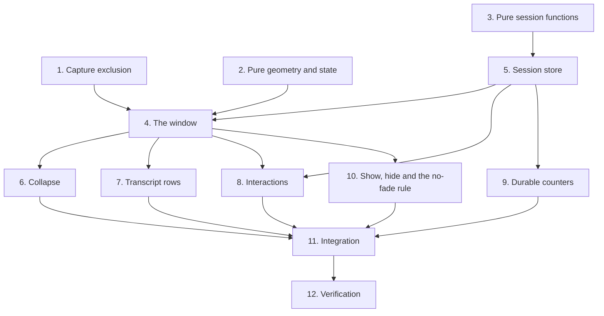

# Implementation Plan

## Overview

Capture exclusion was built and measured **first**, before any visual work, because the answer decided
whether the panel could be translucent at all — and that single measurement invalidated the design
brief's body treatment. Building the appearance first would have meant discarding it.

After that: the pure geometry and the pure session functions, which need nothing; then the store; then
the window; then the interactions that hang off both. The two reversals — the opacity fade and the
button-based session row — are kept as tasks rather than tidied away, because each is a plausible thing
for someone to reach for and the reasoning is the useful part.

Status reconstructed from `SHELL_AND_CHAT.md` §4 and §9's phased rollout. Original item IDs are
preserved so each can be grepped against that document.

## Task Dependency Graph



Task 1 gates the window rather than the reverse, which is the opposite of the obvious order. That is
deliberate: the exclusion measurement determines whether the body can be translucent, and the answer was
no, so building the appearance first would have meant discarding it.

```json
{
  "waves": [
    {
      "wave": 1,
      "tasks": ["1", "2", "3"],
      "rationale": "The exclusion measurement and both sets of pure functions. None depends on the others, and the exclusion result determines the panel's entire visual treatment, so it must land before any widget is built."
    },
    {
      "wave": 2,
      "tasks": ["5"],
      "rationale": "The store needs the pure session functions from wave 1 and nothing else. It is additive against an existing database, so its backward-compatibility gate can be proven in isolation."
    },
    {
      "wave": 3,
      "tasks": ["4"],
      "rationale": "The window composes the exclusion calls, the geometry constants and the store. All three must be real first."
    },
    {
      "wave": 4,
      "tasks": ["6", "7", "8", "9", "10"],
      "rationale": "Collapse, transcript rows, interactions, counters and the show/hide path all attach to the assembled window and are independent of each other."
    },
    {
      "wave": 5,
      "tasks": ["11"],
      "rationale": "Integration: the application's signals, the keyboard routing, the caption suppression and the bundler registration."
    },
    {
      "wave": 6,
      "tasks": ["12"],
      "rationale": "Full suite, selftest, the pixel-count verification with its control, and the six manual checks."
    }
  ]
}
```

## Tasks

- [x] 1. Capture exclusion, measured before anything is built (`S-7`)
- [x] 1.1 Implement the exclusion call, returning a boolean and never raising
  - A ctypes failure must degrade to the hide-and-show cycle, not crash on every show
  - _Requirements: 1.1, 1.8_
- [x] 1.2 Measure the affinity against an opaque window and a translucent one
  - Measured on Windows 10 19045: an opaque frameless tool window returns 1 with affinity `0x11`; the
    same window with a translucent background returns 0 with affinity `0x00`
  - A translucent background adds the layered extended style, and the call fails on a layered window
  - _Requirements: 2.2_
- [x] 1.3 Make the body **opaque** and record the trade
  - The brief's 92%-alpha body and capture exclusion are mutually exclusive, and exclusion wins: a
    cosmetic alpha is not worth the model pointing at Nimbus's own panel. The design document's own
    verification step anticipated this and named the opaque body, so this is sanctioned, not improvised
  - _Requirements: 2.1, 2.3, 2.4_
- [x] 1.4 Verify effectiveness by pixel count, **with a control**
  - 0 of 4,147,200 marker pixels with exclusion on; 299,789 in the same run with it off. Without the
    control a broken test passes silently
  - _Requirements: 1.3, 1.4_
- [x] 1.5 Re-apply exclusion on every show event rather than once at construction
  - A window can lose it
  - _Requirements: 1.2_
- [x] 1.6 Name the region-blanking mode in the source and record why it was rejected
  - It hides the window from capture but renders the region **black**, which is worse than the window
    itself: the model then sees a black rectangle across the top of the screen with no way to know it is
    not part of the application
  - _Requirements: 1.5_
- [x] 1.7 Keep rounded corners via a rounded window region, re-applied on every resize
  - Needs no layering, and verified not to disturb the affinity. The region is defined at a fixed size
    in window coordinates, so a stale one would clip the new geometry
  - _Requirements: 2.5, 2.6, 2.7_
- [x] 1.8 Expose the pre-support query plus no-op hide and show methods
  - So the existing overlay hide cycle can cover the panel too, and the calls can be unconditional
  - _Requirements: 1.6, 1.7_
- [x] 1.9 Prohibit window-level opacity animation and record the reason
  - Setting a window opacity below full also forces the layered path, so a window-level fade would trade
    correct answers for polish
  - _Requirements: 2.8_

- [x] 2. Pure geometry and state (`S-6`)
- [x] 2.1 Implement size clamping into a bounded range
  - The minimum is a real floor: below it the footer's status text and its two pills stop fitting on one
    line, which produced a visibly elided status string. The maximum exists because an unbounded drag
    produces a panel covering the application the user is asking about
  - _Requirements: 5.2, 5.3, 5.4_
- [x] 2.2 Implement top-centre positioning in the target screen's logical coordinates
  - _Requirements: 5.10_
- [x] 2.3 Raise the default size and grow the interior padding with it
  - The first pass optimised only for covering as little of the user's work as possible and produced a
    panel with the header, transcript and footer pressed together with no air. The extra size buys
    margins, not more rows
  - _Requirements: 5.1_
- [x] 2.4 Set the resize border to double as the visible bezel, matching the shell window's width
  - The inset is what leaves bare window under the pointer for the hit test, so a narrower gutter would
    create a ring that changes the cursor but is not grabbable. The wider earlier value read as a second
    frame around the panel — a box inside a box
  - _Requirements: 5.6, 5.7_
- [x] 2.5 Give the corners a hit region several times the border
  - Two thin strips crossing leave a corner of about 25 pixels, and one pixel outside it the user
    silently gets a single-axis resize instead of the diagonal they aimed for. That is exactly what "the
    corner cursor never shows up" was. The larger target is close to what the platform's own frames use
    and costs nothing visually, because it changes only the hit test
  - _Requirements: 5.8, 5.9_
- [x] 2.6 Raise the header, footer and state-strip heights
  - The strip in particular read as a rendering artefact rather than the deliberate indicator it is
  - _Requirements: 5.11_
- [x] 2.7 Map each interaction state to a strip colour, falling back to idle for anything unknown
  - Listening stays green rather than matching the palette: recording indicators are green everywhere,
    and the user needs certainty the microphone is live more than palette tidiness
  - _Requirements: 5.11_
- [x] 2.8 Remember the chosen size per monitor
  - _Requirements: 5.5_

- [x] 3. Pure session functions (`S-8`)
- [x] 3.1 Derive a session title from the first user message with **no model call**
  - A title is cosmetic; spending a request and a round trip on one is not justified, and the first thing
    the user said is a better label than a generated summary because it is what they will search for
  - Truncate on a word boundary where one is available, so it never ends mid-word
  - _Requirements: 13.5, 13.6_
- [x] 3.2 Require **both** an application change and an idle period for an automatic new session
  - Each guards the other's failure mode: per-application memory already exists, so a session spanning
    two unrelated applications is muddled context — but alt-tabbing to a browser for ten seconds must not
    fragment one conversation into three, and an hour of continuous work in one application is still one
    conversation
  - Empty names and an unparseable timestamp both yield no boundary
  - _Requirements: 13.1, 13.2, 13.3, 13.4_
- [x] 3.3 Rebuild history in exactly the shape the pipeline worker appends
  - Anything else would work until the first provider that actually reads history, which is the worst
    time to find out
  - _Requirements: 12.1_
- [x] 3.4 Drop system messages from the rebuild
  - They were never sent to the model, so replaying them would put interface copy into the conversation
    as if the user or Nimbus had said it
  - _Requirements: 8.4_
- [x] 3.5 Apply the image budget newest-first, **before** any blocks are built
  - An old screenshot is actively misleading: the user has moved on and the model would answer about a
    window that is no longer there. Choosing first honours the budget regardless of where the
    screenshots sit
  - _Requirements: 12.5, 12.6, 12.7_
- [x] 3.6 Duplicate the exchange-window constant rather than importing it, and pin the pair
  - Importing the orchestrator here would drag a whole running application into a module that must be
    testable on its own
  - _Requirements: 12.2, 12.3, 12.4_
- [x] 3.7 Read the image budget at call time rather than import time
  - So a settings change applies without a restart
  - _Requirements: 12.5_

- [x] 4. The window (`S-6`)
- [x] 4.1 Build one frameless, always-on-top, never-focusable window
  - _Requirements: 4.1, 4.2_
- [x] 4.2 Accept content only through inbound signals from the three producing threads
  - All visual work on the main thread, the same way the caption reaches the overlay
  - _Requirements: 4.7_
- [x] 4.3 Wrap every public entry point so an exception degrades to "no chat panel"
  - The pipeline emits into the panel and moves on. Logged rather than silent, because an invisible
    swallowed exception is how this feature would rot unnoticed
  - _Requirements: 4.4, 4.5, 4.6_
- [x] 4.4 Record why the panel needs no keyboard-chord guard
  - It accepts no focus anywhere, so it never receives a key event at all
  - _Requirements: 4.3_
- [x] 4.5 Build the state strip, header, scrolling transcript and footer
  - _Requirements: 5.11_
- [x] 4.6 Style the hairlines from the shared theme rule the shell's divider uses
  - So the two surfaces cannot end up with different dividers
  - _Requirements: 5.11_
- [x] 4.7 Explain the core interaction in the empty state, using the **real** configured chord
  - The only surface where the core interaction can be explained at the moment it is relevant, so
    telling a user who remapped the hotkey the wrong chord is worse than saying nothing
  - _Requirements: 16.8_

- [x] 5. Session store (`S-8b`)
- [x] 5.1 Add three tables to the **existing** database, purely additively
  - Same create-if-not-exists contract, same journal-mode pragma, no alteration of the existing tables.
    Users have live databases
  - _Requirements: 9.1, 9.2_
- [x] 5.2 Mirror the existing store's structure: autocommit, row-by-name, connection per method
  - Nothing held across turns, so a crash cannot leave a write transaction open
  - _Requirements: 9.4_
- [x] 5.3 Document the single-writer rule and make it structural rather than a comment
  - The panel — not the pipeline worker — calls the message write, and the panel lives on the main thread
    by definition
  - _Requirements: 9.5, 9.6_
- [x] 5.4 Omit the foreign key deliberately, and make the cascade explicit
  - The database does not enforce one without a per-connection pragma, and neither existing store sets
    it, so a constraint that looks enforced but is not is worse than none: the next reader trusts it
  - The cascade also has to remove the screenshot folder that no constraint could
  - _Requirements: 9.7, 9.8_
- [x] 5.5 Derive the screenshot root from the database path
  - So pointing the database elsewhere moves the images with it instead of scattering test images into a
    developer's real profile
  - _Requirements: 9.9_
- [x] 5.6 Define the three roles, and justify the system role as load-bearing
  - It is how the panel explains an **absence** — a screenshot skipped, a cancelled turn, a new chat.
    Without it, a privacy-suppressed turn is indistinguishable from Nimbus malfunctioning, and the user's
    conclusion is that the application is broken rather than that it protected them
  - _Requirements: 8.1, 8.2, 8.3_
- [x] 5.7 Extend an open reply by an update per delta rather than one write at the end
  - A crash mid-reply leaves the partial answer in the transcript instead of losing the turn. Deltas
    arrive at sentence granularity from the speech split, so this is a handful of small writes per turn
  - _Requirements: 9.10, 9.11_
- [x] 5.8 Re-read a message immediately after writing it
  - So the rendered row carries the identifier and screenshot path the store actually assigned, rather
    than what the panel assumed — which is precisely where a screenshots-off setting would get quietly
    ignored and a thumbnail rendered for a file that was never written
  - _Requirements: 9.12_
- [x] 5.9 Implement the three screenshot refusals, in priority order
  - The suppression flag first, because the guard's purpose is that those pixels are not retained and
    writing them would quietly undo it — worse than never having had the guard, because the user
    believes they are protected. The flag must be the **same** boolean the guard returned
  - The storage setting second, defaulting **off**: screen contents on disk is a materially bigger
    commitment than a transcript and deserves an explicit yes
  - A missing image or a failed write third, returning empty so no row references a missing file
  - _Requirements: 10.1, 10.2, 10.3, 10.4, 10.5, 10.6, 10.7_
- [x] 5.10 Exclude the image and the suppression flag from persistence and comparison
  - They carry the pixels only as far as the main-thread write call
  - _Requirements: 10.8_
- [x] 5.11 Draw the coordinate marker at the same radius and stroke as the diagnostic screenshot's
  - So a thumbnail and a diagnostic image show the user the same marker for the same coordinate
  - Reimplemented rather than reused: the existing method is bound to a diagnostic session's folder and
    gated on a diagnostics setting, so there is no way to reach the drawing without also creating a
    diagnostic session the user did not ask for
  - _Requirements: 10.9, 10.10_
- [x] 5.12 Delete screenshots with their session, and prune by retention at startup
  - A "deleted" conversation that leaves the screen contents on disk is the one failure here that matters
  - Pruning is best effort and never raises: it runs at startup, and a locked image must not stop Nimbus
    from launching
  - _Requirements: 10.11, 10.12, 10.13_
- [x] 5.13 Treat a coordinate as absent unless **both** columns are present
  - A half-null pair read as a coordinate with a zero component would fly the cursor somewhere the model
    never suggested
  - _Requirements: 12.8_
- [x] 5.14 List sessions most-recently-used first, with a search over title and application name
  - Not premature: sessions accumulate silently, a few weeks of normal use is hundreds, and a flat list
    stops being navigable well before that. Those two fields are what a user remembers about a
    conversation they are trying to find
  - _Requirements: 13.8, 13.9_
- [x] 5.15 Set the title at the first user message
  - The earliest moment it is knowable, and it costs nothing
  - _Requirements: 13.7_
- [x] 5.16 Add the backward-compatibility gate asserting the existing tables are untouched
  - _Requirements: 9.3_
- [x] 5.17 Make new-session and switch-session mutate the caller's history **in place**
  - A new chat that starts a fresh visual thread while still sending the last ten exchanges is a lie, and
    the way that lie happens is a caller creating the session and forgetting the clear. One operation
    removes the opportunity
  - In place rather than returning a new list, because the pipeline holds the same object and rebinding
    would leave the worker with the old one
  - _Requirements: 11.1, 11.2, 11.3, 11.4_
- [x] 5.18 Record that the store is a record, not the source of truth
  - Nothing reads back per turn: that would put a database read on the hot path and couple the pipeline
    worker to the interface
  - _Requirements: 11.5_

- [x] 6. Collapse (`S-6b`)
- [x] 6.1 Add the collapsed state, keeping the panel's width and position
  - The third state people actually asked for: know Nimbus is there and which session you are in,
    without a transcript over your work. Minimising shrinks to a pill and loses the session name
  - _Requirements: 6.1, 6.2_
- [x] 6.2 Derive the collapsed height from the live layouts
  - It was a sum with a constant standing for the body's margins; adding the resize gutter put another
    10px between the window edge and the header, so the collapsed window came out 53px short of the 43
    it claimed — the body could not fit the header, and the header spilled past the body's bottom edge
    and clipped the four buttons in it
  - _Requirements: 6.3, 6.4_
- [x] 6.3 Set the height explicitly rather than relying on hiding children
  - A frameless window keeps its old height if nothing tells it otherwise, leaving an empty rectangle
  - _Requirements: 6.5_
- [x] 6.4 Keep the bar exactly where the panel's top edge was
  - What makes it behave like a dropdown handle: the thing you clicked is still under your pointer. An
    earlier version moved it to where the bottom edge had been, and a bar that walks away from the click
    that collapsed it is disorienting even when the arithmetic is right
  - _Requirements: 6.6, 6.7_
- [x] 6.5 Decide the expansion direction before anything moves, and remember it
  - Deciding again on expand would let a panel dragged near a screen edge mid-collapse expand the other
    way and jump
  - _Requirements: 6.8, 6.9_
- [x] 6.6 Choose the direction from the panel's position, defaulting downwards with no screen
  - A panel in the lower half has no room below it, and expanding downwards would run the transcript off
    the bottom edge or, with clamping, appear to teleport the panel. Downwards-and-clipped is still
    usable; off the top is not
  - _Requirements: 6.10, 6.11_
- [x] 6.7 Record the pre-collapse height **before** hiding the children
  - Hiding them makes the layout recalculate immediately and shrink the window to its minimum, so reading
    the height afterwards returns the minimum rather than the size the user chose — expanding then
    "restored" the panel to 220px
  - _Requirements: 6.12_
- [x] 6.8 Block signals while syncing the collapse control
  - Setting the checked state re-emitted the toggle and re-entered the method: the inner call collapsed
    the panel and *then* the outer call recorded the height, by which point it was the bar height
  - _Requirements: 6.13_
- [x] 6.9 Make the glyph an arrow pointing where the body will go
  - Not a state indicator
  - _Requirements: 6.14_

- [x] 7. Transcript and session rows (`S-8`)
- [-] 7.1 Build the session row as a button with a two-line label
  - **Three attempts, all abandoned, each for a different reason.** A button with a two-line label plus a
    minimum height: the application stylesheet's own minimum **overrides** the widget property, giving
    28px for 42px of text. The same with the minimum raised in the button's own stylesheet: the minimum
    governs the content box and the arithmetic never agreed — 42px against 44px needed. A button
    containing a layout of two labels: a styled button computes its size hint from the style's contents
    size and **ignores a child layout**, squeezing the labels to 5px each. All three clipped descenders
  - _Requirements: 7.2_
- [x] 7.2 Build the session row as a plain frame containing its own labels
  - A frame's layout size hint is its size hint, the labels report their own heights, and the row is
    exactly as tall as its content. Clicking is one press handler, less code than any of the attempts
  - Set the hover attribute explicitly, or the stylesheet hover rule never fires on a plain frame
  - _Requirements: 7.1, 7.3, 7.4, 7.5_
- [x] 7.3 Render message rows with the thumbnail and its coordinate marker
  - _Requirements: 10.9_

- [x] 8. Interactions (`S-6b`)
- [x] 8.1 Add replay, re-point, retry and new chat
  - Re-point emits the stored coordinate unchanged and lets the application run the same conversion it
    already runs for a live answer
  - _Requirements: 11.4_
- [x] 8.2 Add the session picker with search and delete
  - _Requirements: 13.8_
- [x] 8.3 Add the "that was wrong" flag, and make it do something
  - Delete the matching review row: reviewing a known-wrong answer for a month would actively teach the
    user the wrong thing. Add a system note so the flag is visible next time the session is opened
  - Guard on the review table existing, so a database predating the journal is unaffected
  - Plain SQL rather than a call into the review store, which exposes no delete — and adding one would
    mean editing a module this workstream must not touch
  - _Requirements: 15.1, 15.2, 15.3, 15.4, 15.5_
- [x] 8.4 Add pinning so the idle timer does not dismiss the panel
  - _Requirements: 16.7_
- [x] 8.5 Add the idle auto-hide with a bounded setting, zero meaning never
  - _Requirements: 16.4_

- [x] 9. Durable counters
- [x] 9.1 Record privacy suppressions from the single capture choke point, never raising
  - So the number shown is a count of actual suppressions rather than an estimate from log lines, and a
    status card is not worth failing an interaction for
  - _Requirements: 14.1, 14.2_
- [x] 9.2 Derive question counts from the stored messages rather than a separate tally
  - So the home page's count and the transcript cannot disagree about what happened
  - _Requirements: 14.3_
- [x] 9.3 Read recent activity from the store rather than an in-memory list
  - The table was empty after every restart even for a user with a week of conversations behind them,
    reported as "it says empty when we clearly had a few sessions"
  - _Requirements: 14.4_
- [x] 9.4 Count and list only user messages, and do not join the reply
  - A question is what the column shows, and pairing a question with the reply that followed it needs a
    correlated subquery for a column nobody displays
  - _Requirements: 14.5, 14.6_
- [x] 9.5 Return a real date-time where the stored value parses, the string where it does not
  - So relative formatting is possible without guessing at an unparseable value
  - _Requirements: 14.7_
- [x] 9.6 Return zero or an empty list on any query failure
  - A status table is not worth taking the window down for
  - _Requirements: 14.8_

- [x] 10. Show, hide, and the no-fade rule
- [-] 10.1 Fade the panel in and out with an opacity effect on the body
  - **Built, then removed after it produced the black panel.** The effect was attached only for the
    duration of the fade, because a permanent one forces every repaint through an offscreen buffer.
    Dismiss detached it when its animation finished; **reveal never did**
  - Measured: after one reveal, the body still carried a live effect at full opacity — so from the first
    time the panel appeared, every repaint went through that buffer for the rest of the session
  - Symptoms: a black background after reopening, and black bars down the sides when switching session,
    because a resize re-creates the buffer and whatever has not repainted into it yet is transparent
    black
  - There is no safe fade to put back: a window-level opacity below full forces the layered path, and a
    layered window cannot be excluded from capture
  - _Requirements: 3.1, 3.3, 3.4, 3.5, 3.8_
- [x] 10.2 Slide the entrance instead, animating position
  - Needs no offscreen buffer
  - _Requirements: 3.2_
- [x] 10.3 Clear any graphics effect on reveal rather than trusting none is attached
  - That is precisely the state that caused the bug
  - _Requirements: 3.6_
- [x] 10.4 Make dismissal immediate
  - There is no fade left to run
  - _Requirements: 3.7_
- [x] 10.5 Stop and dispose of the previous animation before starting its replacement
  - Two live animations on the same property fight, and the loser wins intermittently
  - _Requirements: 3.9_

- [x] 11. Integration
- [x] 11.1 Wire the application's three outbound signals into the panel's inbound ones
  - _Requirements: 4.7_
- [x] 11.2 Route the toggle and new-chat shortcuts through the existing global listener
  - Not a second low-level hook, and not through the chord parser, which deliberately rejects chords it
    cannot own
  - _Requirements: 16.5_
- [x] 11.3 Make the application the single writer of the panel's visibility
  - Three things move this panel: the rail's switch, the keyboard shortcut, and the idle auto-hide. Both
    the switch and the shortcut ask rather than set
  - _Requirements: 16.6_
- [x] 11.4 Suppress the caption overlay while the panel is showing the transcript
  - Two copies of the same words on one screen is noise. The panel exposes the query so the caller
    decides rather than guessing
  - _Requirements: 16.1, 16.2, 16.3_
- [x] 11.5 Pass the capture through the message and let the store decide
  - The suppression flag must be the **same** boolean the guard returned, or the protection is decorative
  - _Requirements: 10.3_
- [x] 11.6 Make the overlay hide-and-show slots call the panel's, unconditionally
  - Both are no-ops when exclusion is active
  - _Requirements: 1.6, 1.7_
- [x] 11.7 Register both modules in the bundler's hidden imports and the selftest's runtime list
  - _Requirements: 4.1_
- [x] 11.8 Prune sessions at startup, best effort
  - _Requirements: 10.12_

- [x] 12. Tests and verification
- [x] 12.1 Full suite green with the dotenv neutralisation, zero regressions
- [x] 12.2 `--selftest` prints `SELFTEST OK` with both modules in the runtime list
- [x] 12.3 Capture exclusion verified by pixel count **with its control**, five runs
- [x] 12.4 Manual: ask with the panel visible — the answer is about the application, not the panel
- [x] 12.5 Manual: reopen after dismissing — the background is not black
- [x] 12.6 Manual: switch session — no black bars down the sides
- [x] 12.7 Manual: collapse near the bottom — the body opens upwards and the bar does not move
- [x] 12.8 Manual: resize from each corner — the diagonal cursor appears at every one
- [x] 12.9 Manual: screenshots on, ask in front of a password manager — no image lands on disk
- [x] 12.10 Write the tests for this feature - 236 declared functions
  - `tests/test_chat_hud.py` (156) - capture exclusion WITH its control, the no-effect rule, collapse geometry
  - `tests/test_sessions.py` (55) - the schema as additive, the three refusals in order, the pure helpers
  - `tests/test_history_images.py` (25) - the image budget, newest-first, and the window constant pinning
  - Each test written **failing first**, and any changed expectation carries a comment
    saying why, or a real regression gets laundered into a green suite
  - _Requirements: 1.1-16.8_

## Notes

**Two items are recorded as built-then-removed.** Task 7.1 — the button-based session row — failed three
times for three different reasons, and all three are worth reading before anyone tries a fourth. Task
10.1 — the opacity fade — is the more important one: it is asked for by the design system, it looked
correct, and it produced a black panel from the first reveal onwards. Neither is outstanding work.

**Where the next work goes.** A new row type belongs in task 7 as a frame, not a button. A new inbound
signal belongs in task 4.2 and needs the never-raises wrapper on whatever it reaches. A new stored field
belongs in task 5.1 as an additive column with a default, never an alteration — and if it carries pixels
or a privacy flag, it must be excluded from persistence and comparison the way the existing two are.

**Three things must not drift.** The panel must never become layered, by any route: a translucent
background, a window opacity below full, or a graphics effect on any child. The suppression check must
stay **first** among the screenshot refusals. And the exchange-window constant must stay equal to the
pipeline's, which is what the pinning test is for.

**The pixel-count control is not optional.** A capture-exclusion test that asserts only "zero marker
pixels" passes when the marker was never rendered. The control assertion is the only thing that proves
the test can fail.
