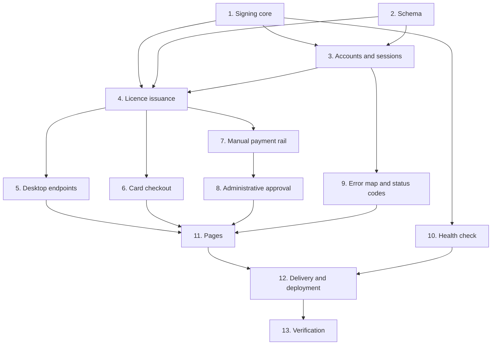

# Implementation Plan

## Overview

The signing core came first and alone, because everything downstream stores its output and because the
byte-exact contract with the desktop client had to be settled before any route depended on it. If the
serialisation had turned out to be unstable across the two languages, the whole token design would have
changed.

Then the schema, then accounts, then issuance, then the three payment rails, then delivery. The
administrative approval page is last among the features because it is the only thing that may mint a
licence from the manual rail, and it should not exist before the rail it approves.

Three items are recorded as **shipped defects found in production**. All three were silent in a
characteristic way — one made writes fail while reads worked, one made two pages disagree, one let a type
error through a green build.

Status reconstructed from the module contracts and the deployment history.

## Task Dependency Graph



Task 1 stands alone at the start rather than beside the schema, because its output is a byte sequence the
desktop client must already accept — and if that could not be made stable across two languages, the token
format itself would have needed rethinking.

```json
{
  "waves": [
    {
      "wave": 1,
      "tasks": ["1", "2"],
      "rationale": "The signing core and the schema share nothing. Signing is settled first because the cross-language byte contract is the one thing that could have invalidated the whole token design."
    },
    {
      "wave": 2,
      "tasks": ["3", "10"],
      "rationale": "Accounts need the schema; the health check needs only the signing core. Neither depends on the other."
    },
    {
      "wave": 3,
      "tasks": ["4", "9"],
      "rationale": "Issuance composes the schema, accounts and signing. The error map and status conventions are needed before any route settles its responses."
    },
    {
      "wave": 4,
      "tasks": ["5", "6", "7"],
      "rationale": "The desktop endpoints and both payment rails all route through the single issuance function and are independent of each other."
    },
    {
      "wave": 5,
      "tasks": ["8"],
      "rationale": "Administrative approval is the only thing that may mint from the manual rail, so it lands after that rail exists."
    },
    {
      "wave": 6,
      "tasks": ["11", "12"],
      "rationale": "The pages consume every endpoint; delivery and deployment configuration follow once there is something to deploy."
    },
    {
      "wave": 7,
      "tasks": ["13"],
      "rationale": "Typecheck, the contract test, and the six manual checks against the live deployment."
    }
  ]
}
```

## Tasks

- [ ] 1. The signing core
- [ ] 1.1 Sign with the runtime's own crypto and **zero** dependencies
  - The wrapper the key format needs is a fixed sixteen-byte prefix, small enough that reaching for a
    package would add supply-chain surface to the one file that must not have any
  - _Requirements: 8.6_
- [ ] 1.2 Serialise the payload over **sorted keys with no whitespace**, omitting empties
  - The client verifies the signature over the exact bytes it received, so any difference in key order
    between what was signed and what was sent breaks every licence. Omitting empty, null and undefined
    values keeps an absent optional field from changing the byte sequence
  - _Requirements: 8.3, 8.4, 8.5_
- [ ] 1.3 Match the client's token format exactly, and record why it is not a standard web token
  - The standard carries an algorithm field, and algorithm negotiation is where those libraries get broken
  - _Requirements: 8.1, 8.2_
- [ ] 1.4 Read the private key from the environment and validate its decoded length
  - Rather than trusting it and failing at signing time with an opaque error
  - _Requirements: 8.7_
- [ ] 1.5 Add a verification function using the public half
  - So a deployment with a mismatched pair is caught by a health check rather than by a tester trying to
    activate
  - _Requirements: 8.8_
- [ ] 1.6 Add the cross-language contract test on the exact bytes
  - Sorted keys, no whitespace, no base64 padding. The two halves are written in different languages and
    cannot share a serialiser, so a shared fixture is the only thing keeping them in agreement. A test that
    only round-trips within this codebase would pass while every real licence failed
  - _Requirements: 8.9_
- [ ] 1.7 Generate licence keys from a secure source over an unambiguous alphabet
  - Excluding the visually ambiguous characters, because these keys get read aloud and typed by hand. A
    guessable licence key is a licence key everyone has
  - _Requirements: 7.1, 7.2, 7.3_
- [ ] 1.8 Cap the token lifetime below the billing period
  - A cancelled licence simply stops being re-signed, so this is the longest a lapsed licence keeps
    working — and it is comfortably longer than the client's revalidation interval, so nobody honest
    notices
  - _Requirements: 9.1, 9.2, 9.3_
- [ ] 1.9 Set the default seat count with its justification
  - Two devices: a desktop and a laptop. Enough for how one person actually works, small enough that a key
    passed round a room runs out immediately — which is the entire point of counting devices
  - _Requirements: 10.7_

- [ ] 2. The schema
- [ ] 2.1 Define exactly seven models, and record why no more
  - The whole data model is who has an account, who is activated, what key they got, which machines it is on,
    whether this device has had its trial, and what happened. Every table beyond that is a table someone
    has to keep correct
  - _Requirements: 1.1, 1.2_
- [ ] 2.2 Use Postgres rather than a file-backed database
  - This runs where the filesystem is ephemeral, so a file would be wiped on every deploy, taking the
    account list with it
  - _Requirements: 1.3_
- [ ] 2.3 Cascade deletes from an account and from a licence
  - _Requirements: 1.4_
- [ ] 2.4 Add the append-only audit trail
  - When someone says their licence stopped working, the answer is in there
  - _Requirements: 1.5_
- [ ] 2.5 Make the licence-and-device pairing unique
  - So a double request cannot create two rows for one machine
  - _Requirements: 11.9_
- [ ] 2.6 Key the trial on the **device**, with no address column and an optional owner
  - A new address cannot obtain a second trial because the address was never what a trial was counted against.
    Expired rows are kept forever, because deleting them would hand back the trial
  - The owner is nullable only so the column could be added to an existing database without a migration
    that could fail; new trials always have one
  - _Requirements: 12.1, 12.2, 12.3, 12.4, 12.5_
- [ ] 2.7 Give the manual payment a status and a review timestamp
  - So its lifecycle is visible
  - _Requirements: 13.6_
- [ ] 2.8 Configure both a pooled and a direct database address
  - Schema operations need a direct connection
  - _Requirements: 20.4_

- [ ] 3. Accounts, sessions and single-use secrets
- [ ] 3.1 Hash passwords with the runtime's own memory-hard function, salted per account
  - No password library: it is in the standard library, it is memory-hard, and it is one less dependency to
    keep patched in the place where a supply-chain problem is worst
  - Record the measured cost per hash, so the parameter choice is a known trade rather than a guess
  - _Requirements: 2.1, 2.2, 2.3_
- [ ] 3.2 Declare the maximum memory parameter **explicitly** — shipped defect
  - The function needs about 64 megabytes at these parameters and the runtime caps it at about 32 unless
    told otherwise, so **every** hash threw a range error. Reads worked and writes did not, so signup
    returned a server error while login happily reported "no account"
  - Declare headroom well above the requirement, so a future parameter increase does not silently
    reintroduce it. The deployment's default function memory leaves room
  - _Requirements: 2.4, 2.5, 2.6, 2.7_
- [ ] 3.3 Read the parameters back from the stored hash on verification, with the same memory limit
  - Verification allocates exactly as much as hashing did
  - _Requirements: 2.8, 2.10_
- [ ] 3.4 Compare in constant time
  - A fast equality check on hashes leaks how much of the digest matched
  - _Requirements: 2.9_
- [ ] 3.5 Use a signed cookie rather than a session row
  - A session row per login is a database round trip on every request, and this site's pages are mostly
    public
  - _Requirements: 3.1, 3.2_
- [ ] 3.6 Set the relaxed same-site policy, **not** the strict one
  - It has to survive the redirect back from the payment provider. The symptom of getting this wrong is
    being signed out by a round trip to another site
  - _Requirements: 3.3_
- [ ] 3.7 State the revocation trade rather than hiding it
  - A signed cookie cannot be revoked server-side before it expires, so the realistic worst case is a
    stolen cookie working until it does. For a low-value desktop tool that is the right side of the trade;
    for anything holding money it would not be
  - _Requirements: 3.4, 3.5_
- [ ] 3.8 Require the signing secret to meet a minimum length, and error on its absence
  - _Requirements: 3.6_
- [ ] 3.9 Add the three-valued session state — shipped defect
  - Signature verification is by design all a stateless cookie checks, so a cookie stays cryptographically
    perfect after its account is deleted. The sign-in page saw a session and redirected to the account
    page; the account page found no account row and redirected back; **neither cleared the cookie**, so the
    browser bounced between them until it gave up on a blank page
  - A deleted account is rare in production and routine in development, which is exactly the kind of defect
    that ships
  - _Requirements: 4.1, 4.2, 4.3_
- [ ] 3.10 Branch every page on all three states, and add the endpoint that clears a stale cookie
  - So the loop is breakable from the client
  - _Requirements: 4.4, 4.5_
- [ ] 3.11 Trust the cookie when the account lookup **throws**
  - A stale cookie is a nuisance for one person; treating an unreachable database as "nobody is signed in"
    would sign out everybody at once for the duration of a blip, and send them to a sign-in page that also
    cannot reach the database. Failing towards the cookie keeps the failure proportional
  - _Requirements: 4.6, 4.7_
- [ ] 3.12 Use one model for verification codes, sign-in links and password resets
  - They are the same mechanism with different consequences — proof that whoever presented it controls the
    mailbox — and three half-implementations would be three places to get single-use, expiry and hashing
    wrong
  - _Requirements: 5.1, 5.2_
- [ ] 3.13 Store only the hash, salted with the account identifier for codes
  - A leaked database must not hand out working sign-in links or verification codes, and there is no reason
    for us to be able to read one. Salting means a code cannot be checked against a different account, and
    the same six digits for two people are two different hashes
  - _Requirements: 5.3, 5.4, 5.5_
- [ ] 3.14 Put the attempt counter **on the row**
  - Six digits is a million possibilities: plenty against a person, nothing against a script. So the code
    is only safe with a try limit, and the counter cannot live in memory because serverless functions do
    not share it
  - _Requirements: 5.6_
- [ ] 3.15 Delete any earlier unused code for the same purpose at issue time
  - Two live codes means "it says the code is wrong" from someone reading the first of two emails, which is
    indistinguishable from a defect
  - _Requirements: 5.7_
- [ ] 3.16 Return distinct outcomes for correct, wrong, expired and too-many; consume on success
  - _Requirements: 5.8, 5.9_
- [ ] 3.17 Make links single-use and purpose-bound
  - Rejected if unknown, expired, already used, or issued for a different purpose
  - _Requirements: 5.10_
- [ ] 3.18 Record why both a code and a link exist
  - The desktop application is where the trial starts, and a link cannot get someone from their inbox back
    into a native window — clicking it opens a browser, which then has to hand off to an application that
    may not be listening. A code is typed into the window that is already open and asking for it. The link
    stays for the browser, where it is the better answer
  - _Requirements: 5.11_
- [ ] 3.19 Store the failed-attempt counter and lockout on the account, checked before any comparison
  - Serverless functions do not share memory, so an in-process counter would reset on every cold start and
    protect nothing. The lockout expires on its own rather than needing intervention
  - _Requirements: 6.1, 6.2, 6.3, 6.4_

- [ ] 4. Licence issuance
- [ ] 4.1 Make issuance **one** function shared by all three rails
  - Three copies of "issue a licence" is three chances to issue two
  - _Requirements: 10.1, 10.2_
- [ ] 4.2 Make issuance idempotent
  - The payment provider sends more than one event for a single activation, and the success page may ask
    first, so minting a key per arrival would leave one account holding three — two of which count seats they
    are not using, and no way to know which is theirs
  - _Requirements: 10.3_
- [ ] 4.3 Extend rather than replace an existing active licence, moving the period end only forward
  - That path is also how a renewal arrives
  - _Requirements: 10.4, 10.5_
- [ ] 4.4 Record an audit event on creation
  - _Requirements: 10.6_
- [ ] 4.5 Always readmit a device already on the licence, **even at the seat limit**
  - It is re-activating, not taking a new seat, and refusing it would lock a legitimate user out of their
    own machine after a reinstall. With a small seat count that is the normal case rather than an edge case
  - _Requirements: 11.1, 11.2, 11.3, 11.4_
- [ ] 4.6 Refuse a new device at the limit, and floor the seat total at one
  - So a misconfigured zero does not lock out everybody
  - _Requirements: 11.5, 11.6_
- [ ] 4.7 Mark a released device inactive rather than deleting it
  - So the audit trail survives
  - _Requirements: 11.7_
- [ ] 4.8 Take the device identifier as the salted hash the desktop application computes
  - Never a raw hardware identifier
  - _Requirements: 11.8_
- [ ] 4.9 Return the **existing** expiry for a device that already has a trial
  - Someone who reinstalls mid-trial has not used their trial up. Only an elapsed trial is refused, and
    that is the caller's decision from the returned flag and date
  - _Requirements: 12.7, 12.8_
- [ ] 4.10 Never overwrite an existing trial owner
  - The first verified account on a machine is the one the trial belongs to, and letting a later address
    claim it would make the row rewritable by anyone who can reach the endpoint
  - _Requirements: 12.6_
- [ ] 4.11 Truncate the trial expiry to the stored precision
  - Otherwise the token issued on the first request and the one issued on a reinstall disagree about the
    same trial's expiry
  - _Requirements: 12.9_
- [ ] 4.12 Record an audit event when a new trial starts
  - _Requirements: 12.10_

- [ ] 5. Desktop endpoints
- [ ] 5.1 Add activation, refresh, deactivation and trial endpoints
  - _Requirements: 10.1_
- [ ] 5.2 Add the register, verify and login endpoints the desktop flow uses
  - Verification and trial start in one call, because from the user's side it is one action
  - _Requirements: 5.11_
- [ ] 5.3 Return the licence key alongside the token on the login route
  - So the client caches the key for revalidation and never stores the password
  - _Requirements: 10.1_

- [ ] 6. Card checkout
- [ ] 6.1 Create a checkout session and route the webhook through the shared issuance function
  - _Requirements: 10.1_
- [ ] 6.2 Verify the webhook signature before acting on any event
  - _Requirements: 10.1_
- [ ] 6.3 Let the success page ask for the licence before the webhook lands
  - Which is one of the two reasons issuance has to be idempotent
  - _Requirements: 10.3_

- [ ] 7. The manual payment rail
- [ ] 7.1 Record the research behind the automated alternative, with sources cited
  - The provider does have an official gateway, it is not self-serve, and it requires a merchant
    application, a registered business, and issued credentials — so there is no equivalent of simply adding
    a card processor
  - _Requirements: 13.7_
- [ ] 7.2 Offer the hosted checkout only where credentials are configured
  - Availability derived from configuration rather than hardcoded, so a deployment without credentials
    shows only what it can honour
  - _Requirements: 13.8, 13.9_
- [ ] 7.3 Sort the parameters before hashing and validate the key length
  - Integrators report that a rejection almost always traces to parameter order, a non-secure callback
    address, or the wrong key length. The error names both the actual and the expected length
  - _Requirements: 14.1, 14.2, 14.3_
- [ ] 7.4 Use a deliberately set local-currency amount rather than a converted one
  - A rate that moves under a tester mid-checkout is how a payment ends up short and rejected
  - _Requirements: 14.4_
- [ ] 7.5 Select the test or live endpoint by configuration
  - _Requirements: 14.5_
- [ ] 7.6 Record a pending payment and **mint nothing**
  - There is no signing secret on that rail, so the callback carries no proof, and a payment claim is not a
    payment
  - _Requirements: 13.1, 13.2_
- [ ] 7.7 Present the manual path as manual
  - A page that says confirmation happens by hand, usually within a few hours, and then does, is better
    than a spinner that lies. It is the existing behaviour made less manual rather than a stopgap, because
    this is how the rail is expected to work once it is connected
  - _Requirements: 13.4, 13.5_

- [ ] 8. Administrative approval
- [ ] 8.1 Make approval an explicit action that calls the shared issuance function
  - The only path from the manual rail to a licence
  - _Requirements: 13.3_
- [ ] 8.2 Build the review interface over pending payments
  - _Requirements: 13.6_

- [ ] 9. The error map and status conventions
- [ ] 9.1 Put every user-facing failure in one map with a machine code and a sentence
  - Ten routes each inventing their own wording produces ten different ways of saying "that did not work",
    and the ones written last are always the worst. A shared map also makes coverage reviewable: the list
    **is** the list of things that can go wrong, so a missing case is visible as a missing entry
  - _Requirements: 15.1, 15.2, 15.3_
- [ ] 9.2 Record the account-existence decision as an argued choice
  - It gives up the textbook defence against enumeration. The reasoning: the support cost of "it says wrong
    password and I know my password" is real and constant, while enumeration is mostly a nuisance for a
    product with no social graph to mine, and the major providers all answer honestly
  - What is kept: rate limiting and lockout, which is what actually stops someone working through a list
  - _Requirements: 15.4, 15.5_
- [ ] 9.3 Keep the reset path silent about whether an address exists
  - Confirming one to an unauthenticated stranger has no upside at all
  - _Requirements: 15.6_
- [ ] 9.4 Add the client-side helper that turns any response into a message
  - Handling the case every hand-rolled form gets wrong: a network failure, where there is no response to
    read a message out of and the browser's own error text means nothing to anyone
  - _Requirements: 15.7_
- [ ] 9.5 Say when nothing was charged
  - _Requirements: 15.8_
- [ ] 9.6 Return the payment-required status for a missing subscription, not the forbidden one
  - The desktop client clears its cache on a client-error refusal and keeps it on a server error, so the
    distinction between "you are not activated" and "we are broken" has to be carried by the status code
  - _Requirements: 16.1, 16.2_
- [ ] 9.7 Partition every error path: user state is 4xx, our failure is 5xx
  - _Requirements: 16.3, 16.4_
- [ ] 9.8 Carry both the code and the sentence in every error response
  - So the client can show the message without knowing the code
  - _Requirements: 16.5_

- [ ] 10. Health check
- [ ] 10.1 Sign a token and verify it with the configured public half on every call
  - So a deployment with a mismatched pair is caught by a check rather than by a tester trying to activate
  - _Requirements: 17.1, 17.2_
- [ ] 10.2 Report database reachability, and disclose no secret
  - _Requirements: 17.3, 17.4_

- [ ] 11. Pages
- [ ] 11.1 Build the landing, signup, sign-in, reset, account, pay and administration pages
  - _Requirements: 4.4_
- [ ] 11.2 Show the licence key, the bound devices and the seat count on the account page
  - _Requirements: 11.1_
- [ ] 11.3 Offer only the payment methods the configuration can honour
  - _Requirements: 13.9_

- [ ] 12. Delivery and deployment
- [ ] 12.1 Redirect the download endpoint to the installer in this repository's releases
  - No session required: the licence gate is in the application, so gating the download adds friction
    without adding enforcement
  - _Requirements: 18.1, 18.2_
- [ ] 12.2 Pin a single deployment region
  - So database round trips are not crossing continents unpredictably
  - _Requirements: 20.1_
- [ ] 12.3 Make the apex the production target, with the alternative host redirecting permanently
  - And record the consequence for the desktop client: it must follow redirects, because the service
    address is baked into shipped installers and cannot be corrected retroactively
  - _Requirements: 18.3, 20.2, 20.3_
- [ ] 12.4 Pin dependency versions exactly rather than by range
  - A range is how an advisory-fixed version silently regresses
  - _Requirements: 19.4_
- [ ] 12.5 Resolve a security advisory by an explicit version bump, recording the advisory identifier
  - _Requirements: 19.5_
- [ ] 12.6 Document the build configuration's error-suppressing options as a **release valve**
  - So nobody reads their presence as permission to skip the check
  - _Requirements: 19.3_
- [ ] 12.7 Record the earlier standalone service directory as **superseded**, with its tests still passing
  - So its presence is not mistaken for rot, and its status is not left ambiguous
  - _Requirements: 21.1, 21.2, 21.3_

- [ ] 13. Tests and verification
- [ ] 13.1 Explicit typecheck passing — the real gate, run separately from the build — shipped defect
  - The framework's build command does not typecheck, so a type error can reach production with the build
    reporting success. A green build is not evidence of a type-clean tree
  - _Requirements: 19.1, 19.2_
- [ ] 13.2 The signing test file green, including the cross-language byte contract
- [ ] 13.3 Health endpoint returning a successful sign-and-verify against the live deployment
- [ ] 13.4 Manual: complete a card activation, confirm **one** key arrives rather than three
- [ ] 13.5 Manual: activate on two machines, confirm the seat count; try a third, confirm the refusal names the action
- [ ] 13.6 Manual: submit a manual payment, confirm no licence appears until approval
- [ ] 13.7 Manual: delete an account holding a live cookie, confirm the sign-in page recovers rather than looping
- [ ] 13.8 Manual: request a reset for an address that does not exist, confirm the response is identical to one that does
- [ ] 13.9 Write the tests for this feature - 14 declared functions
  - `web/src/lib/licence.test.ts` (14) - the cross-language byte contract - sorted keys, no whitespace, no padding
  - Each test written **failing first**, and any changed expectation carries a comment
    saying why, or a real regression gets laundered into a green suite
  - _Requirements: 1.1-21.3_

## Notes

**Three defects here shipped, and each was silent in its own way.** They are recorded as their own task
items rather than folded into the work that introduced them:

| Task | Defect | Why it was silent |
|---|---|---|
| 3.2 | Nobody could sign up | Reads worked and writes did not, so the symptom pointed at the wrong layer |
| 3.9 | A redirect loop to a blank page | Two pages each behaving correctly on their own, disagreeing with each other |
| 13.1 | A type error could ship | The build command reported success without typechecking |

**Where the next work goes.** A new payment rail belongs in task 7 and must route through the single
issuance function in task 4 — never create a licence directly. A rail with no signing secret **records
evidence and does not mint**, like the existing manual one. A new user-facing failure belongs in the error
map in task 9 with both a code and a sentence, and its status code must land on the right side of the
4xx-versus-5xx split, because the desktop client's cache behaviour depends on it.

**Four things must not drift.** The signed byte sequence, which is pinned by the cross-language contract
test and is the only thing keeping two languages in agreement. The single issuance path, because three
copies is three chances to issue two. The known-device readmission, because refusing it locks a
legitimate user out of their own machine. And the trial's device key, because moving it to an address
is how a
second trial becomes free.

**No trial row may ever be deleted.** Retention is not a cleanup opportunity here: deleting an expired
trial hands the trial back.
