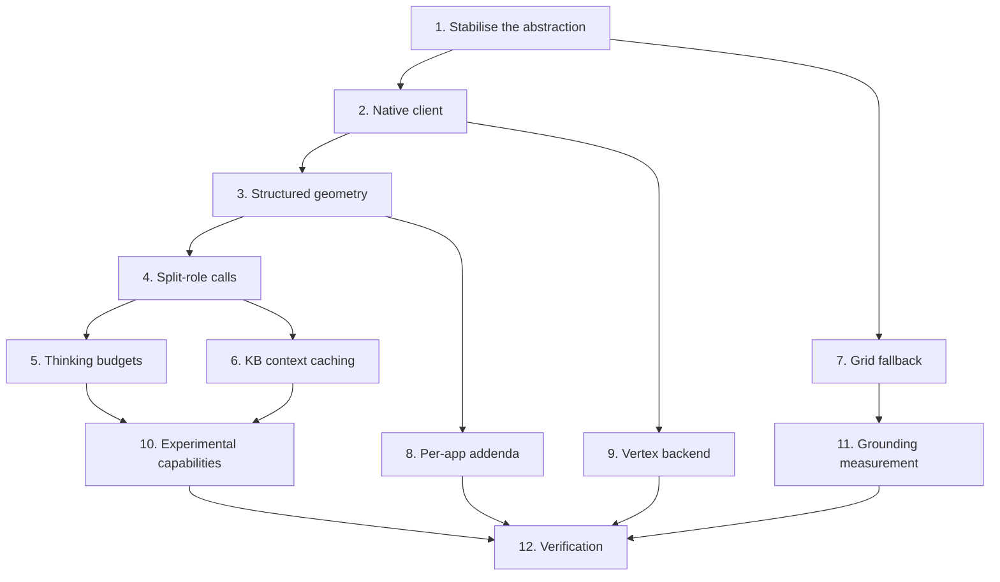

# Implementation Plan

## Overview

Order was dictated by one rule: **stabilise the abstraction before adding anything to it.** Tier 0
fixed three silent failures in the existing providers first, because building capability on top of a
broken factory would have hidden the breakage further. Then the native client, then structured
geometry, then the split-role architecture that structured geometry turned out to require, then the
optimisations that only make sense once the shape is settled.

Tier 1 closed 2026-08-09 at 757 tests, up 199 over Tier 0, with the native path verified live end to
end. Original task IDs (`T0-1`, `T1-9`, …) are preserved so each item can be grepped against
`IMPROVEMENTS.md`.

## Task Dependency Graph



Task 4 depends on 3 rather than the other way round because the split-role architecture was
*discovered* by building structured geometry and measuring the silence it produced.

```json
{
  "waves": [
    {
      "wave": 1,
      "tasks": ["1"],
      "rationale": "Three silent failures in the existing factory. Everything else builds on this, so a broken base would hide the breakage further."
    },
    {
      "wave": 2,
      "tasks": ["2", "7"],
      "rationale": "The native client and the grid fallback are independent: one adds a provider, the other serves the providers that cannot do geometry at all."
    },
    {
      "wave": 3,
      "tasks": ["3", "9"],
      "rationale": "Structured geometry and the Vertex switch both extend the native client and do not touch each other."
    },
    {
      "wave": 4,
      "tasks": ["4", "8"],
      "rationale": "The split-role architecture, forced by measuring what structured geometry did to prose. Per-app addenda land here because they are what forced prefix matching."
    },
    {
      "wave": 5,
      "tasks": ["5", "6"],
      "rationale": "Budgets and caching both attach to the two calls that now exist and are independent of each other."
    },
    {
      "wave": 6,
      "tasks": ["10", "11"],
      "rationale": "Surface the capabilities in Settings with honest descriptions; build the measurement harness."
    },
    {
      "wave": 7,
      "tasks": ["12"],
      "rationale": "Full suite, selftest, the fully-local regression gate, and a live end-to-end run."
    }
  ]
}
```

## Tasks

- [x] 1. Stabilise the provider abstraction (Tier 0)
- [x] 1.1 Fix the Anthropic provider, which failed on every request (`T0-1`)
  - Root cause was deeper than the audit found: a placeholder default model id **and** a slug-format
    mismatch that broke both key types
  - Add `_anthropic_model_for_endpoint` as a pure function; route both key types through it
  - Delete the `startswith("model")` fossil that routed any such id to Anthropic
  - Add the model picker to Settings, so the setting became writable from the UI for the first time
  - **Caveat recorded rather than hidden:** verified by construction and unit test, not against the
    live API. No key was available
  - _Requirements: 1.3, 1.5_
- [x] 1.2 Reconcile three conflicting provider defaults (`T0-2`)
  - The audit said two call sites; verification found **three**. A drift-guard test now counts them
  - _Requirements: 1.1_
- [x] 1.3 Fix three silent-failure modes in coordinate tag parsing (`T0-3`)
  - Accept signed coordinates; drop the end-of-string anchor; add fail-closed stripping for complete
    but unparseable and for truncated tags
  - _Requirements: 2.7_
- [x] 1.4 Centralise the endpoint decision in one function
  - _Requirements: 1.4_
- [x] 1.5 Improve the startup provider log (`T0-4`)
  - **The audit was wrong here.** It claimed four model defaults were fictional; verification against
    the account's own model list found them live. The item collapsed from "replace four broken
    defaults" to "log which provider is actually in use". Coding from the audit would have replaced
    three working defaults
  - _Requirements: 10.3_

- [x] 2. Native client (`T1-1`)
- [x] 2.1 Add the native client as a distinct provider, not auto-detection inside the existing one
  - The user can see and choose which transport they get, because only this one offers structured
    geometry, budgets, grounding and agentic vision
  - _Requirements: 1.1, 1.6_
- [x] 2.2 Build the SDK client lazily on first use, behind an injectable factory
  - _Requirements: 1.6_
- [x] 2.3 Route a direct key to the native path and an OpenRouter key to the compatibility shim
  - Two recognised key prefixes, one of them confirmed against a working key rather than guessed
  - _Requirements: 1.4_

- [x] 3. Structured geometry (`T1-2`)
- [x] 3.1 Declare the pointing function with separately named integer coordinates
  - _Requirements: 2.1_
- [x] 3.2 Add the structured-geometry capability flag and skip the tag machinery for it
  - _Requirements: 2.2_
- [x] 3.3 Substitute the structured prompt for a tag-based one
  - The live test showed the model obeys the prompt's "append a tag" instruction rather than calling
    the tool, putting coordinates straight back into the speech channel
  - _Requirements: 2.3_
- [x] 3.4 Pass a genuinely custom prompt through untouched
  - _Requirements: 2.6_
- [x] 3.5 Drop a malformed geometry call and keep the spoken answer
  - _Requirements: 2.7_
- [x] 3.6 Fix the normalised-versus-pixel assumption in the text-tag fallback
  - Measured on 900×900, 1920×1080, 600×400 and 400×1200: a dead-centre target returned the same
    normalised value every time. Consuming those as pixels inflated every refined point and pushed a
    pixel-perfect seed ~50 px off target — refinement made pointing worse
  - _Requirements: 2.1_

- [x] 4. Split-role concurrent calls (`T1-9`)
- [x] 4.1 Measure whether one tool-enabled call can produce both prose and a pointer
  - Across budgets 0, 64, 128, 256, 512: choosing to point produced **zero text**. Silence is a
    correctness failure, so the split is forced rather than chosen
  - _Requirements: 3.1_
- [x] 4.2 Issue the speech call with no tools declared
  - _Requirements: 3.1_
- [x] 4.3 Issue the geometry call on a daemon thread with tools only and the minimal budget
  - _Requirements: 3.2, 3.3_
- [x] 4.4 Skip the geometry call for a conceptual question; always attempt it in annotation mode
  - _Requirements: 3.4, 3.5_
- [x] 4.5 Make the harvest idempotent across both accessors in either order
  - _Requirements: 3.6_
- [x] 4.6 Contain every geometry failure; never propagate into speech
  - _Requirements: 3.7_
- [x] 4.7 Withhold the knowledge base from the geometry call
  - _Requirements: 3.8_

- [x] 5. Thinking budgets (`T1-7`)
- [x] 5.1 Write the query classifier as a pure function, testing diagnostic intent first
  - _Requirements: 4.1, 4.2_
- [x] 5.2 Map the three classes to budgets and clamp per model family
  - Verified live: one model family returns 400 on a zero budget while another accepts it happily
  - Measured: zero budget moved time-to-first-token from 3.97 s to 1.18 s
  - _Requirements: 4.3, 4.4_
- [x] 5.3 Force the minimal budget on the geometry call
  - _Requirements: 4.5_
- [x] 5.4 Raise the geometry budget and append inspection guidance under agentic vision
  - _Requirements: 4.6_
- [x] 5.5 Add a test asserting the two copies of the directional word list stay in sync
  - _Requirements: 4.7_

- [x] 6. Knowledge-base context caching (`T1-6a`)
- [x] 6.1 Verify live that a max-size payload caches before building anything
  - 60,000 characters measured at 10,002 tokens; caching served 10,008 of 10,013 prompt tokens
  - _Requirements: 5.1_
- [x] 6.2 Key the cache on application name plus a content hash
  - _Requirements: 5.2_
- [x] 6.3 Suppress inline injection when a cache resolved, and omit the system instruction
  - _Requirements: 5.3, 5.4_
- [x] 6.4 Degrade every failure path to inline injection
  - _Requirements: 5.5_
- [x] 6.5 Apply the cache to the speech call only, and record why one cache cannot serve both
  - _Requirements: 5.6_
- [x] 6.6 Delete every live cache on client shutdown
  - _Requirements: 5.7_
- [x] 6.7 Estimate tokens locally, pessimistically, with the measured ratio recorded
  - _Requirements: 5.8_

- [x] 7. Grid fallback
- [x] 7.1 Implement the coarse first pass with numbered cells and a JSON-only reply contract
  - _Requirements: 6.1, 6.2_
- [x] 7.2 Implement the fine second pass over the chosen cell plus one cell of context
  - _Requirements: 6.3_
- [x] 7.3 Fall back to the first pass's cell centre when the second pass fails
  - _Requirements: 6.4_
- [x] 7.4 Honour the conceptual sentinel by placing no pointer
  - _Requirements: 6.5_
- [x] 7.5 Upscale a small crop so grid labels stay legible to a weak model
  - _Requirements: 6.6_
- [x] 7.6 Distinguish decode failure, transport failure and an unparseable reply in diagnostics
  - Previously every one of the three returned the same `None` and logged the same line
  - _Requirements: 6.7_
- [x] 7.7 Skip the locator entirely on a cancelled turn
  - _Requirements: 6.8_
- [x] 7.8 Add the native-resolution refinement crop with a keep-the-original failure path
  - _Requirements: 6.4_

- [x] 8. Per-application prompt addenda (`T2-5`)
- [x] 8.1 Build the addendum table keyed on sanitised executable basenames
  - Editor entries verified present on the development machine by enumerating installed software and
    running processes rather than guessed; the rest are standard basenames and inert when unmatched
  - _Requirements: 7.1, 7.3_
- [x] 8.2 Provide one entry point that appends, making the rule structural
  - _Requirements: 7.2, 7.6_
- [x] 8.3 Return an empty string for an unknown or failed application name
  - _Requirements: 7.4, 7.5_
- [x] 8.4 Switch prompt matching from equality to prefix, and unify the geometry decision with it
  - Caught by pre-flight reasoning, not by a test: appending an addendum would have made an equality
    check treat the prompt as fully custom, silently disabling structured geometry **and** the
    geometry call. Code Mode would have stopped Nimbus pointing at anything on this provider
  - _Requirements: 2.3, 2.4, 2.5_

- [x] 9. Vertex AI backend
- [x] 9.1 Add the project and region settings, read fresh rather than cached at import
  - _Requirements: 8.4_
- [x] 9.2 Construct the client against Vertex when a project is set, passing no key
  - _Requirements: 8.1, 8.2_
- [x] 9.3 Check the project before the key shape in the factory
  - _Requirements: 8.3_
- [x] 9.4 Coerce a blank region to the global endpoint
  - _Requirements: 8.5_
- [x] 9.5 Apply the identical switch on the speech-to-speech path
  - _Requirements: 8.6_
- [x] 9.6 Expose which backend is live to the Settings and Account pages
  - _Requirements: 8.7_
- [x] 9.7 Widen the injected factory call only when Vertex is configured
  - Existing test factories are declared as one-argument lambdas, so widening unconditionally would
    have broken every test that predates this backend rather than any real behaviour
  - _Requirements: 8.8_
- [ ] 9.8 Execute against a live Vertex project
  - **Not done.** Eleven tests pass by construction; this path has never made a real request. Needs
    `gcloud auth application-default login`, the AI Platform API enabled, and one push-to-talk turn
  - _Requirements: 8.1, 8.8_

- [x] 10. Experimental capabilities, honestly labelled
- [x] 10.1 Default every capability off, with the one argued exception
  - _Requirements: 9.1_
- [x] 10.2 Make each reachable from Settings rather than leaving it unreachable
  - _Requirements: 9.2_
- [x] 10.3 Write each description with its trade-off stated
  - Search grounding's says **not recommended**: alone it returns correct cited answers, but combined
    with the persona prompt and a screenshot the citations vanished and one answer came back wrong.
    A settings dialog that oversells a switch is how a user blames the app for a nudge
  - Agentic vision's says **unmeasured**, because the harness exists and the run has not happened
  - _Requirements: 9.3, 9.4_
- [x] 10.4 Persist an explicit on or off rather than deleting the key
  - _Requirements: 9.5_
- [x] 10.5 Collect citations for the diagnostic log and keep them out of spoken text
  - _Requirements: 9.6_
- [x] 10.6 Register both lazily-imported satellite modules in the spec and the selftest
  - Both shipped invisible to PyInstaller's static graph before this. This is the gap
  - _Requirements: 10.2_

- [-] 11. Grounding measurement (`T1-8`)
- [x] 11.1 Build the fixture labeller and the accuracy harness
  - Hit rate, pixel error from a box centre in Space C, latency, plus the same statistics
    `tools/bench.py` uses
  - _Requirements: 9.3_
- [-] 11.2 Run the comparative measurement for agentic vision versus the crop pass
  - **Skipped by decision, not forgotten.** The tooling is complete; the measurement was judged not
    worth the time at that point. The consequence is recorded honestly: agentic vision stays off and
    its description says it is untested
  - _Requirements: 9.3_

- [x] 12. Tests and verification
- [x] 12.1 Full suite green with the dotenv neutralisation, zero regressions
- [x] 12.2 `--selftest` prints `SELFTEST OK`, including both lazy satellite modules
- [x] 12.3 Fully-local regression gate: Ollama plus local speech in and out, no keys, no network
- [x] 12.4 Live end-to-end run on the native path
- [x] 12.5 Write the tests for this feature - 333 declared functions
  - `tests/test_gemini_native.py` (60) - the split-role config, thinking budgets, structured geometry
  - `tests/test_gemini_cache.py` (59) - cache keys, the content hash, the no-double-send rule
  - `tests/test_experimental.py` (50) - every default-off toggle, and that each one is genuinely off
  - `tests/test_ai.py` (109) - the provider ABC, all four clients, the tag parser, the speech scrubbers
  - `tests/test_prompts.py` (18) - the addendum-appended-not-replaced guard
  - `tests/test_vertex_backend.py` (11) - the alternate credential path, by construction only
  - `tests/test_ollama_health.py` (16) - the local-provider compatibility probe
  - `tests/test_realtime.py` (10) - the parallel speech-to-speech path
  - Each test written **failing first**, and any changed expectation carries a comment
    saying why, or a real regression gets laundered into a green suite
  - _Requirements: 1.1-10.4_

## Notes

**One capability is built but not recommended, and one is built but unverified.** Search grounding
measured *worse* under Nimbus's own prompt, and its tooltip says so. Agentic vision is genuinely
untested against the current crop-and-recheck approach because the harness was never run. Neither is
a gap to be closed quietly — the honest label is the deliverable.

**One capability was skipped outright and is now a non-goal.** Gated Computer Use (`T3-1`) is recorded
in `IMPROVEMENTS.md` §8 as **do not build**. See `.kiro/steering/product.md` for the reasoning.

**One was found unnecessary rather than outstanding.** The Files API path for PDFs (`T1-6c`) would
have fractured the provider-agnostic contract — the knowledge base is a *string* injected into the
prompt, and routing one file format through a vendor-specific file reference would break PDFs on the
local path, which is a regression gate.

**The rule for the next provider.** One class implementing `ask_stream`, one case in the factory, and
concrete defaults for anything the ABC does not already provide. If the pipeline needs to know which
provider is active, the design is wrong.
