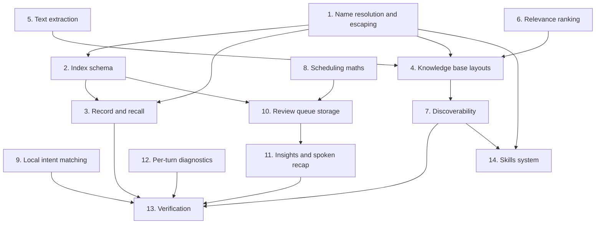

# Implementation Plan

## Overview

Built in the order the dependencies allow: the pure helpers first, because both stores need name
resolution and both are worthless if it drifts; then the schema, because two features share one
database; then the two recall paths; then the scheduling maths, which touches nothing; and the
discoverability work last, because it describes behaviour that has to already exist.

Memory and diagnostics predate the tiered plan and were part of the original build. The knowledge-base
expansion (`T3-2`) and the Knowledge Journal (`T3-3`) closed with Tier 3 on 2026-08-15. Original task
IDs are preserved so each item can be grepped against `IMPROVEMENTS.md`.

## Task Dependency Graph



Task 1 gates almost everything because a divergent name resolver is the one defect in this feature that
is invisible until a user follows the documentation and gets nothing. Task 6 precedes 4 rather than
following it: recall calls ranking on every over-budget lookup, so ranking has to be a finished pure
function before the lookup path can be trusted.

```json
{
  "waves": [
    {
      "wave": 1,
      "tasks": ["1", "8", "9", "12"],
      "rationale": "Pure functions and one self-contained I/O module. None of them share state, so all four can proceed in parallel."
    },
    {
      "wave": 2,
      "tasks": ["2", "5", "6"],
      "rationale": "The shared schema and the two knowledge-base primitives. Each needs name resolution from wave 1 and nothing else."
    },
    {
      "wave": 3,
      "tasks": ["3", "10"],
      "rationale": "Both stores' write paths. Both need the schema, and the journal also needs the scheduling maths."
    },
    {
      "wave": 4,
      "tasks": ["4"],
      "rationale": "The knowledge-base lookup composes extraction, ranking and name resolution, so it lands after all three are real."
    },
    {
      "wave": 5,
      "tasks": ["7", "11"],
      "rationale": "Both describe behaviour that must already exist: the guide documents the layouts, and insights summarise the queue."
    },
    {
      "wave": 6,
      "tasks": ["13"],
      "rationale": "Full suite, selftest, the two manual verification entry points, and the live in-house-software comparison."
    },
    {
      "wave": 7,
      "tasks": ["14"],
      "rationale": "Not built. Sequenced last and gated on the discoverability work, because the drop-in-a-folder pattern and its guide have to be settled before the same pattern is applied to something that executes."
    }
  ]
}
```

## Tasks

- [x] 1. Name resolution and Markdown escaping
- [x] 1.1 Write `_sanitize_app_name` as the single normalisation point
  - Lowercase, strip surrounding whitespace, replace all nine Windows-reserved characters
  - Raise on a name that is empty before or after normalisation, because that indicates a caller defect
  - _Requirements: 3.1, 3.7_
- [x] 1.2 Delegate the knowledge base's name resolution to memory's (`T3-2`)
  - Replaced a second copy whose docstring claimed to mirror this one "exactly" and did not
  - Measured across 15 inputs: 7 disagreed. Memory stripped whitespace and replaced nine characters;
    the copy stripped nothing and replaced three
  - The whitespace case was the user-visible one: memory showed `spaced.exe`, the knowledge base
    looked for `  spaced.exe  ` and silently found nothing
  - Catch the `ValueError` and return empty, since a lookup miss is a normal outcome there
  - _Requirements: 3.2, 3.3, 3.4, 3.5, 3.7_
- [x] 1.3 Add the 15-case parametrised drift guard
  - Seeded with the seven inputs that actually diverged, so the test would have caught the original
  - _Requirements: 3.6_
- [x] 1.4 Write `_escape_markdown_fences` and `_escape_single_line`
  - Triple backticks to `'''`; newlines to a visible `↵`; carriage returns dropped
  - Zero-width-space insertion considered and rejected as too clever to debug later
  - _Requirements: 4.2, 4.3, 4.4_

- [x] 2. The shared index
- [x] 2.1 Create the `apps` table and its index with create-if-not-exists semantics
  - _Requirements: 5.1, 5.2_
- [x] 2.2 Enable write-ahead logging and open a short-lived connection per method
  - Document the single-writer model at the class level rather than adding in-process locks
  - _Requirements: 5.3, 5.4, 5.5_
- [x] 2.3 Create the index parent directory eagerly, and leave the memory directory lazy
  - A user who never asks a question gets no folders in their home directory
  - _Requirements: 1.7, 5.7_
- [x] 2.4 Implement `list_known_apps`, sorted most-recently-seen first
  - _Requirements: 5.6_

- [x] 3. Memory record and recall
- [x] 3.1 Implement `recall` as a bounded tail read with no filtering
  - Guard a non-positive budget explicitly: `text[-0:]` returns the **whole** string
  - Record the no-scoring choice as a wait-for-the-data decision, not an oversight
  - _Requirements: 2.1, 2.2, 2.3, 2.4, 2.5_
- [x] 3.2 Write the fixed four-field block and the header carrying the transparency line
  - Assemble the header by f-string, never `.format()`, so a literal brace in an application name
    cannot raise on a path that runs after the user already has their answer
  - Write an explicit text-only placeholder when there is no coordinate, for block-shape stability
  - _Requirements: 1.3, 4.1, 4.5, 4.6_
- [x] 3.3 Preserve the body as everything from the first block heading to end of file
  - A file with no heading yields an empty body and a clean rewrite rather than an error
  - _Requirements: 4.7, 4.8, 1.6_
- [x] 3.4 Take one clock reading per record and share it between the file and the index
  - Two readings let the Markdown and the database skew, making sort-by-last-seen non-deterministic
  - _Requirements: 4.9_
- [x] 3.5 Upsert the index row, computing the count before writing the header
  - _Requirements: 5.1_
- [x] 3.6 Add the manual verification entry point
  - Writes to the real folder under a reserved synthetic application name so repeated runs cannot
    pollute memory built up during actual use
  - Reconfigures stdout to UTF-8, because a Windows console defaults to an encoding that cannot
    represent the arrows and dashes that land in responses
  - _Requirements: 1.1, 1.4_

- [x] 4. Knowledge base lookup (`T3-2`)
- [x] 4.1 Keep the flat layout working untouched, and read it first
  - So a user who later adds a folder keeps their original file as the leading context
  - _Requirements: 6.1, 6.3_
- [x] 4.2 Add the recursive folder layout with a stable relative-path sort
  - _Requirements: 6.2, 6.7_
- [x] 4.3 Cap files per application, applied before extraction
  - Bounds hot-path cost regardless of file sizes when a user points at a large directory
  - _Requirements: 6.8_
- [x] 4.4 Label each file inline with its relative path
  - The model benefits from knowing a shortcut list and a troubleshooting guide are separate
    documents, and the user can tell which of their files an answer came from
  - _Requirements: 6.9_
- [x] 4.5 Return empty for a miss and let the pipeline answer from vision and memory
  - _Requirements: 6.10_
- [x] 4.6 Skip files whose extracted text is blank rather than emitting an empty labelled section
  - _Requirements: 7.6_

- [x] 5. Text extraction
- [x] 5.1 Read Markdown and plain text with replacement on undecodable bytes
  - _Requirements: 6.4, 7.5_
- [x] 5.2 Extract PDF text behind a lazy, optional import
  - _Requirements: 6.4, 7.1, 7.2_
- [x] 5.3 Extract Word paragraphs **and table cells**
  - Tables are where documentation puts shortcuts, field definitions and option matrices
  - _Requirements: 6.5_
- [x] 5.4 Make the extraction entry point never raise, and ignore unsupported suffixes silently
  - The pipeline already wraps the lookup; this keeps one bad file from costing the rest
  - _Requirements: 6.6, 7.3, 7.4_
- [-] 5.5 Route PDFs through the provider's file-upload API (`T1-6c`)
  - **Unnecessary rather than outstanding.** The content is a string injected into the system prompt
    and flows provider-agnostically; a vendor-specific file reference would fracture that contract and
    break PDFs on the fully-local path, which is a standing regression gate
  - _Requirements: 6.4_

- [x] 6. Relevance ranking (`T3-2`)
- [x] 6.1 Return content unchanged when it fits the budget
  - Ranking must not reorder content that all fits: a document's own order carries meaning
  - _Requirements: 8.1, 8.2_
- [x] 6.2 Split on Markdown headings, falling back to one section
  - _Requirements: 8.3_
- [x] 6.3 Score by **distinct** query terms, dropping terms below the minimum length
  - Occurrence counting would let a glossary entry repeating one word outrank the page that answers
    the question
  - _Requirements: 8.5, 8.6_
- [x] 6.4 Admit by score, break ties by earlier index, then re-emit in document order
  - Earlier sections win ties because a document's opening usually carries the overview
  - _Requirements: 8.4_
- [x] 6.5 Stop admitting zero-scoring sections once anything scoring is in
  - _Requirements: 8.9_
- [x] 6.6 Preserve tail truncation for no query, one section, or nothing admitted
  - Keeps the change additive: callers passing no query get the exact previous behaviour
  - _Requirements: 8.7, 8.8_
- [x] 6.7 Guard a non-positive budget
  - _Requirements: 8.12_
- [x] 6.8 Record the defect being fixed and the decision against embeddings
  - Previously an over-budget file was tail-truncated, so a question about the discarded part was
    answered from nothing
  - Keyword ranking chosen over embeddings: a keyword score is inspectable where a cosine distance
    is not, and the standing judgement against premature vector-database complexity holds
  - _Requirements: 8.10, 8.11_

- [x] 7. Discoverability (`T3-2` follow-up)
- [x] 7.1 Embed the guide as a module string and seed it when absent
  - A bundled data file would need frozen-versus-source path resolution, a recurring "works in
    development, missing in the installer" failure. A few kilobytes in the module cannot go missing
  - Never raises: a read-only or redirected folder must not prevent startup
  - _Requirements: 9.1, 9.2, 9.5, 9.6_
- [x] 7.2 Write the guide content: naming, both layouts, formats, budget, cap, privacy note
  - Tell the user to read the canonical name out of their memory folder, since that is the one place
    the exact name is visible
  - _Requirements: 9.3, 9.4_
- [x] 7.3 Choose a guide filename a flat lookup can never match, and record why it is unreachable
  - A flat lookup reads only `<name>.md`, and foreground detection returns executable basenames
  - _Requirements: 9.10_
- [x] 7.4 Add the Settings action that re-seeds then opens the folder
  - Covers folders created by an earlier version; reports failures because the user clicked something
  - _Requirements: 9.7, 9.8_
- [x] 7.5 Derive the opened folder from the path seeding returns
  - Fixes a latent fragility: the handler read the folder setting twice, so it could seed one folder
    and open another
  - _Requirements: 9.9_

- [x] 8. Scheduling maths (`T3-3`)
- [x] 8.1 Define the fixed ladder and the ease bounds, each with its reason in the source
  - Ladder over a computed formula: the classic formula needs both an ease and a repetition count and
    misbehaves on the small datasets a personal journal is made of
  - Capped at 120 days because software changes and an older item may describe a vanished interface
  - _Requirements: 10.1, 10.2, 10.3, 10.4, 10.5_
- [x] 8.2 Implement ladder advance and reset
  - Wrong resets to the start rather than stepping back: stepping back keeps a genuinely unknown item
    circulating at week-long gaps
  - _Requirements: 10.6, 10.7_
- [x] 8.3 Implement asymmetric ease adjustment with clamping
  - Failure moves ease further than success, because one correct answer is weak evidence
  - _Requirements: 10.8_
- [x] 8.4 Scale the ladder by ease, flooring at one day and capping at the ladder top
  - A zero-day interval would make the item due again in the same session
  - _Requirements: 10.9_
- [x] 8.5 Expose one scheduling entry point returning position, ease and days together
  - So a caller cannot update position and ease inconsistently
  - _Requirements: 10.10, 10.11_

- [x] 9. Local intent matching (`T3-3`)
- [x] 9.1 Define the three intents and their trigger phrases
  - _Requirements: 12.1, 12.2_
- [x] 9.2 Normalise case, question marks and whitespace before matching
  - _Requirements: 12.7_
- [x] 9.3 Reject any transcript over the word cap as a real question
  - The false-positive guard. A false positive silently replaces a genuine answer with a quiz, which
    is a far worse failure than a missed shortcut
  - _Requirements: 12.3, 12.4, 12.5_
- [x] 9.4 Resolve multiple matches by longest phrase
  - So "what should i review" cannot be shadowed by a bare "review"
  - _Requirements: 12.6_
- [x] 9.5 Check journal intent **before** capture in the pipeline
  - Less work, and one less privacy exposure for a question about the user's own data
  - _Requirements: 12.8_
- [x] 9.6 Pin both directions with tests, including the two recorded near-misses
  - _Requirements: 12.9_

- [x] 10. Review queue storage (`T3-3`)
- [x] 10.1 Add the `review_queue` table to the existing database, purely additively
  - Same create-if-not-exists contract and journal-mode pragma as the existing store, no `ALTER`
  - Verified: no migration was needed, and the insights path was defined and written by nothing, so
    it was free to use. A rare item where the plan survived contact intact
  - _Requirements: 13.1, 13.2, 13.3_
- [x] 10.2 Carry `target_label` so an item can be positional
  - Populated from the element that was pointed at, which costs nothing since it is already in the
    result. This is what no flashcard tool can do, because none of them can see the screen
  - _Requirements: 11.1, 11.2, 11.3, 11.4_
- [x] 10.3 Implement add, due, grade, recap and stats
  - Store dates as ISO strings so text comparison sorts correctly and needs no date functions
  - _Requirements: 13.1_
- [x] 10.4 Skip empty questions and answers silently, and swallow every write failure
  - Written after the user already has their answer, so a lost entry is invisible while raising is not
  - _Requirements: 13.6, 13.7_
- [x] 10.5 Default the feature on, recording why the reproduce-existing-behaviour rule does not apply
  - Purely additive, and written only after an interaction has already succeeded
  - _Requirements: 13.5_
- [x] 10.6 Add the backward-compatibility gate asserting the existing table is untouched
  - Users have live databases
  - _Requirements: 13.4_
- [x] 10.7 Add the degradation test proving a broken journal falls back to a normal answer
  - _Requirements: 13.8_

- [x] 11. Insights and spoken recap (`T3-3`)
- [x] 11.1 Write the progress summary as plain Markdown the user can edit or delete
  - _Requirements: 13.9_
- [x] 11.2 Report "not yet reviewed" rather than a zero percentage when nothing is graded
  - _Requirements: 13.10_
- [x] 11.3 Format the recap for the ear: one sentence, no lists, capped at three topics
  - The cap is a speech constraint rather than a data one — a longer spoken list is unfollowable
  - _Requirements: 13.11_

- [x] 12. Per-turn diagnostics
- [x] 12.1 Write one folder per interaction with a millisecond-stamped log
  - _Requirements: 14.1, 14.2_
- [x] 12.2 Save screenshots, optionally with a marker drawn at the coordinate
  - Turns "the pointer was off" from an assertion into an image
  - _Requirements: 14.3_
- [x] 12.3 Add the null session with an identical interface
  - So callers need no branch and no error path, which is the only way an optional feature stays
    optional in practice
  - _Requirements: 14.4_
- [x] 12.4 Swallow every diagnostic write failure
  - _Requirements: 14.5_
- [x] 12.5 Prune expired folders at session start, scoped to Nimbus's own diagnostics root
  - Treat a locked file as a skip: retention is best effort and must not block an interaction
  - _Requirements: 14.6, 14.7, 14.8_
- [x] 12.6 Assert that a privacy-suppressed capture is never written here
  - _Requirements: 14.9_

- [x] 13. Tests and verification
- [x] 13.1 Full suite green with the dotenv neutralisation, zero regressions
- [x] 13.2 `--selftest` prints `SELFTEST OK`, and does **not** seed the guide — it only imports
- [x] 13.3 Manual verification entry points run and read correctly by eye
- [x] 13.4 Live in-house-software comparison recorded
  - Same question, twice: without the knowledge base *"shift plus command plus r"* — hallucinated, and
    `command` is not even a Windows key. With it, *"control shift q"* — correct, extracted from a Word
    **table**, and it volunteered `F9` from the same table
- [x] 13.5 PDF extraction verified against a hand-built PDF containing real text
  - A blank page would only have proven "does not raise"
- [x] 13.6 Discoverability verified by deleting the guide and confirming it reappears on launch
- [x] 13.7 Write the tests for this feature - 146 declared functions
  - `tests/test_kb.py` (10) - the original flat layout, unchanged - the backward-compatibility gate
  - `tests/test_kb_expansion.py` (61) - folders, extraction, ranking, and the 15-case sanitiser drift guard
  - `tests/test_memory.py` (20) - the block shape under hostile input, and the one-clock-reading rule
  - `tests/test_review.py` (52) - the ladder exhaustively, plus both directions of the intent guard
  - `tests/test_debug_log.py` (3) - the null session and bounded retention
  - Each test written **failing first**, and any changed expectation carries a comment
    saying why, or a real regression gets laundered into a green suite
  - _Requirements: 1.1-14.9_

- [ ] 14. Skills system (`T4-3`)
- [ ] 14.1 Write the trust model down **before** any execution path exists
  - A skill runs with the full privileges of the process: the user's files, their credential store,
    their network, their screen. That sentence has to exist in the guide before the loader does
  - **This is the gate on the whole item.** Everything below is small; this is the part that is not
  - _Requirements: 15.2, 15.3, 15.11_
- [ ] 14.2 Discover plain Python files in a documented directory under the user's Nimbus folder
  - Same drop-in-a-folder shape as the knowledge base, so there is nothing new to learn
  - _Requirements: 15.1_
- [ ] 14.3 Keep the feature off by default and show the trust model at the moment of enabling
  - Not buried in documentation. At the moment the switch is flipped
  - _Requirements: 15.5_
- [ ] 14.4 Import each file in isolation; log and skip one that raises
  - The same contract a corrupt knowledge-base document already has: one bad file costs that file
  - _Requirements: 15.6, 15.8_
- [ ] 14.5 Define the declaration contract for a trigger and a callable
  - So discovery does not mean inspecting arbitrary module contents
  - _Requirements: 15.7_
- [ ] 14.6 Add no remote fetch and no writer into the skills directory
  - A marketplace turns one careless install into a compromise. There is no version of this that is
    safe to add later without revisiting 14.1
  - _Requirements: 15.4_
- [ ] 14.7 Seed one inert example that touches nothing outside its own folder
  - _Requirements: 15.10_
- [ ] 14.8 Prove no skill can reach a capture path around the Privacy Guard
  - Enforced by the guard's existing choke point, asserted structurally. A guarantee that depends on
    skills behaving is not a guarantee
  - _Requirements: 15.9_

## Notes

**Task 14 is open and its blocker is not effort.** The loader is a morning's work; the trust model is
the item. Everything else in this spec deals in files that can at worst mislead a model, and this one
deals in files that can do anything the process can — including reading the credential store that holds
the user's keys. It stays `[ ]` rather than `[-]` because nothing has been decided against; the writing
that has to come first simply has not been done.

**One item is deliberately not done.** Task 5.5 — provider file-upload for PDFs — is recorded as
**unnecessary**, not outstanding. Local extraction keeps one code path across five providers and keeps
the extracted text inspectable. Reading its row as backlog would be a misreading.

**Where the next work goes.** A new document format is task 5: add the suffix set, add a lazily-imported
extractor, and add a real fixture file — not a blank one. A new store belongs beside these three, sharing
the same database with create-if-not-exists and a backward-compatibility test asserting the existing
tables are untouched. Do not add an `ALTER`.

**The two things that must not drift.** Name resolution is one function; if a third module needs it, it
delegates. And the ranking constants — the budget, the file cap, the minimum term length — are
load-bearing for what fits in a request, so changing one needs a measurement rather than an argument.

**`T3-2` also exposed a regression that belongs elsewhere.** The Settings dialog had grown past a
1366×768 laptop — 744 px of content against 728 usable — so the Save button would have been off-screen on
a dialog that is modal at first launch. Nothing in this feature caused it; the knowledge-base button was
the last straw. The fix is tracked in the application-shell spec, where the scroll area and the pinned
button box live.
