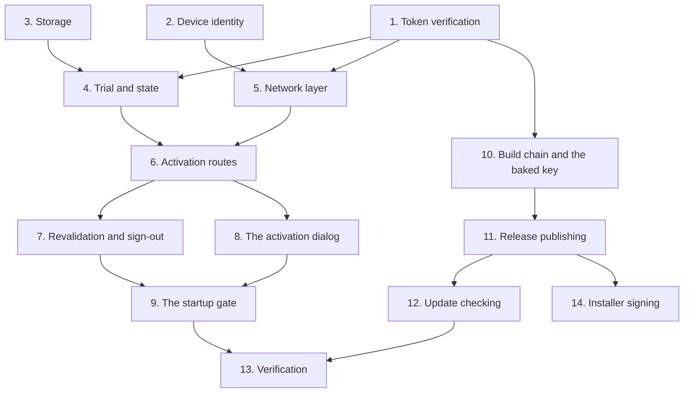

# Implementation Plan

## Overview

Built inside out: verification first, because everything else stores its result; then device identity and
storage; then the trial and the state read; then the network layer; then the routes; then the gate; then
the build chain that bakes the key into an installer.

The verification step came before any network work on purpose. A token that verifies locally is what makes
offline use possible, and if that had turned out to be impractical the whole shape would have changed.

Four items are recorded as **shipped defects found in production**, each marked with the release it was
fixed in rather than folded into the task that introduced it. All four were silent, and the reason each was
silent is the useful part.

Status reconstructed from `SHELL_AND_CHAT.md` §5 and the module contract. Original item IDs are preserved
so each can be grepped against that document.

## Task Dependency Graph



Task 10 hangs off task 1 rather than off the whole feature, because the baked public key is what
verification reads and the build script's key-presence report is what stops a keyless installer shipping.

```json
{
  "waves": [
    {
      "wave": 1,
      "tasks": ["1", "2", "3"],
      "rationale": "Verification, device identity and storage share nothing and gate everything else. Verification comes first in this wave because if local verification were impractical the whole offline design would change."
    },
    {
      "wave": 2,
      "tasks": ["4", "5", "10"],
      "rationale": "The trial and state read need verification and storage; the network layer needs verification and the device identifier; the build chain needs only the key format."
    },
    {
      "wave": 3,
      "tasks": ["6", "11"],
      "rationale": "The activation routes compose the network layer and the state read. Release publishing follows the build chain."
    },
    {
      "wave": 4,
      "tasks": ["7", "8", "12"],
      "rationale": "Revalidation, the dialog and the update checker all build on wave 3 and are independent of each other."
    },
    {
      "wave": 5,
      "tasks": ["9"],
      "rationale": "The gate composes the state read and the dialog, and must be placed before the hotkey listener and the microphone."
    },
    {
      "wave": 6,
      "tasks": ["13"],
      "rationale": "Full suite, selftest, the cross-language contract test, and the seven manual checks against the live service on real machines."
    },
    {
      "wave": 7,
      "tasks": ["14"],
      "rationale": "Not built. Depends on the release workflow existing, because signing belongs in the workflow rather than on a developer machine. Blocked on buying a certificate, which is the only item here whose blocker is cost."
    }
  ]
}
```

## Tasks

- [ ] 1. Token verification (`S-10`)
- [ ] 1.1 Define the token as a base64url payload and signature separated by one dot
  - Deliberately not a standard web token: the standard brings algorithm negotiation with it, and
    algorithm negotiation is where those libraries get broken. One algorithm, no header, nothing to
    negotiate
  - _Requirements: 2.1, 2.2_
- [ ] 1.2 Verify against a public key embedded in the build, so verification needs no network
  - _Requirements: 2.3_
- [ ] 1.3 Fail closed with no configured key, and reconstruct base64 padding on decode
  - The halves are stored unpadded
  - _Requirements: 2.6, 2.10_
- [ ] 1.4 Raise on any suspect input, with a message fit to show a user
  - A tampered token is indistinguishable from a corrupt one from here, and both mean "do not trust"
  - _Requirements: 2.8, 2.9_
- [ ] 1.5 Reject claims that do not decode to a mapping
  - _Requirements: 2.11_
- [ ] 1.6 Resolve the key from the environment first, then the baked constant
  - Environment first so the test suite can sign with a throwaway key; baked second so a shipped
    installer needs no configuration
  - _Requirements: 2.3_
- [ ] 1.7 Keep the private half out of the repository, and add the test that asserts it
  - It is never committed, never sent to a client, and exists only in the licence service's environment.
    The consequence of getting this wrong once is unrecoverable
  - _Requirements: 2.4, 2.5_
- [ ] 1.8 Record the honest position in the module docstring
  - This **deters** casual sharing and does not prevent a determined user from patching the check out of
    a frozen bundle; no client-side check can. The alternative — proxying inference — would end
    bring-your-own-key and contradict a recorded non-goal
  - State the three optimisation targets in order: honest use is never inconvenienced, seat abuse
    is visible and revocable, offline use keeps working
  - Record obfuscation and per-launch phone-home as non-goals, each with its reason
  - _Requirements: 1.1, 1.2, 1.3, 1.4, 1.5_

- [ ] 2. Device identity
- [ ] 2.1 Build the identifier as a salted hash of three values, truncated
  - Never a raw hardware identifier. The reason is custodial: a raw value is a fingerprint that
    correlates across every service that receives it, and collecting one makes us responsible for it. A
    salted hash is stable enough to bind a seat to and useless for anything else
  - _Requirements: 3.1, 3.2, 3.3_
- [ ] 2.2 Read the installation identifier from the operating system's own registry value
  - Not a hardware serial, and suppress the console window so a windowed build does not flash a terminal
  - _Requirements: 3.4, 3.8_
- [ ] 2.3 Include the volume serial, which changes on a reformat
  - _Requirements: 3.5_
- [ ] 2.4 Fall back to the hostname when both lookups fail, and to a sentinel when nothing is available
  - Weakens the binding on an unusual machine rather than blocking a legitimate user, which is the right
    way round
  - _Requirements: 3.6, 3.7_

- [ ] 3. Storage
- [ ] 3.1 Store in the per-user credential store as the primary location
  - Already a dependency, already encrypted per user, and a licence file on disk is trivially copied
    between machines
  - _Requirements: 4.1, 4.2_
- [ ] 3.2 Measure the credential store's real ceiling and fall back to a file above it
  - Measured: it accepted one kilobyte and **refused two**. A signed token is a few hundred bytes, so the
    store is primary and the file is the safety net. A licence that fails to persist means the tester
    re-activates on every launch
  - _Requirements: 4.3, 4.4, 4.5_
- [ ] 3.3 Read from the credential store first, then the file; clear both
  - _Requirements: 4.6, 4.7_
- [ ] 3.4 Swallow every storage failure and report success as a boolean
  - _Requirements: 4.8_

- [ ] 4. The trial and the state read
- [ ] 4.1 Make the trial a signed token on the same verification path
  - Differs only in its claims; the trial is not a special case in verification
  - _Requirements: 5.1_
- [ ] 4.2 Key the trial on the device identifier server-side
  - Where trial abuse is actually stopped. A local-only trial is defeated by deleting a file, and a new
    email address must not get a second trial on the same machine
  - _Requirements: 5.2_
- [ ] 4.3 Keep two independent first-run records, and take the earliest
  - Clearing one is a plausible accident; clearing both is not. Earliest-wins means restoring one does
    not hand back a fresh trial
  - Record the honest limit: this stops only the most casual reset, and the records exist so an offline
    first run still has a start date
  - _Requirements: 5.3, 5.4, 5.5_
- [ ] 4.4 Round day counts **up**, and clamp at the nominal period
  - Saying zero while the application runs is the kind of small dishonesty that makes someone distrust
    everything else on the screen. And a fresh install has just under the full period, which rounds up to
    one more than the promise — promising eight days of a seven-day trial is a worse first impression
    than it looks. Caught by a test rather than by a user
  - _Requirements: 6.1, 6.2, 6.3, 6.4_
- [ ] 4.5 Apply the same rounding to the token-derived count
  - Flooring made a freshly issued trial read one day short the moment it was granted, because the token
    expires in just under the nominal period. **Caught by driving the real client against the real
    service, not by a unit test** — a unit test with a hand-built token would have used a round number
  - _Requirements: 6.5_
- [ ] 4.6 Expose both a trial-specific and a kind-agnostic day count
  - The gate and the home page read the trial-specific one and mean "trial specifically", so widening it
    in place would have made an activated licence look like a trial to both
  - _Requirements: 6.6, 6.7_
- [ ] 4.7 Give account holders a countdown too
  - The page answered "what am I on" and not "how long have I got", and the second question is the one
    people open it for. Days rather than a bare date, because a relative figure needs no arithmetic
  - _Requirements: 6.8_
- [ ] 4.8 Make the state read total, and match the account page's declared shape field for field
  - So the page needs no change and the shell depends on a shape rather than on this module
  - _Requirements: 7.1, 7.2_
- [ ] 4.9 Clear an unverifiable token on read
  - A token we cannot verify is worse than none: the user is asked once rather than shown a broken state
    forever
  - _Requirements: 7.3_
- [ ] 4.10 Prefer a subscription over a trial
  - So a tester who activates mid-trial is not told they have three days left. Activating a subscription
    clears any trial token
  - _Requirements: 5.7, 5.8_
- [ ] 4.11 Report the offline grace only when it is meaningful
  - A permanent grace line is noise on a machine that has been online all week
  - _Requirements: 7.4_
- [ ] 4.12 Include the grace period in the run decision
  - The common reason for an expired token is a laptop that has not been online, not a lapsed card
  - _Requirements: 7.5, 7.6_
- [ ] 4.13 Vary the detail string by kind and by expiry
  - A lapsed subscription, an ended trial and a healthy licence each read differently
  - _Requirements: 7.7_

- [ ] 5. The network layer
- [ ] 5.1 Resolve the service address from the environment, then the baked constant, then a default
  - _Requirements: 9.1_
- [ ] 5.2 Accept a comma-separated list, with a single value behaving exactly as before
  - During development the real answer is both: the deployed site is what ships, and a local development
    server is what can be tested against before the domain exists. One value meant editing it back and
    forth, and forgetting to edit it back is how a shipped build ends up talking to a local address
  - Record why including a local address is safe: every token is signed and verified against the embedded
    key, so a local impostor achieves at most a refused activation. Ordering matters for **speed**, not
    safety
  - _Requirements: 9.2, 9.3, 9.4_
- [ ] 5.3 Advance to the next candidate **only** on unreachability
  - Retrying a *rejection* against a second service would turn one wrong password into two attempts
    against two rate limiters, and would let a fallback overrule a real answer from the primary
  - _Requirements: 9.5, 9.6, 9.7_
- [ ] 5.4 Use a short timeout
  - Activation is interactive, and a hung request reads as a broken application
  - _Requirements: 9.11_
- [ ] 5.5 Distinguish a server error from a rejection, and reject a non-mapping body
  - _Requirements: 9.12, 9.13_
- [ ] 5.6 **Follow redirects** — shipped defect, found in production
  - The client does not follow redirects by default, and that default broke every licence operation the
    moment the site went live: the host redirected the apex to a subdomain with a permanent redirect, the
    client saw a non-JSON body reading "Redirecting…", and every activation failed with an unhelpful
    message about an unexpected response
  - The severity is what makes this structural: the service address is **baked into shipped installers**,
    so it cannot be corrected for anyone who already has one. A licence client that breaks on a redirect
    is a client a future hosting change can brick in the field
  - Add the regression test against a **redirecting fixture**, not a mock returning the final response —
    a mock would pass with the defect present
  - _Requirements: 9.8, 9.9, 9.10_

- [ ] 6. Activation routes
- [ ] 6.1 Activate by licence key
  - _Requirements: 10.1_
- [ ] 6.2 Activate by the email and password the tester registered with
  - "Where is my licence key" is the most predictable support question a desktop application with accounts gets,
    and "check your email from three weeks ago" is not an answer. The tester already has an account, because registration creates one
  - The password is used once and **never stored**: the service returns the licence key alongside the
    token, and that key is what gets cached for revalidation. The outcome is identical to the key route,
    so nothing downstream can tell which was used
  - The seat limit is the same check either way, because the server binds the machine's salted hash. A
    login count would have been the wrong mechanism: signing out would defeat it, and a hardware seat
    cannot be
  - _Requirements: 10.2, 10.3, 10.4, 10.5, 10.6, 10.7_
- [ ] 6.3 Register from inside the application, then verify a code that also starts the trial
  - One call, because from the user's side it is one action: they type six digits and Nimbus starts
    working. Splitting them would give the flow two ways to fail halfway, and a verified account with no
    trial is a support conversation nobody wants to have
  - The server decides what comes back, so an account that already has a subscription gets a subscription
    token rather than a trial
  - _Requirements: 10.8, 10.9, 10.10_
- [ ] 6.4 Record the anonymous-to-identified trial trade honestly
  - A device hash stops a second trial and is useless for everything else: nobody to email when a trial
    is ending, nobody to answer "I registered, where is my key", and no way to reach a tester who
    stopped using it to ask why
  - What it costs the user is one email address and six digits typed into a window already open and asking
    for them. What it does not cost them is a card, or any of the days
  - _Requirements: 10.11, 10.12_
- [ ] 6.5 Add the browser signup route as an escape hatch
  - Not the main road. For an address that already has a subscription, a password needing a reset, or
    someone who does not want to type a new password into a desktop window they met a minute ago
  - _Requirements: 10.13_
- [ ] 6.6 Verify the returned token **before** storing it, on every route
  - A service returning an unsigned or wrongly signed token would otherwise poison the cache, and the
    failure would surface later as an unexplained lockout rather than here, where there is a dialog to
    show it in
  - _Requirements: 10.14_
- [ ] 6.7 Validate input before any request
  - A non-empty key, an address containing an at sign, a minimum password length, a minimum digit count
  - _Requirements: 10.15_

- [ ] 7. Revalidation, sign-out and seat release
- [ ] 7.1 Revalidate on a fixed interval, silently
  - Not on every launch: that makes startup depend on the licence service's uptime
  - _Requirements: 8.1, 8.2, 8.9_
- [ ] 7.2 **Never** clear a good licence because the network was down
  - That is the difference between a revalidation and a lockout, and getting it wrong means an outage on
    our side becomes an outage on the tester's. Only an explicit refusal — a revoked key, a seat limit
    — clears the cache, and that arrives as a client-error status
  - _Requirements: 8.3, 8.4, 8.5, 8.6, 8.7_
- [ ] 7.3 Make revalidation a no-op with no cached key
  - _Requirements: 8.8_
- [ ] 7.4 Clear the licence, key, trial token and last-validated record on sign-out
  - And leave the first-run record alone, because signing out is not a way to restart the trial clock
  - _Requirements: 11.1, 11.2_
- [ ] 7.5 Release the seat, clearing locally **even if the service call fails**
  - The user asked to sign this machine out, and leaving a working licence behind because a request timed
    out would be the wrong answer to a deliberate action. The seat is reclaimed by the next revalidation
    from the server side. Report whether the service acknowledged, so the interface can be honest
  - _Requirements: 11.3, 11.4, 11.5_
- [ ] 7.6 Re-run the gate after an in-application sign-out — shipped defect
  - Sign-out previously did nothing observable. Raise a signal and re-run the gate through a **deferred**
    single-shot timer rather than inline: the signal originates in a widget's own handler, and re-entering
    a modal flow from there is not safe
  - _Requirements: 11.6, 11.7, 11.8_

- [ ] 8. The activation dialog
- [ ] 8.1 Build the modal, blocking flow with retry, offline, register, sign in and start trial
  - Never silently degrade: a legitimate user must never be left guessing
  - _Requirements: 12.3, 12.4_
- [ ] 8.2 Show the trial's day count and the plan detail from the state, not from constants
  - _Requirements: 6.8_

- [ ] 9. The startup gate
- [ ] 9.1 Place the gate after the application object and **before** the listener and the microphone
  - An unlicensed instance should consume no devices and register no global hooks
  - _Requirements: 12.1, 12.2_
- [ ] 9.2 Extract the gate into its own function with **all imports local to it** — shipped defect
  - The worst defect in this feature. A module was referenced but not imported, producing a name error
    that a blanket exception handler swallowed — in a windowed build with no console, so nothing anywhere
    reported it. **The gate never ran at all.** The application started unlicensed and looked completely
    normal
  - _Requirements: 12.5, 12.6, 12.7_
- [ ] 9.3 Catch any gate exception, record it to a **file**, and start anyway
  - Refusing to run because the licence is invalid is correct; refusing to run because *our check crashed*
    is not. A file because there is no console in a frozen windowed build, which is exactly why the
    original defect was invisible
  - _Requirements: 12.8, 12.9, 12.10_
- [ ] 9.4 Add the regression test that injects an exception at each import and call inside the gate
  - Asserting the application still starts and a record lands on disk
  - _Requirements: 12.8, 12.9_
- [ ] 9.5 Add the static assertion that the gate call precedes the listener and the microphone
  - The ordering is the whole point of having a gate
  - _Requirements: 12.1_

- [ ] 10. Build chain and the baked key
- [ ] 10.1 Write the build-time constants into a generated, git-ignored module
  - Public half only, plus the service address
  - _Requirements: 13.1, 13.2, 13.3_
- [ ] 10.2 Treat a missing generated module as normal, and never raise reading a baked constant
  - That is a development checkout, and the environment variable covers it
  - _Requirements: 13.4, 13.5_
- [ ] 10.3 Let the environment override the baked constant
  - So the test suite can sign with a throwaway key and a staging service needs no rebuild
  - _Requirements: 13.6_
- [ ] 10.4 Make the build script report whether a key is present
  - Rather than leaving its absence to be discovered by the first person who tries to activate
  - _Requirements: 2.7_
- [ ] 10.5 Add the tool that issues a licence locally
  - So the activation path can be exercised without the live service
  - _Requirements: 13.7_
- [ ] 10.6 Verify the produced bundle rather than assuming it
  - Including that the licence modules are present
  - _Requirements: 13.8_
- [ ] 10.7 Register every lazily imported module in **both** the bundler list and the selftest list
  - A module behind a default-off toggle is invisible to the bundler's static graph *and* to the
    selftest, so it fails first in a user's frozen build
  - _Requirements: 13.9_
- [ ] 10.8 Write no auto-start entry in the installer
  - No run key, no startup shortcut. Which is why the shell window defaults to opening: every launch is a
    person double-clicking a shortcut, and the only useful answer to that is to appear
  - _Requirements: 14.7_
- [ ] 10.9 Point the installer's update link at the releases page, not a website path
  - It was `{AppURL}/releases`, and the site has no such route and no rewrite for one — so the "check
    for updates" link in Windows' own settings was a 404 for every installed copy
  - _Requirements: 14.8_

- [ ] 11. Release publishing
- [ ] 11.1 Publish installers to a repository readable without credentials
  - This one: releases sit beside the commits they describe, so `--generate-notes` produces a changelog
    about the build it is attached to, there is one place a reviewer has to look, and no token spanning
    repositories to maintain
  - _Requirements: 14.1, 14.2_
- [ ] 11.2 Use the platform-injected token rather than a stored secret
  - And **no** empty-credential guard beside it: the injected token cannot be absent, so a check for it
    would be dead code, and a guard that can never fire reads as though the case is handled
  - _Requirements: 14.3_
- [ ] 11.3 Check the exit status of every publishing call
  - _Requirements: 14.4_
- [ ] 11.4 Read the published asset list back and confirm the installer is present
  - A publish step that reports success while uploading nothing is indistinguishable from a working
    release until someone tries to download
  - _Requirements: 14.5, 14.6_

- [ ] 12. Update checking
- [ ] 12.1 Point the check at a repository readable with no credentials — shipped defect
  - A target that cannot be read anonymously returns a not-found status, and that was interpreted as
    "you are up to date" — so every user was silently told there were no updates, forever
  - The target is baked into every installer, so a wrong value is not correctable for anyone who
    already has one
  - _Requirements: 15.1, 15.2, 15.3, 15.4_
- [ ] 12.2 Keep the version comparison a pure function
  - Testable without a network
  - _Requirements: 15.5_
- [ ] 12.3 Keep a failed check silent and non-blocking
  - _Requirements: 15.6_

- [ ] 13. Tests and verification
- [ ] 13.1 Full suite green with the dotenv neutralisation, zero regressions
- [ ] 13.2 `--selftest` prints `SELFTEST OK`, with every licence module in the runtime list
- [ ] 13.3 Set an explicit maximum memory parameter on the server-side password hash — shipped defect
  - The chosen parameters need roughly 64 megabytes and the runtime's default cap is roughly 32, so the
    call threw on **every** password until the limit was raised. The measured cost per hash is recorded,
    so the parameter choice is a known trade rather than a guess. Both the hash and verify paths use the
    same parameters, or verification would fail against every stored hash
  - _Requirements: 16.1, 16.2, 16.3, 16.4_
- [ ] 13.4 Cross-language contract test on the token bytes
  - Sorted keys, no whitespace, no base64 padding. The two halves are written in different languages and
    cannot share a serialiser
- [ ] 13.5 Manual: activate with a key on a clean machine
- [ ] 13.6 Manual: activate the same key on a second machine, confirm the seat count moves
- [ ] 13.7 Manual: activate on a third machine, confirm refusal
- [ ] 13.8 Manual: disconnect the network, confirm Nimbus still starts
- [ ] 13.9 Manual: advance past the grace period, confirm it stops
- [ ] 13.10 Manual: sign out, confirm the gate reappears
- [ ] 13.11 Manual: register, receive the code, verify, confirm the trial reads the full period
- [ ] 13.12 Write the tests for this feature - 134 declared functions
  - `tests/test_licensing.py` (68) - token verification, both day-rounding defects, and every failure decision
  - `tests/test_activation_dialog.py` (32) - the modal flow, its retry and its offline path
  - `tests/test_config_keyring.py` (30) - credential-store round-trips and the measured size ceiling
  - `tests/test_updates.py` (4) - the pure version comparison, and that the public repository is queried
  - Each test written **failing first**, and any changed expectation carries a comment
    saying why, or a real regression gets laundered into a green suite
  - _Requirements: 1.1-16.4_

- [ ] 14. Installer signing (`T4-8`)
- [ ] 14.1 Obtain a code-signing certificate and record what it cost
  - **The blocker, and it is money rather than a decision.** Every other open item in this repository
    is waiting on a measurement or a judgement; this one is waiting on a purchase
  - _Requirements: 17.1, 17.2_
- [ ] 14.2 Sign in the release workflow, not on a developer machine
  - So a release cannot go out unsigned by someone forgetting a step
  - _Requirements: 17.3_
- [ ] 14.3 Hold the credential as a workflow secret, never in the repository
  - Same rule that already governs the licence signing key
  - _Requirements: 17.4_
- [ ] 14.4 Fail the workflow loudly when the credential is absent
  - Requirement 14's rule applies unchanged: a publish step that reports success while doing the wrong
    thing is indistinguishable from a working release
  - _Requirements: 17.5_
- [ ] 14.5 Read the signature back off the published asset
  - The existing verification already reads the asset list back. Extend it rather than trusting the
    signing step's own exit code
  - _Requirements: 17.6_
- [ ] 14.6 Run the bundle verification **after** signing
  - Signing rewrites the file, so a check that only ran before it proves nothing about what a user
    downloads
  - _Requirements: 17.7_
- [ ] 14.7 Keep the unsigned local build working and label it as unsigned
  - Development must not depend on a paid credential
  - _Requirements: 17.8_

## Notes

**Task 14 is the only open item in this spec, and it is the cheapest kind of blocked.** No design
question is unresolved: signing belongs in the workflow, the credential is a secret, and the check reads
the signature back. It is `[ ]` because a certificate has not been bought. Worth being clear about the
cost of leaving it: an unsigned installer makes SmartScreen warn every person who downloads it, and a
warning shown to someone who has never heard of Nimbus is where most of them stop.

**Four defects here shipped and were found in production, and all four were silent.** They are recorded as
their own task items rather than folded into the work that introduced them, because the reason each was
invisible is the transferable lesson:

| Task | Defect | Why it was silent |
|---|---|---|
| 9.2 | The gate never ran | A name error swallowed by a blanket handler, in a windowed build with no console |
| 5.6 | Every licence call failed | An HTTP client default that only matters once a real host is involved |
| 12.1 | Every user "up to date" forever | A not-found status read as a successful "no newer release" |
| 13.3 | Registration always failed | A memory limit left at a default below what the parameters need |

**Where the next work goes.** A new activation route belongs in task 6 and must verify before storing, like
the other four. A new stored blob belongs in task 3 and must be added to the sign-out list — **except** the
first-run record, which must never be. A new claim consumed from a token belongs in the state builder with a
default, so an older service can still activate a newer client.

**Three things must not drift.** Revalidation must never clear on anything but a client-error refusal,
because that is the line between a check and a lockout. The gate must keep every import local to itself,
because that is the fix for the defect that made it never run. And every lazily imported module must stay in
both registration lists, because the frozen build is the only place that gap shows up and the tester is
the one who finds it.

**The redirect regression test must use a real redirecting fixture.** A mock that returns the final
response passes with the defect present, which makes it worse than no test.
