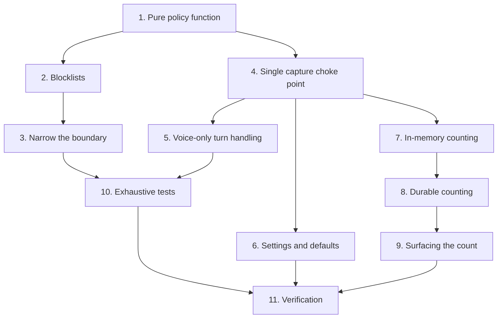

# Implementation Plan

## Overview

Policy first, mechanism second, counting third. Writing the pure function before touching the capture
path meant the whole blocklist could be tested exhaustively before any pixel handling changed — which
is the right order for a feature whose failure mode is *silent*.

The counting work came later and in two stages: in-memory first, then durable, because the in-memory
version shipped and then read wrong. `T2-1` closed with Tier 2 on 2026-08-12, on by default; the
durability fix landed with the shell work. Original task IDs are preserved.

## Task Dependency Graph



```json
{
  "waves": [
    {
      "wave": 1,
      "tasks": ["1"],
      "rationale": "The pure decision function, with no I/O and no dependency on the capture path. Everything else consumes it."
    },
    {
      "wave": 2,
      "tasks": ["2", "4"],
      "rationale": "The blocklists and the capture choke point are independent: one is data, the other is where the policy gets called."
    },
    {
      "wave": 3,
      "tasks": ["3", "5", "6", "7"],
      "rationale": "Narrowing the patterns, handling a voice-only turn, wiring the settings, and counting in memory all attach to what wave 2 built."
    },
    {
      "wave": 4,
      "tasks": ["8"],
      "rationale": "Durable counting replaces the in-memory version once there is something to make durable."
    },
    {
      "wave": 5,
      "tasks": ["9", "10"],
      "rationale": "Surface the number in the interface, and write the exhaustive table tests."
    },
    {
      "wave": 6,
      "tasks": ["11"],
      "rationale": "Full suite, and manual verification with a real password manager in front."
    }
  ]
}
```

## Tasks

- [x] 1. The pure policy function
- [x] 1.1 Write the decision function with no I/O, no clock and no global state
  - Lists arrive as parameters with defaults, so the function never learns that settings exist
  - _Requirements: 1.1, 1.2, 1.3_
- [x] 1.2 Put the policy in its own module, separate from the capture code
  - Mixing them would put a blocklist inside the highest-risk geometry code in the project
  - _Requirements: 1.4_
- [x] 1.3 Order the checks: enabled, then application name, then window title
  - _Requirements: 1.5, 1.6_
- [x] 1.4 Fail open on the unknown sentinel and on an empty name, with the reasoning in the module
  - Detection fails transiently during window transitions, on elevation prompts, and against elevated
    processes. Failing closed would make Nimbus stop working at random and users would experience a
    privacy feature as breakage
  - _Requirements: 2.1, 2.2, 2.3, 2.4_
- [x] 1.5 Keep reason strings user-presentable, with no regex, path or executable name in them
  - The toast is on screen and may itself be captured in a screenshot or a recording
  - _Requirements: 9.6_

- [x] 2. The blocklists
- [x] 2.1 Build the application list from the machine, not from memory
  - Three entries verified by enumerating the uninstall registry and the install directory rather than
    guessed; the rest are standard basenames, marked as unverified in the source. A non-matching entry
    is inert, and the cost of omitting a real password manager is far higher than an unused list entry
  - _Requirements: 3.1, 3.2_
- [x] 2.2 Match application names by exact lowercase basename
  - _Requirements: 3.1_
- [x] 2.3 Write the title patterns in four labelled groups
  - Authentication, finance, secret-bearing filenames, private browsing
  - _Requirements: 3.3, 3.4_
- [x] 2.4 Match titles case-insensitively as a search
  - _Requirements: 3.5_
- [x] 2.5 Make user lists additive to the defaults
  - So pinning one extra application cannot accidentally discard the built-in list
  - _Requirements: 3.6_
- [x] 2.6 Discard an invalid user pattern and keep the rest
  - These lists are user-editable, and one bad expression must degrade the guard rather than break
    capture on every interaction
  - _Requirements: 3.7_

- [x] 3. Narrow the boundary
- [x] 3.1 Replace the bare word match for "password" with three context-aware patterns
  - **Caught by the new tests before shipping.** A bare match suppressed any documentation page or blog
    post merely mentioning passwords — exactly the kind of page Nimbus is most useful for
  - Title-initial position, a credential-verb prefix, and a vault-noun suffix
  - _Requirements: 4.1, 4.2, 4.3_
- [x] 3.2 Fix the environment-file pattern to catch the extension after a filename
  - **Also caught by the new tests.** The pattern missed a configuration file carrying the extension.
    The literal dot is what keeps it tight: after the three letters, the word boundary fails against
    the next character of "environment"
  - _Requirements: 4.4, 4.5_
- [x] 3.3 Write a must-not-suppress table alongside the must-suppress table
  - A guard tested only for what it catches has not been checked for what it wrongly catches
  - _Requirements: 4.6_

- [x] 4. The single capture choke point
- [x] 4.1 Collapse every capture call site into one guarded helper
  - The audit said two sites; verification found **three**, and a fourth arrived later. That is the
    argument for one helper rather than applying the gate by hand at each site
  - _Requirements: 5.1, 9.1, 9.2, 9.3, 9.5_
- [x] 4.2 Evaluate the guard against the application recorded at press time
  - By the time a capture thread runs the foreground window may have changed, and the decision must be
    about the window the user was looking at when they asked
  - _Requirements: 8.1, 8.2_
- [x] 4.3 Skip the overlay hide-and-show cycle entirely on a suppression
  - No flicker for a capture that is not happening
  - _Requirements: 6.7_
- [x] 4.4 Restore the overlay in a `finally` on the permitted path
  - _Requirements: 6.7_
- [x] 4.5 Extend the guard to the re-point path
  - Re-pointing must not become a way to photograph a password manager
  - _Requirements: 9.4_

- [x] 5. Voice-only turn handling
- [x] 5.1 Return an empty list rather than raising, and document that it is not an abort
  - The user asked a question and deserves an answer even if Nimbus must answer it blind
  - _Requirements: 6.1, 6.2_
- [x] 5.2 Tell the model plainly that the screen was withheld
  - Otherwise it answers as though it can see and describes a screen it was never shown
  - _Requirements: 6.3_
- [x] 5.3 Discard any coordinate returned on a suppressed turn
  - A model given no image can still emit one; placing a pointer from it would be pure invention
  - _Requirements: 6.4_
- [x] 5.4 Discard annotations while still stripping their tags from the spoken text
  - _Requirements: 6.5_
- [x] 5.5 Skip the grid locator on a suppressed turn
  - _Requirements: 6.6_
- [x] 5.6 Toast the reason and state that the question is being answered without the screen
  - _Requirements: 6.8_

- [x] 6. Settings and defaults
- [x] 6.1 Default the guard to on, and record the deviation with its justification
  - The one deliberate exception to "a new setting must reproduce current behaviour": here the current
    behaviour is the defect, not a preference
  - _Requirements: 7.1, 7.2_
- [x] 6.2 Persist an explicit on or off rather than deleting the key
  - This setting defaults on, so treating absent as off would silently disable a privacy feature the
    user believes is active
  - _Requirements: 7.4_
- [x] 6.3 Add the two extension settings, and mark all three restart-required
  - _Requirements: 3.6_
- [x] 6.4 Include all three in the local-data wipe, restoring the on default
  - A wipe must not silently weaken privacy
  - _Requirements: 7.3_
- [x] 6.5 Add the Privacy group to the Settings form with its explanation
  - _Requirements: 7.1_

- [x] 7. In-memory counting
- [x] 7.1 Count a suppression once, at the choke point
  - _Requirements: 5.1, 5.2_
- [x] 7.2 Trim the in-memory list to the reporting window
  - _Requirements: 5.5_

- [x] 8. Durable counting
- [x] 8.1 Add the suppressions table to the existing database, purely additively
  - That database already exists, is already in the right folder, and is already pruned
  - _Requirements: 5.3_
- [x] 8.2 Record durably inside a try/except at the choke point
  - A counter must never cost the user their answer
  - _Requirements: 5.4_
- [x] 8.3 Read the count for a rolling seven-day window, in-memory as the fallback
  - **Why this was needed:** the in-memory version meant the card said "this week" while counting only
    since the last restart — a label wrong most of the time it was read, since Nimbus is left running
    for a day and restarted the next. A trust-building number that resets to zero undermines the thing
    it exists to build
  - _Requirements: 5.3, 5.5_

- [x] 9. Surfacing the count
- [x] 9.1 Show the count on the Home page
  - _Requirements: 5.6_
- [x] 9.2 Render a placeholder rather than zero when the count cannot be read
  - An unmeasured zero is a false claim, and this is the number whose whole value is being an
    observation
  - _Requirements: 5.7_
- [x] 9.3 Add the always-visible state indicator to the navigation rail
  - _Requirements: 5.8_
- [x] 9.4 Use the danger colour when the guard is off, not a gentler warning colour
  - Amber was the earlier, politer choice and it was wrong: with the guard off every question captures
    whatever is in front, including a password manager, and that is the one thing here worth being
    blunt about. The tooltip says what it means and where to change it, so it informs rather than nags
  - _Requirements: 5.9_

- [x] 10. Exhaustive tests
- [x] 10.1 Assert the must-suppress and must-not-suppress tables
  - _Requirements: 4.6_
- [x] 10.2 Assert the function is pure
  - _Requirements: 1.1_
- [x] 10.3 Assert every default application entry is lowercase
  - An uppercase entry could never match, so it would be a silent gap
  - _Requirements: 3.1_
- [x] 10.4 Assert every default title pattern compiles
  - A pattern that cannot compile protects nothing
  - _Requirements: 3.3_
- [x] 10.5 Assert graceful degradation in both directions for malformed user patterns
  - _Requirements: 3.7_
- [x] 10.6 Assert reason strings are safe to display
  - _Requirements: 9.6_
- [x] 10.7 Integration: a suppressed turn answers, emits no coordinate, writes no screenshot
  - _Requirements: 6.1, 6.2, 6.4_
- [x] 10.8 Assert the re-point path respects the guard
  - _Requirements: 9.4_

- [x] 11. Tests and verification
- [x] 11.1 Full suite green with the dotenv neutralisation, zero regressions
- [x] 11.2 `--selftest` prints `SELFTEST OK`
- [x] 11.3 Manual: real password manager in front — toast appears, answer is spoken, no screenshot
      in the diagnostics folder, Home count increases
- [x] 11.4 Manual: guard off restores the previous behaviour exactly
- [x] 11.5 Write the tests for this feature - 289 declared functions
  - `tests/test_privacy.py` (33) - the pure policy exhaustively, including BOTH the must-suppress and must-NOT-suppress tables
  - `tests/test_app.py` (114) - the single guarded capture choke point and the voice-only branch
  - `tests/test_integration.py` (87) - a suppressed turn still answers, emits no coordinate, writes no image
  - `tests/test_sessions.py` (55) - the suppression check ordered FIRST among the screenshot refusals
  - Each test written **failing first**, and any changed expectation carries a comment
    saying why, or a real regression gets laundered into a green suite
  - _Requirements: 1.1-9.6_

## Notes

**The two bugs this feature's own tests caught before it shipped** are the reason the must-not-suppress
table exists. A guard that over-blocks is not "safe" — it disables the product on exactly the pages it
is most useful for, and it does so invisibly.

**The related invariant lives in another spec.** A privacy-suppressed screenshot must never be written
to disk, and that is enforced in the chat session store as its first refusal, checked before the
settings check. See `.kiro/specs/chat-hud/`. It is stated there rather than here because that is where
the code is, but it is part of this feature's promise: writing those pixels would quietly undo the
guard while the user believes they are protected.

**When extending the blocklists.** Add to the correct labelled group, add a row to **both** test tables,
and prefer a narrow pattern with context over a broad word match. If a new pattern cannot be written
narrowly, that is a signal it should be an application-name entry instead.
