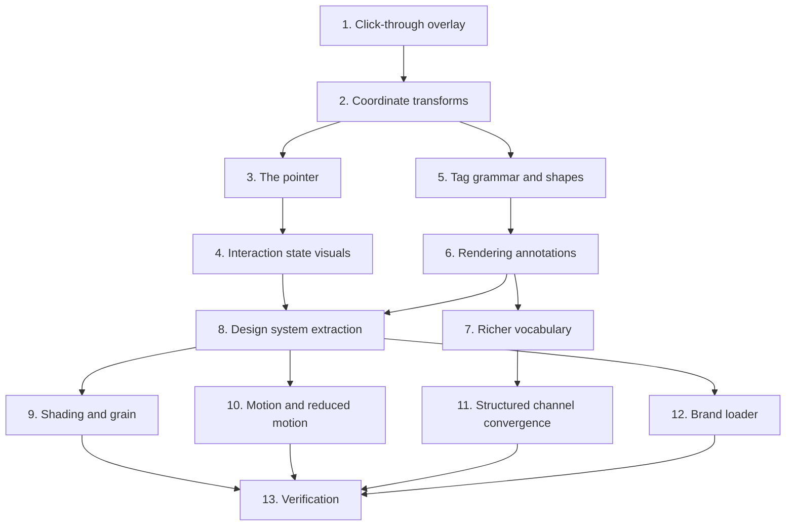

# Implementation Plan

## Overview

The overlay came first and has been the highest-risk area of the codebase since — click-through,
per-monitor DPI and per-frame painting all fail in ways that are invisible on a single-monitor
development machine. Annotations were layered on top of it in two stages: the text-tag channel for
every provider, then the structured channel and the richer vocabulary. The design system was extracted
last, from three surfaces that had already drifted apart.

`T3-5` (richer annotations) closed 2026-08-17. The design system landed with the shell work. Original
task IDs are preserved so each item can be grepped against `IMPROVEMENTS.md` and `SHELL_AND_CHAT.md`.

## Task Dependency Graph



Task 8 comes after 4 and 6, not before: the design system was **extracted** from surfaces that already
existed and had already drifted, which is why the extraction found a false claim in its own design
document.

```json
{
  "waves": [
    {
      "wave": 1,
      "tasks": ["1", "5"],
      "rationale": "The window and its Win32 styles, and the pure shape grammar. Independent: one is a window, the other is regex over text."
    },
    {
      "wave": 2,
      "tasks": ["2"],
      "rationale": "Coordinate transforms need the window's per-screen model to exist, and everything visual needs them."
    },
    {
      "wave": 3,
      "tasks": ["3", "6"],
      "rationale": "The pointer and the annotation renderer both consume the transforms and do not touch each other."
    },
    {
      "wave": 4,
      "tasks": ["4", "7"],
      "rationale": "Interaction-state visuals extend the pointer; the richer vocabulary extends the renderer."
    },
    {
      "wave": 5,
      "tasks": ["8"],
      "rationale": "Extract the design system from three surfaces that had drifted. Has to come after they exist."
    },
    {
      "wave": 6,
      "tasks": ["9", "10", "11", "12"],
      "rationale": "Shading, motion, structured-channel convergence and the brand loader all consume the design system and are independent of one another."
    },
    {
      "wave": 7,
      "tasks": ["13"],
      "rationale": "Full suite, selftest, and visual review on real hardware including a mixed-DPI pair."
    }
  ]
}
```

## Tasks

- [ ] 1. Click-through overlay
- [ ] 1.1 Create one frameless always-on-top window per physical monitor
  - A single spanning window renders wrong on mixed DPI; per-monitor is what makes the
    "islands of screens" case correct
  - _Requirements: 1.1, 1.7_
- [ ] 1.2 Apply the Win32 extended styles after `show()`, OR-ing rather than assigning
  - The native handle does not exist before `show()`; assigning would wipe the toolkit's own flags
  - _Requirements: 1.2, 1.3_
- [ ] 1.3 Force a frame recalculation so the style change takes effect immediately
  - Without it the new styles do nothing until the window is resized or moved
  - _Requirements: 1.4_
- [ ] 1.4 Raise on style-change failure, including the Win32 error detail
  - _Requirements: 1.5_
- [ ] 1.5 Use window attributes for transparency, never a stylesheet or a window opacity
  - Stylesheet transparency is the primary flicker source on Windows 11; a sub-one opacity forces the
    toolkit's own layered path and overrides the styles just applied
  - _Requirements: 1.6, 1.8_
- [ ] 1.6 Pin the bit pattern with a test asserting both the expression and the literal
  - _Requirements: 1.3_

- [ ] 2. Coordinate transforms
- [ ] 2.1 Write the physical-to-local-logical transform using the per-screen ratio
  - _Requirements: 2.1_
- [ ] 2.2 Match a monitor descriptor to a screen by physical geometry, primary as fallback
  - _Requirements: 2.2_
- [ ] 2.3 Write the shape transform: positions transform, lengths only scale
  - _Requirements: 2.3, 2.4_
- [ ] 2.4 Keep both transforms pure so they test with no toolkit
  - _Requirements: 2.6_
- [ ] 2.5 Test at 100% and 200% scaling, on primary and offset screens
  - _Requirements: 2.1, 2.2, 2.3_

- [ ] 3. The pointer
- [ ] 3.1 Trace the silhouette from the brand artwork with a tool, not by hand
  - Boundary tracing, simplification, tip normalised to the origin. Deriving it is what keeps the
    flying pointer and the logo from drifting; the aspect ratio and heel position are both wrong when
    guessed
  - _Requirements: 3.1, 3.2_
- [ ] 3.2 Implement the Bézier flight with a distance-scaled clamped duration
  - _Requirements: 3.3, 3.4_
- [ ] 3.3 Suppress tangent rotation; the tip stays on target through the flight
  - _Requirements: 3.5_
- [ ] 3.4 Drive position by eased progress and the scale pulse by linear progress
  - So the 1.3× peak lands at the true mid-arc rather than the eased midpoint
  - _Requirements: 3.6_
- [ ] 3.5 Apply the scale about the tip
  - _Requirements: 3.7_
- [ ] 3.6 Snap to the target and reset scale at completion
  - Defensive: the animation sometimes emits its final value slightly early
  - _Requirements: 3.8_
- [ ] 3.7 Fly back to the mouse after the dwell and resume spring-following it
  - _Requirements: 3.9_
- [ ] 3.8 Add the idle breathing pulse within a restrained range
  - _Requirements: 3.10_
- [ ] 3.9 Derive the fill's highlight and lower edge from the state accent
  - They were literals — a pale blue highlight and a navy edge — which is why the pointer still read
    as blue after the palette moved to orange
  - _Requirements: 7.2_
- [ ] 3.10 Stroke a black outline under the fill at a wider pen
  - White at high alpha was chosen when the pointer was blue; against a light accent it lowers
    contrast at the silhouette boundary and washes out on a light background
  - _Requirements: 3.1_

- [ ] 4. Interaction state visuals
- [ ] 4.1 Define one central state-to-accent mapping, sourced from the design system
  - _Requirements: 4.1_
- [ ] 4.2 Build the audio-reactive waveform with a dead zone and a non-flat floor
  - _Requirements: 4.2, 4.3, 4.4_
- [ ] 4.3 Build the thinking spinner with a comet tail
  - _Requirements: 4.5_
- [ ] 4.4 Keep the listening state green, and record why
  - Off-brand deliberately: recording indicators are green everywhere, and overriding a learned signal
    for palette tidiness costs the user certainty that the microphone is live
  - _Requirements: 4.6, 4.7, 4.8_
- [ ] 4.5 Enforce mutual exclusion between pointer, waveform and spinner
  - _Requirements: 4.9_

- [ ] 5. Tag grammar and shapes
- [ ] 5.1 Define the shapes as immutable value objects
  - _Requirements: 5.6_
- [ ] 5.2 Write case-insensitive, whitespace-tolerant regexes for each shape
  - The prompt asks for lowercase prose, so a lowercase tag must both parse **and** strip
  - _Requirements: 6.4_
- [ ] 5.3 Strip every complete tag from the spoken text
  - _Requirements: 6.5_
- [ ] 5.4 Add the fail-closed strip for an unterminated tag and everything after it
  - _Requirements: 6.6_
- [ ] 5.5 Centralise the keyword list so both patterns read from one source
  - The list was written twice; forgetting the second would let a truncated tag's coordinates be
    read aloud
  - _Requirements: 6.7_
- [ ] 5.6 Drop malformed tags silently rather than raising
  - _Requirements: 6.8_
- [ ] 5.7 Return shapes in order of appearance
  - _Requirements: 6.9_

- [ ] 6. Rendering annotations
- [ ] 6.1 Paint highlights in an unconditional first pass, before everything else
  - Not in list order: the model controls that order and must not be able to break the visual
  - _Requirements: 5.4_
- [ ] 6.2 Add the fade-in, hold and fade-out envelope before the automatic clear
  - _Requirements: 5.7_
- [ ] 6.3 Clear annotations at the start of every turn
  - So stale shapes never survive a no-speech, cancelled or errored previous turn
  - _Requirements: 5.8_
- [ ] 6.4 Route annotations to one overlay and clear the others
  - _Requirements: 2.2_

- [ ] 7. Richer vocabulary (`T3-5`)
- [ ] 7.1 Add the rectangle shape with a centre property
  - A real bounding box frames a control correctly, where a circle with a guessed radius either clips
    it or swallows its neighbours
  - _Requirements: 5.2_
- [ ] 7.2 Add the highlight shape with inverted geometry
  - Cheap here specifically because the overlay is already full-screen, per-monitor and click-through.
    On any other architecture this would be the expensive shape
  - _Requirements: 5.3_
- [ ] 7.3 Add the 1-based numbered step badge
  - _Requirements: 5.5_
- [ ] 7.4 Extend the tag grammar and the transform to all three
  - **This uncovered a latent bug**: the rectangle shape from the structured-geometry work was silently
    discarded by both coordinate transforms, so the box-drawing tool had never rendered anything. The
    parser produced the objects, the transform had no branch, and the loop dropped them without error
  - _Requirements: 2.5, 6.1_

- [ ] 8. Design system extraction
- [ ] 8.1 Define the five-step elevation ramp with a consistent tint
  - The extraction found the design document's original claim about tint direction was **false**; the
    ramp is cool because a cool neutral is the warm accent's complement, and the test asserts it
  - _Requirements: 7.3_
- [ ] 8.2 Define the spacing scale as the only permitted source of spacing
  - _Requirements: 7.4_
- [ ] 8.3 Define exactly one accent hue and its derived states
  - _Requirements: 7.5_
- [ ] 8.4 Write the contrast helpers and audit every text colour
  - Caught the muted colour at 3.49:1 against a 4.5:1 requirement — failing for exactly the small
    labels it was destined for. A second candidate missed at 4.46:1; both are named so neither is
    retried
  - _Requirements: 7.6_
- [ ] 8.5 Make the disabled colour deliberately fail, with a test saying so
  - _Requirements: 7.7_
- [ ] 8.6 Generate the stylesheet from the constants and assert no literal colour survives
  - _Requirements: 7.8_
- [ ] 8.7 Exclude the overlay from the stylesheet; have it consume constants directly
  - _Requirements: 7.9_
- [ ] 8.8 Re-theme the overlay's state palette through the design system
  - Was a one-dict change in the overlay; now a one-dict change in the design system, which is the
    right place for it
  - _Requirements: 4.1, 7.1, 7.2_

- [ ] 9. Shading and grain
- [ ] 9.1 Add the top-edge highlight to every raised surface
  - The single highest-impact technique: the difference between a card reading as an object and
    reading as a hole
  - _Requirements: 9.1_
- [ ] 9.2 Tint each elevation step rather than only lightening it
  - _Requirements: 9.2_
- [ ] 9.3 Add the ambient accent bloom, offset to zero, on static elements only
  - _Requirements: 9.3, 9.4_
- [ ] 9.4 Paint the bloom with a gradient on any surface that repaints per frame
  - _Requirements: 9.5_
- [ ] 9.5 Add the window-level noise overlay, varying alpha rather than colour
  - The first version varied colour and premultiplied, quantising to seven output levels — far too
    coarse to break banding, which is the texture's only job
  - _Requirements: 9.6, 9.7_
- [ ] 9.6 Fix the seed so the tile is byte-identical between runs
  - A grain layer that changed per launch would make screenshots and visual diffs useless
  - _Requirements: 9.8_
- [ ] 9.7 Make the overlay mouse-transparent, one instance per window
  - Verified by hit-testing a button's centre: without the flag the click resolves to the grain widget
  - _Requirements: 9.9_
- [ ] 9.8 Give cards no drop shadow
  - _Requirements: 9.10_

- [ ] 10. Motion and reduced motion
- [ ] 10.1 Define micro, standard, entrance and exit durations plus a cap
  - _Requirements: 8.1_
- [ ] 10.2 Make every exit faster than its entrance, and assert it
  - The most common mistake in hand-rolled motion: equal durations make dismissal feel sluggish
  - _Requirements: 8.2_
- [ ] 10.3 Prefer animating opacity and position over layout properties
  - _Requirements: 8.3_
- [ ] 10.4 Keep all animation on the main thread
  - _Requirements: 8.4_
- [ ] 10.5 Honour the system reduced-motion preference with an explicit override
  - _Requirements: 8.5_
- [ ] 10.6 Collapse every duration to zero through one helper
  - One call site per animation rather than a conditional
  - _Requirements: 8.6_
- [ ] 10.7 Verify a zero-duration animation still emits completion, and pin it
  - Cleanup logic hangs off that signal; without the guarantee, disabling motion silently breaks it
  - _Requirements: 8.7_
- [ ] 10.8 Cache the preference check once and fail open
  - _Requirements: 8.8_

- [ ] 11. Structured channel convergence
- [ ] 11.1 Map each structured tool call onto the same shape objects
  - _Requirements: 6.2, 6.3_
- [ ] 11.2 Convert a bare point into a small circle so it is visible as an annotation
  - The pointer path uses the coordinate directly; this is the annotation representation
  - _Requirements: 6.3_
- [ ] 11.3 Test that identical geometry through both channels yields equal objects
  - _Requirements: 6.3_

- [ ] 12. Brand loader
- [ ] 12.1 Load every brand asset through one module
  - Five call sites previously meant five sizes and five amounts of accidental padding
  - _Requirements: 10.1_
- [ ] 12.2 Crop to the alpha bounding box before scaling
  - The source canvas is far larger than the artwork, so scaling the file directly yields a mark about
    a third of the requested size floating in its own padding
  - _Requirements: 10.2_
- [ ] 12.3 Cache the alpha scan per asset, not per size
  - Measured: the scan costs about 100 ms, and the first version recomputed it per height — 323 ms to
    prepare three sizes, all of it before the window appeared
  - _Requirements: 10.3_
- [ ] 12.4 Return an empty image rather than raising on a missing asset
  - _Requirements: 10.4_
- [ ] 12.5 Make brand labels mouse-transparent
  - A click-eating label put a dead spot in the title bar and made the chat panel undraggable
  - _Requirements: 10.5_
- [ ] 12.6 Assert the artwork bounding boxes in tests
  - _Requirements: 10.6_

- [ ] 13. Tests and verification
- [ ] 13.1 Full suite green with the dotenv neutralisation, zero regressions
- [ ] 13.2 `--selftest` prints `SELFTEST OK`
- [ ] 13.3 Visual review through the preview harness, which writes nothing
- [ ] 13.4 Manual check on a mixed-DPI monitor pair: the pointer lands correctly on both
- [ ] 13.5 Manual check that click-through works — the interface is unusable if it does not
- [ ] 13.6 Write the tests for this feature - 219 declared functions
  - `tests/test_annotations.py` (18) - the shape grammar and fail-closed stripping of truncated tags
  - `tests/test_shapes.py` (40) - every shape on both paths, with a strip test and a mapping test each
  - `tests/test_overlay.py` (38) - the click-through bit pattern, per-screen DPI, positions-transform-lengths-scale
  - `tests/test_captions.py` (32) - the caption surface and its suppression when the panel is showing
  - `tests/test_theme.py` (56) - contrast ratios against the 4.5:1 requirement, and no literal colours
  - `tests/test_brand.py` (18) - the mark, its trimming and its nudge
  - `tests/test_icons.py` (17) - icon generation at every required size
  - Each test written **failing first**, and any changed expectation carries a comment
    saying why, or a real regression gets laundered into a green suite
  - _Requirements: 1.1-10.6_

## Notes

**Two known limitations, documented rather than fixed.** If the cursor crosses monitors mid-hold, the
waveform and spinner stay on their original monitor. Two spinner arc constants are declared and
documented but never referenced in the paint handler — dead but harmless, and left rather than removed
in a change that was not about them.

**Two stale details in the overlay's own documentation.** The window class docstring still describes a
property-driven animation that no longer exists, and two widget attributes are reached through
defensive lookups rather than being initialised in the constructor. Both are cosmetic and both are
recorded here rather than silently tidied, because a docstring that lies is worth knowing about.

**Where the next shape goes.** Add the dataclass, add its regex, add the keyword to the single
keyword constant, add a branch to the coordinate transform, add a branch to the renderer, and add a
branch to the structured-channel mapper. **Five places, and the transform is the one that gets
forgotten** — that is exactly how the rectangle shipped invisible. The property asserting the transform
returns as many shapes as it received is what catches it.

**Do not hand-edit generated geometry.** The pointer vertices and every icon come from tools. After
changing artwork, run `tools/trace_cursor.py` and `tools/make_icons.py` and paste the output.
