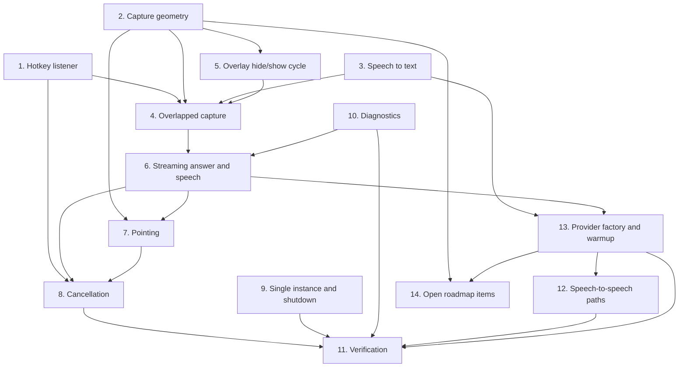

# Implementation Plan

## Overview

The pipeline was built bottom-up: the pure maths first (hotkey parsing, capture geometry, coordinate
transforms), then the I/O layers behind their ABCs, then the threading that overlaps them, and only
then the optimisations that depend on all of it. Cancellation came last on purpose — it has to know
every point at which a turn can produce a side effect.

Status reconstructed from `IMPROVEMENTS.md`. Tier 0 closed 2026-08-09 (477 → 558 tests); the capture
and cancellation work closed with Tier 2 on 2026-08-12 (988 tests). Original task IDs are preserved so
each item can be grepped against that document.

## Task Dependency Graph



Task 5 sits between 2 and 4 because the guarded-capture helper has to exist before the press and
release workers can both call it. Task 10 precedes 6 because the streaming loop logs through it.

Tasks 12 and 13 are numbered after 11 because they were **specified after they shipped**, not built
after. They belong where the graph puts them: the factory needs the speech interfaces from 3 and the
streaming loop from 6, and the speech-to-speech paths need the factory. Task 14 depends on work that
exists but nothing depends on it, because none of it is built.

```json
{
  "waves": [
    {
      "wave": 1,
      "tasks": ["1", "2", "3", "9", "10"],
      "rationale": "Pure functions and self-contained I/O layers. No shared state, so all five can proceed in parallel."
    },
    {
      "wave": 2,
      "tasks": ["5"],
      "rationale": "The guarded-capture choke point needs capture geometry from wave 1 and must exist before any worker calls it."
    },
    {
      "wave": 3,
      "tasks": ["4"],
      "rationale": "Threading and the press/release handover. Needs the hotkey, the capture helper and speech finalisation to all be real."
    },
    {
      "wave": 4,
      "tasks": ["6"],
      "rationale": "The streaming loop and the tag guard sit inside the pipeline worker built in wave 3, and log through task 10."
    },
    {
      "wave": 5,
      "tasks": ["7"],
      "rationale": "Geometry consumes the stream's final result and the coordinate transforms from wave 1."
    },
    {
      "wave": 6,
      "tasks": ["8"],
      "rationale": "Cancellation must come last: it has to know every point at which a turn can produce a side effect."
    },
    {
      "wave": 7,
      "tasks": ["13"],
      "rationale": "The provider factory needs both speech interfaces from wave 1 and the streaming loop from wave 4 before it can be the single place a settings string becomes a class."
    },
    {
      "wave": 8,
      "tasks": ["12"],
      "rationale": "The speech-to-speech paths replace the factory's output with one socket, so the factory has to exist first. Cancellation from wave 6 is also a prerequisite: Escape must mean the same thing in both modes."
    },
    {
      "wave": 9,
      "tasks": ["11"],
      "rationale": "Full suite, selftest, manual smoke test and a latency measurement against a recorded baseline. Runs after every built stage, including 12 and 13."
    },
    {
      "wave": 10,
      "tasks": ["14"],
      "rationale": "Not built. Sequenced last because every item in it is blocked on a measurement that does not exist yet, not on code."
    }
  ]
}
```

## Tasks

- [ ] 1. Global hotkey listener
- [ ] 1.1 Implement the observe-only chord listener with independent key-down flags
  - Track Ctrl, Alt and the trigger separately so all six press orders reach `RECORDING`
  - Set `suppress=False` and document why in the module docstring and at the call site
  - Fire callbacks outside the lock; swallow callback exceptions
  - _Requirements: 1.1, 1.2, 1.3, 1.4, 1.5_
- [ ] 1.2 Write `parse_hotkey` as a pure function with tailored rejection messages
  - Require a modifier plus exactly one trigger from Space/Enter/Tab/A–Z/0–9/F1–F12
  - Reject the three known conflicts by name
  - _Requirements: 1.6, 1.7_
- [ ] 1.3 Add `set_enabled` gating without touching the installed listener
  - _Requirements: 1.8_
- [ ] 1.4 Add secondary shortcuts matched on virtual key code
  - `shortcut_vk` for A–Z/0–9, `control_character_vk` for the `ord(c) + 64` control-character case
  - _Requirements: 1.9_

- [ ] 2. Capture geometry (`T2-8`)
- [ ] 2.1 Implement `pick_resolution` with the native check before the aspect test
  - _Requirements: 8.1, 8.2_
- [ ] 2.2 Add `_aspect_preserving_size` using one uniform factor, capped at 1.0
  - Measured: a 3840×1080 monitor previously picked 1920×1080 and was squashed 2× horizontally,
    giving `scale_x=2.0, scale_y=1.0`; 4/6 targets hit at 50 px max error, versus 6/6 at 15 px after
  - _Requirements: 8.3, 8.4_
- [ ] 2.3 Implement `unscale_model_coords`, clamping before scaling
  - _Requirements: 6.1_
- [ ] 2.4 Sort captures cursor-screen-first and label each with its dimensions
  - _Requirements: 8.5, 8.6_
- [ ] 2.5 Implement `monitor_containing` with half-open rectangles and a primary fallback
  - _Requirements: 8.7_
- [ ] 2.6 Unit-test the maths with no Qt, including every rejection path
  - _Requirements: 8.1, 8.2, 8.3, 8.4, 8.7_

- [ ] 3. Speech to text
- [ ] 3.1 Split the lifecycle: `connect` at startup, `start_recording` per press
  - _Requirements: 4.1_
- [ ] 3.2 Implement the finalisation loop with a 2 s deadline and a 100 ms trailing grace
  - Fix the `else: break` that returned a stale partial after 300 ms of silence
  - Rely on `end_of_turn is True` as the authoritative signal, not `turn_is_formatted`
  - _Requirements: 4.2, 4.3, 4.4_
- [ ] 3.3 Add `set_tts_grace_until` and discard chunks inside the window
  - Compute and report the audio level first, unconditionally, so the waveform does not freeze
  - _Requirements: 4.5, 4.6_
- [ ] 3.4 Store and re-raise stream errors so `stop_recording` cannot hang
  - _Requirements: 4.7_
- [ ] 3.5 Add the local `faster-whisper` provider behind the same interface
  - _Requirements: 4.1 (regression gate: the fully-local path)_
- [ ] 3.6 Abandon a turn with an empty transcript and return to idle
  - _Requirements: 4.8_

- [ ] 4. Overlapped capture (`T0-7`)
- [ ] 4.1 Start the press-time capture and memory recall on a background thread
  - _Requirements: 2.1_
- [ ] 4.2 Set the TTS grace window before the chime, with the reason at the call site
  - _Requirements: 2.2_
- [ ] 4.3 Snapshot the release cursor synchronously in the release handler
  - _Requirements: 2.3_
- [ ] 4.4 Start the capture worker before the pipeline worker; hand over via `Queue(maxsize=1)`
  - _Requirements: 2.4_
- [ ] 4.5 Implement the reuse-versus-recapture decision at a 150 px threshold
  - Raised from 50 px after session logs showed 100–150 px target hovers re-capturing unnecessarily;
    150 px is about 3 cm on a 200% DPI laptop panel
  - _Requirements: 2.5_
- [ ] 4.6 Add the 5 s queue timeout with a press-time fallback and an abort path
  - _Requirements: 2.6_
- [ ] 4.7 Guard the press-time fields with a lock and publish them as one atomic write
  - `_read_press_state` / `_write_press_state`; reachable when the 0.5 s join times out
  - _Requirements: 2.7_

- [ ] 5. The overlay is never in its own screenshot
- [ ] 5.1 Collapse three capture call sites into one guarded helper
  - _Requirements: 3.1, 3.4_
- [ ] 5.2 Restore the overlay in a `finally` block
  - _Requirements: 3.2_
- [ ] 5.3 Replace the fixed 50 ms sleep with `DwmFlush()`, keeping the sleep as a fallback
  - Measured over 7 cycles: 174.9 ms median → 119.8 ms, a 55 ms saving per interaction
  - Safety proved by pixel count, not assumed: 413 px of Nimbus orange with the overlay visible,
    332 px with either wait, identical across five runs
  - _Requirements: 3.3_
- [ ] 5.4 Make the chat panel's hide/show calls unconditional no-ops when exclusion is active
  - _Requirements: 3.5_
- [ ] 5.5 Delete the hide/show cycle entirely (`S-9`)
  - **Attempted and abandoned.** `SetWindowDisplayAffinity` returns 0 on a `WS_EX_LAYERED` window,
    and the overlay must be layered to be translucent. Recorded so nobody tries it again
  - _Requirements: 3.1_

- [ ] 6. Streaming answer and speech
- [ ] 6.1 Flush complete sentences to speech during the stream
  - _Requirements: 5.1_
- [ ] 6.2 Add the bracket tag-safety guard, and skip it for structured providers
  - _Requirements: 5.2, 5.5_
- [ ] 6.3 Compute and flush the tail from the tag-stripped text; strip outside the `try`
  - _Requirements: 5.3, 5.4_
- [ ] 6.4 Build the prefetch/playback pair with a size-1 queue and an epoch guard
  - _Requirements: 5.6_
- [ ] 6.5 Implement the six-pronged `stop()` and prove no audio plays after it returns
  - _Requirements: 5.7_

- [ ] 7. Pointing
- [ ] 7.1 Emit the physical coordinate with its monitor descriptor after hiding the spinner
  - _Requirements: 6.1, 6.2_
- [ ] 7.2 Place no pointer for a conceptual question
  - _Requirements: 6.3_
- [ ] 7.3 Discard any coordinate on a voice-only turn
  - _Requirements: 6.4_
- [ ] 7.4 Implement the Bézier flight, the 3 s dwell and the return to the mouse
  - _Requirements: 6.5_
- [ ] 7.5 Add the native-resolution refinement crop with a keep-the-original failure path
  - _Requirements: 6.6_

- [ ] 8. Cancellation (`T2-2`)
- [ ] 8.1 Route Escape through the hotkey listener, gated on an in-flight check
  - Handled before the state machine, without taking the lock, with all exceptions swallowed
  - _Requirements: 7.1, 7.3_
- [ ] 8.2 Define "in flight" as worker alive OR speech still playing
  - _Requirements: 7.2_
- [ ] 8.3 Reuse the press path's abandon sequence, minus anything that starts a new turn
  - _Requirements: 7.4, 7.5_
- [ ] 8.4 Place all 11 cancel checkpoints, each with a comment naming the race it prevents
  - Two of them exist specifically because the grid locator takes 5–10 s on Ollama and would
    otherwise emit a pointer and a memory record for an abandoned turn
  - _Requirements: 7.6_
- [ ] 8.5 Cancel a live worker at press time, before clearing the overlay
  - _Requirements: 7.7_
- [ ] 8.6 Write `tests/test_cancel.py` covering every checkpoint (26 tests)
  - _Requirements: 7.1–7.7_

- [ ] 9. Single instance and shutdown
- [ ] 9.1 Acquire a named mutex before `QApplication`; signal and exit if it exists
  - _Requirements: 9.1, 9.2_
- [ ] 9.2 Declare explicit ctypes `argtypes` and `restype` for every Win32 call
  - _Requirements: 9.3_
- [ ] 9.3 Add the show-window event and its watcher thread so a second launch raises the window
  - _Requirements: 9.2_
- [ ] 9.4 Route the tray's Quit and the Account page's Quit into one shutdown sequence
  - _Requirements: 9.4_

- [ ] 10. Diagnostics
- [ ] 10.1 Write one folder per turn with a millisecond-stamped log and the screenshots
  - _Requirements: 10.1_
- [ ] 10.2 Log the providers actually used, replacing the hardcoded labels that lied
  - _Requirements: 10.2_
- [ ] 10.3 Log the capture decision, memory size, KB size, coordinate and first audible chunk
  - _Requirements: 10.3_
- [ ] 10.4 Add the no-op session with an identical interface
  - _Requirements: 10.4_
- [ ] 10.5 Prune expired folders on startup, treating a locked file as a skip
  - _Requirements: 10.5_
- [ ] 10.6 Log stripped malformed tags rather than discarding them silently (`T0-3`)
  - _Requirements: 10.6_

- [ ] 11. Tests and verification
- [ ] 11.1 Full suite green with the dotenv neutralisation, zero regressions
- [ ] 11.2 `--selftest` prints `SELFTEST OK`
- [ ] 11.3 Manual smoke test: all five steps, on real hardware
- [ ] 11.4 Latency measured with `tools/bench.py` against a recorded baseline
- [ ] 11.5 Write the tests for this feature - 362 declared functions
  - `tests/test_hotkey.py` (15) - chord parsing, all six press orders, the three rejected conflicts
  - `tests/test_capture.py` (34) - resolution choice, the uniform-scale invariant, coordinate unscaling
  - `tests/test_stt.py` (21) - the finalisation deadline, the trailing grace, the acoustic guard
  - `tests/test_tts.py` (32) - sentence flushing, the epoch guard, the six-pronged stop
  - `tests/test_cancel.py` (26) - one test per cancel checkpoint, each named for the race it prevents
  - `tests/test_locator.py` (25) - the two-stage grid fallback and the native-resolution refinement
  - `tests/test_debug_log.py` (3) - the null session and retention pruning
  - `tests/test_bench.py` (5) - the measurement harness itself, so a latency claim is checkable
  - `tests/test_app.py` (114) - the orchestrator: press/release handover, threading, the guarded capture
  - `tests/test_integration.py` (87) - whole turns end to end with every provider faked
  - Each test written **failing first**, and any changed expectation carries a comment
    saying why, or a real regression gets laundered into a green suite
  - _Requirements: 1.1-10.6_

- [ ] 12. Speech-to-speech paths
- [ ] 12.1 Build `gemini_live.py` outside the `AIClient` hierarchy, with the reason recorded
  - One socket carries audio in and audio out, so there is no intermediate text to sentence-chunk
    and no transcript to hand onward. Forcing the interface would mean inventing one
  - _Requirements: 11.1_
- [ ] 12.2 Expose `connect / start_turn / respond / stop / close` so the orchestrator needs no branching
  - _Requirements: 11.2_
- [ ] 12.3 Add `realtime.py` on the same five-method shape
  - _Requirements: 11.2, 11.3_
- [ ] 12.4 Put both behind default-off settings, switchable without a rebuild
  - _Requirements: 11.3_
- [ ] 12.5 Do not open the streaming recogniser while a socket is active
  - Two microphones fighting: both claim the same input device, neither works, and neither produces
    an error worth reading. Cost most of a day before the cause was found
  - _Requirements: 11.4_
- [ ] 12.6 Route the socket's captures through the existing Privacy Guard choke point
  - _Requirements: 11.5_
- [ ] 12.7 Apply the Vertex backend switch identically, so voice and text cannot split endpoints
  - _Requirements: 11.6_
- [ ] 12.8 Return to idle on a mid-turn socket close, and leave the next turn clean
  - _Requirements: 11.7_
- [ ] 12.9 Route socket playback through the same cancellation path as text-to-speech
  - _Requirements: 11.8_
- [ ] 12.10 Register both modules in the hidden-import list **and** the selftest's runtime list
  - `gemini_live` shipped broken through exactly this gap. A function-local import behind a
    default-off toggle is invisible to the static graph and the selftest at the same time
  - _Requirements: 11.9_

- [ ] 13. Provider factory and warmup
- [ ] 13.1 Resolve both speech implementations from a settings string in one factory
  - _Requirements: 12.1, 12.9_
- [ ] 13.2 Implement streaming cloud recognition and local recognition behind one ABC
  - _Requirements: 12.2_
- [ ] 13.3 Implement two cloud voices and one local voice behind one ABC
  - _Requirements: 12.3_
- [ ] 13.4 Make the fully-local combination a regression gate rather than a fallback
  - Ollama plus faster-whisper plus Kokoro, no key and no network. Invariant 29: a change that only
    works against a cloud provider is not finished
  - _Requirements: 12.4_
- [ ] 13.5 Download the local voice weights on first use into a documented path
  - Roughly 336 MB into `~/.nimbus/kokoro/` — larger than the rest of the installer, so not bundled.
    The path is documented so a user can delete it and reclaim the space
  - _Requirements: 12.5, 12.6_
- [ ] 13.6 Warm each provider on a background thread at startup, swallowing failures
  - _Requirements: 12.7, 12.8_
- [ ] 13.7 Stop excluding `av` and `onnxruntime` from the bundle
  - faster-whisper needs PyAV and Kokoro needs ONNX Runtime. `av` needs special handling because
    `collect_all` misclassifies its `.pyd` as data and its FFmpeg DLLs live in a sibling `av.libs`
  - _Requirements: 12.2, 12.3_

- [ ] 14. Open roadmap items
- [ ] 14.1 Add a 4K-aware capture candidate and measure its token cost (`T4-6`)
  - The candidate list caps at 1920x1200, so a 3840x2160 panel downscales roughly 2x and loses
    small-icon detail. **Blocked on `T1-8` measurement data** — raising the cap costs tokens on every
    turn, so this is a decision to take against numbers, not intuition
  - Must keep Requirement 8 intact: never upscale, closest aspect first, equal scale on both axes
  - _Requirements: 13.1, 13.2, 13.3, 13.4, 13.5_
- [ ] 14.2 Detect the transcript's language and select a matching voice (`T4-2`)
  - **Check the detection library's licence before adding the dependency**, and record it in the
    technology notes
  - Voice identifiers are per-provider, so one detected language maps to three different strings.
    One mapping table per provider, so a missing language reads as a missing entry
  - _Requirements: 14.1, 14.2, 14.3, 14.4, 14.5, 14.6_
- [ ] 14.3 Add an optical fallback for text the model cannot resolve (`T4-4`)
  - **Measure first.** This may be obviated entirely by `T1-3` agentic vision, and building both
    would be paying twice for one capability. Record the measurement next to the decision
  - _Requirements: 15.1, 15.2, 15.3, 15.4, 15.5_

## Notes

**Two items are deliberately not done.** `S-9` (task 5.5) was attempted and is recorded as
unachievable rather than outstanding — capture exclusion fails on a layered window and the overlay
must be layered to be translucent. `T2-3` (local multi-step lesson state) is deferred with its full
specification in `IMPROVEMENTS.md` §5.9.

**Tasks 12 and 13 were specified after they shipped.** Both are `[x]` because the code is in the
product and covered by tests, not because a plan was followed. They were written down because two live
runtime modules and a five-provider factory with no owning requirement is how a lifecycle decision gets
reversed by accident — which is the same reason every other decision here is written down.

**Task 14 is the honest backlog, and none of it is blocked on effort.** Every item is blocked on a
measurement: `14.1` on `T1-8` token-cost data, `14.2` on a licence check, `14.3` on whether agentic
vision already covers it. That is why they are `[ ]` and not `[-]` — no decision has been taken yet,
so nothing has been decided against.

**Where the next work goes.** New pipeline stages belong between tasks 6 and 7, after the stream and
before geometry, and every one of them needs a cancel checkpoint added to task 8.4 in the same change.
Adding a stage without its checkpoint is how a cancelled turn starts producing side effects again.

**The 150 px reuse threshold and the 200 ms grace window are measured values, not guesses.** Changing
either needs a fresh measurement, not an argument. `tools/bench.py record --label before` then
`compare` gives a Mann-Whitney U and a bootstrap CI on the median.
