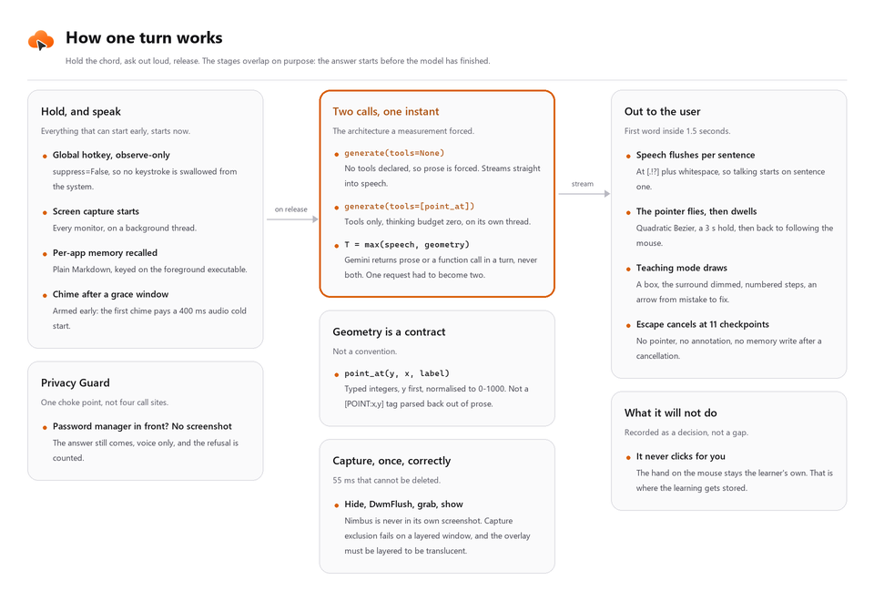
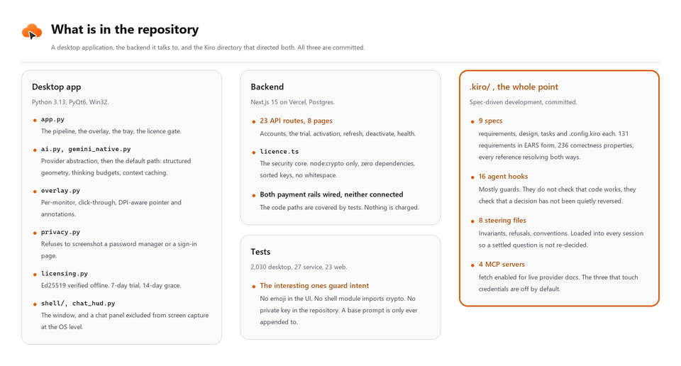
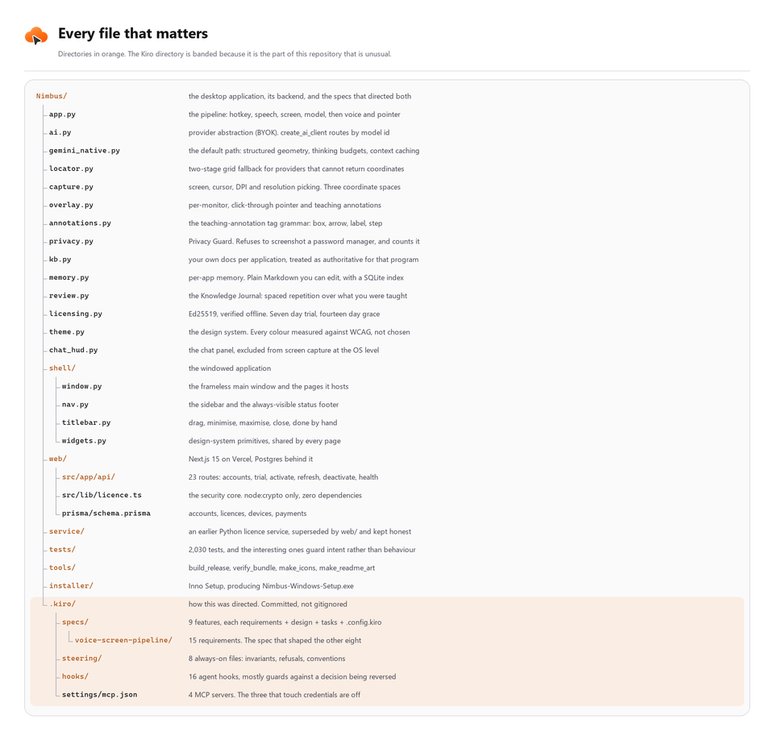

<div align="center">

<picture>
  <source media="(prefers-color-scheme: dark)" srcset="assets/readme/hero-dark.png">
  <source media="(prefers-color-scheme: light)" srcset="assets/readme/hero-light.png">
  
</picture>

<br>

<a href="https://kiro.dev"></a>


<a href="https://x.com/CordAILabs"></a>

**A push-to-talk, screen-aware AI tutor for Windows.**

<a href="https://youtu.be/HX75DiNGJm8"><b>Demo video</b></a>
&nbsp;·&nbsp;
<a href="https://trynimbus.vercel.app"><b>Live site</b></a>
&nbsp;·&nbsp;
<a href="../../releases/latest"><b>Download for Windows</b></a>

[Emad Qureshi](https://github.com/EmadQureshiKhi) &nbsp;·&nbsp; [Arham Khan](https://github.com/ArhamKhan117)

</div>

---

## The thirty second version

You are four menus deep in a piece of software nobody ever wrote a tutorial for. A school portal. A
lab instrument's control panel. An accounting package a small business has run since 2009. Something
is wrong and you cannot look up the fix, because **you do not know what the thing is called.**
Describing it *is* the hard part.

So you hold `Ctrl + Alt + Space` and just say it out loud. *"Why did my export come out blank?"*
Let go.

Inside about a second and a half Nimbus is already talking, and your pointer is already moving. It
looked at the same screen you are looking at, so you never had to describe anything. It tells you what
you are looking at and why the thing you tried did not work, then walks you through the fix, moving
the pointer to each control as it talks about it. When words are the wrong tool it draws instead: a
box around the thing you need, the rest of the screen dimmed, numbered steps for a sequence, an arrow
from the mistake to the fix. It keeps going until the task actually works, and it will tell you when
your whole approach is wrong rather than politely pointing at the next button in a plan that was never
going to succeed.

Then the rest of it. It **remembers per application**, so what you asked in Excel stays with Excel, as
plain Markdown you can open and edit. Drop your own PDFs and notes in a folder named after the `.exe`
and it treats them as **authoritative for that program**, which is the only real answer to in-house
tools with no documentation. Say **"quiz me"** and it starts asking *you* questions against your live
screen, which no flashcard app can do. **Privacy Guard** notices a password manager or a sign-in page
in front and refuses to take the screenshot at all, then shows you a running count of how many times
it has refused. Your licence is **Ed25519-signed and verified offline**, with a fourteen day grace
period, so it does not die on a flight. And the whole stack can run **fully local**, model, speech
recognition and voice, with no API key and nothing leaving the machine.

One thing it will never do is click for you. That is not a missing feature. It is [the point](#what-building-this-way-requires).

---

## Start here

| | |
|---|---|
| **What it is** | A Windows desktop application, plus the website and licence backend that go with it. A personal project, built by two people |
| **Who built it** | [Emad Qureshi](https://github.com/EmadQureshiKhi) and [Arham Khan](https://github.com/ArhamKhan117). See [contributors](#contributors) |
| **Built with Kiro** | Written in Kiro day to day, using spec-driven development. Nine specs, sixteen agent hooks, eight steering files and four MCP servers, all committed in [`.kiro/`](.kiro). Each spec ends in a dependency graph and numbered waves, so Kiro ran [up to five subagents in parallel](#parallel-execution-a-dependency-graph-then-up-to-five-agents-at-once) with every wave reviewed and re-tested by hand before it counted. See [how Kiro was used](#how-kiro-was-used), then [what building this way requires](#what-building-this-way-requires) |
| **See it working** | The [demo video](https://youtu.be/HX75DiNGJm8) is the fastest way in. The site, the application, then real tasks run live, no editing tricks |
| **Try it in ten seconds** | [Run it locally](#run-it-locally). Clone, install, paste a Gemini key, hold the chord |
| **Deployed** | The [live site](https://trynimbus.vercel.app) carries accounts, the trial, licence signing and the download. `/api/health` signs a token and verifies it, so a mismatched key pair fails a health check rather than an activation |
| **Payments** | Stripe and a manual-transfer rail are **integrated but not connected**. The code paths exist and are covered by tests. Nothing is charged and no money has moved through them |
| **Model** | Gemini via `google-genai`, bring your own key. `config.DEFAULT_LLM_PROVIDER = "gemini-native"`. OpenAI, Anthropic and a fully local Ollama stack are selectable, and Vertex AI is a one-setting switch for anyone who needs inference inside their own cloud project |
| **The bet** | That the software people are genuinely stuck in is a native Windows window, not a browser tab. See [why a desktop application](#why-a-desktop-application) |

Nothing in this repository is derived from another codebase. Every line was written for this project.

**On testers.** Through the build we had a small group of people running it on their own machines,
mostly close friends, who reported bugs and asked for features. Several of the fixes recorded in
`IMPROVEMENTS.md` and `SHELL_AND_CHAT.md` came from watching them get stuck rather than from a test
failing.

---

## The problem, and the moment it became obvious

Someone is inside a piece of software, a spreadsheet, a coding environment, a school portal, a lab
tool, and is stuck. Not stuck on the concept. Stuck because **they do not know the word for the thing
they are looking at.**

You cannot search for it. You cannot ask a chatbot, because describing it is the hard part. So a
tutorial video gets opened, scrubbed through, and the moment passes.

Every existing answer to this assumes you can already name the problem. Nimbus removes that
requirement: it looks at the same screen you are looking at, so **you never have to describe
anything.**

From there it does what a person sitting beside you would do. It tells you what you are looking at and
why the thing you tried did not work. It suggests the next step, and the one after that. It draws on
the screen when words are the wrong tool. And it moves your pointer to whatever it is talking about,
so there is never a gap between the explanation and the thing being explained.

Pointing is the part people notice first, and it is the smaller half of it. "Click the publish button,
top right" is advice you still have to act on. A pointer landing on the publish button *while* you are
told what publishing will do to your draft is being taught. The difference matters most on the tasks
that are not one click: exporting with the right settings, fixing a formula that references the wrong
sheet, getting a lab tool to talk to a sensor. Those need a guide through several steps, not a
signpost.

## What it actually does

| | |
|---|---|
| **Guides, does not just point** | Explains what you are looking at, suggests what to do next, and keeps going through a multi-step task, moving your pointer to each thing as it talks about it |
| **Teaching mode** | Draws on screen when words are the wrong tool: a box around the control you need, everything else dimmed, numbered steps for a sequence, an arrow from the mistake to the fix |
| **Knows your software** | Drop notes and PDFs in a folder named after the `.exe` and Nimbus treats them as authoritative for that program. The answer to in-house tools with no documentation |
| **Remembers per application** | What you asked in one program stays with that program, as plain Markdown you can read, edit or delete |
| **Quizzes you back** | Say "quiz me" and it asks you questions against your live screen, which a flashcard app cannot do |
| **Chat panel** | A windowed chat HUD for follow-ups, excluded from screen capture at the OS level so it never appears in its own screenshots |
| **Runs fully offline** | Model, speech recognition and voice can all be local. Nothing leaves the machine, no API key needed |
| **Privacy Guard** | Refuses to screenshot password managers and sign-in pages, answers anyway by voice, and shows you the count |
| **Activation** | Device-bound licences, Ed25519-signed, verified offline with a fourteen day grace. Two devices per licence |
| **Trial** | Seven days, no card, one per machine. Needs an email and a six-digit code to confirm it, and it is bound to the device, so a second address earns nothing |

## How one turn works



Perceived latency target is **1.5 s** from key release to the first audible word, and the pipeline is
built around that number. Speech finalises while the screen is being captured, so the wall clock is
`max(speech, capture)` rather than their sum. The answer streams. Text-to-speech starts on the first
complete sentence rather than the full response.

### Why the native Gemini path is the default

`gemini_native.py` talks to the Gemini API through `google.genai`, and that choice is load-bearing
rather than branding.

- **Coordinates come back as a structured function call.** `point_at(y, x, label)` and `draw_box(...)`
  are declared tools, so the pointer target is a typed value, not a `[POINT:x,y]` tag parsed back out
  of prose. That is the difference between a contract and a convention, and it is why the pointer
  lands.
- **Two calls, one instant.** Gemini returns prose *or* a function call in a single turn, never both.
  We measured that, and it is the reason one request had to become two: an untooled call streams the
  answer into speech while a tooled call with a thinking budget of zero fetches the geometry on its
  own thread.
- **Thinking budgets per question class.** "Where is the export button" gets a budget of zero. "Why is
  this failing" gets the most. Both correctness and cost.
- **Search grounding, Agentic Vision and context caching** for the knowledge-base files, which cuts
  the token cost of resending a user's own notes on every question.

Other providers stay selectable: OpenAI, Anthropic, or a fully local Ollama plus faster-whisper plus
Kokoro stack for users who want nothing to leave the machine. That is what bring-your-own-key means
here, and proxying inference through our own servers is a recorded non-goal rather than a to-do.

## Why a desktop application

The decision most people would have made the other way round.

**Desktop, not web.** A browser extension cannot see the application someone is actually stuck in. The
software that has no tutorial is a native Windows window. A web product is structurally unable to help
with any of it. Choosing the desktop meant Win32, DPI-aware overlays and a PyInstaller build, and it
also meant the entire category of "software nobody wrote a tutorial for" became addressable.

**Windows specifically**, because that is where the desktop is. Windows leads and macOS is a distant
second ([StatCounter, roughly 62% against 15% in June 2026](https://en.wikipedia.org/wiki/Usage_share_of_operating_systems)),
and the long tail of untutorialised line-of-business software is almost entirely Win32. A Mac-first
product cannot reach it.

The cost of that choice is most of the hard engineering in this repository: three coordinate spaces,
per-monitor DPI, click-through overlays, a global hotkey that must not swallow every key on the
system, and a frozen build where a missing lazy import fails on someone else's machine rather than
ours.

## How Kiro was used

Everything in `.kiro/` is in this repository and is the honest record of how the work was directed.
Four mechanisms, each doing a different job.

> **Reviewing one thing?** Open [`.kiro/specs/voice-screen-pipeline/`](.kiro/specs/voice-screen-pipeline).
> It is the oldest spec and the one that shaped the other eight: fifteen requirements in EARS form, a
> design whose correctness properties each name the requirement they validate, and a task list whose
> leaves cite the criteria they satisfy. Read it alongside `IMPROVEMENTS.md`, where the same decisions
> appear under their original task IDs, and the paper trail closes.

### Specs: nine of them, requirements to design to tasks

`.kiro/specs/` holds nine feature specs, one per subsystem: `voice-screen-pipeline`,
`gemini-native-backend`, `teaching-annotations`, `privacy-guard`, `knowledge-and-memory`,
`application-shell`, `chat-hud`, `licensing-and-activation`, `commerce-and-delivery`. Each is three
documents plus a `.config.kiro` recording that it is a `feature` spec on the `requirements-first`
path.

- **`requirements.md`** holds numbered requirements, each with a user story and acceptance criteria in
  EARS form (`WHEN ... THEN THE ... SHALL`, `IF ... THEN`, `WHERE ...`). 131 requirements across the
  nine specs.
- **`design.md`** holds architecture, component contracts and data models, then a **Correctness
  Properties** section: 236 numbered properties, each stating what must hold for *any* input and each
  carrying a `**Validates: Requirements N.M**` back-reference.
- **`tasks.md`** holds a Mermaid dependency graph, an execution-waves JSON block, and hierarchical
  checkboxes where every leaf cites the criteria it satisfies with `_Requirements: N.M_`. The graph and
  the waves are what let Kiro run several tasks at once; see the next section.

Every reference in every direction resolves, and we check that with a script rather than by eye. The
status marks are load-bearing and there are three of them: `[x]` done, `[-]` **decided against with
the reason recorded**, and `[ ]` genuinely open. Twenty-four leaves are `[ ]` and each says what
blocks it, which is usually a measurement rather than effort.

The specs were written up from the engineering logs (`IMPROVEMENTS.md`, `SHELL_AND_CHAT.md`) as the
work went, and each carries a **Provenance** note saying so. The original task IDs, `T0-3`, `S-9`,
`T4-7b`, are preserved in both places so any decision can be grepped from spec to log and back.

### Parallel execution: a dependency graph, then up to five agents at once

A task list is not a queue. Most of the work in a subsystem does not depend on the rest of it, and the
part that does depends on it strictly. So every `tasks.md` ends with two things a machine can act on:

- **A Mermaid dependency graph.** All nine specs have one. `T2[2. Capture geometry] --> T4[4.
  Overlapped capture]` is an edge that says the coordinate maths has to be real before the thread
  handover can be written.
- **An execution-waves block, as JSON.** 65 waves across the nine specs. Each names the tasks that can
  run together and carries a `rationale` explaining why they are independent. Wave 1 of the pipeline is
  five tasks with the note *"Pure functions and self-contained I/O layers. No shared state, so all five
  can proceed in parallel."* Wave 2 is a single task, because the guarded-capture choke point needs
  wave 1's geometry and must exist before any worker calls it.

Kiro reads that and dispatches a **wave at a time, up to five subagents concurrently**, each owning one
task. A subagent implements its task, writes the tests for it, runs them, and reports back; the wave
does not close until every agent in it is green. The widest wave in this repository is five tasks, which
is the concurrency ceiling we ran at. The graph is what makes that safe: two agents never touch the same
contract, because if they would, there is an edge between their tasks and they land in different waves.

That is the leverage. It is also where the honesty has to come in.

**The agents did not finish anything on their own.** Every wave came back to us before it counted, and
the pattern was consistent: the code an agent produced usually worked, and the thing it had quietly
decided was often wrong. We read every diff. We ran the suites ourselves rather than trusting a report
that they passed. We ran the built app on our own machines and handed it to testers on theirs, which is
the only way some of these bugs were ever going to surface.

A representative sample of what human review caught, all of it recorded in `IMPROVEMENTS.md` and
`SHELL_AND_CHAT.md`:

- **A licence gate that never ran.** The code was correct and the import was at module scope, so the
  gate was constructed before the thing it gated. No test failed. It took reading it.
- **The pointer landing two buttons off**, but only on a tester's monitor layout. Correct maths, wrong
  assumption about which coordinate space the window manager reports.
- **A fix that changed nothing observable**, because a stale value in a local env file overrode the
  corrected fallback. The diff was right and the behaviour did not move. Only running it showed that.
- **A translucent fill that punched a hole through an opaque panel**, because the drawing API replaces
  rather than composites for shapes. It looked plausible in code and was visibly wrong in the output.
- **Four "failures" that were not failures**, where our own verification scripts flagged English idiom,
  a provider's free-tier quota and test fixture data as pricing claims. Reading the flagged lines
  mattered more than the count of them.

So the split is: Kiro planned the waves and wrote most of the code, and we decided what to build, what
to refuse, which measurement to trust, and which of its confident reports were actually true. The
drift-guard tests in the suite exist because of that last one. They are the part of the review we could
automate after learning what to look for.

**One thing we did not use, and it is worth naming.** [Kiro Crew](https://kiro.dev/docs/crew/) was open
sourced under Apache 2.0 partway through this build, and it is the piece that would run waves
unattended: a persistent workspace on your own hardware that keeps agent memory and task state across
sessions, driven by a schedule or a webhook rather than by someone sitting in the IDE. Every wave in
this repository was dispatched from an interactive session with one of us watching it, so there is no
Crew configuration here and we are not claiming otherwise. The waves are already shaped for it, which
makes it the obvious next step rather than a rewrite, and it is on the [roadmap](#roadmap) as exactly
that.

### Steering: eight always-on context files

`.kiro/steering/` is what stops the agent re-deciding a settled question in a fresh session.

| File | What it holds |
|---|---|
| `product.md` | What Nimbus is, who it is for, and a **Refusals** table of things not to implement |
| `invariants.md` | 30 numbered invariants every change is measured against |
| `tech.md` | The stack, and the settings-resolution chain with its consequences |
| `structure.md` | Every module and what it owns, including the two modules that are deliberately not `AIClient`s |
| `testing.md` | Suite conventions: `mocker` at the use site, imports inside the test body, why `conftest.py` stays minimal |
| `frozen-build.md` | The PyInstaller traps, including the lazy-import gap two modules already shipped through |
| `backward-compatibility.md` | What may not change shape |
| `voice-ux.md` | Write for the ear: no lists, no markdown, nothing destined for speech that reads badly aloud |

### Hooks: sixteen, and most of them are guards

`.kiro/hooks/` automates the checks we would otherwise have to remember. Fifteen use `askAgent` and
one runs a command.

| Hook | Trigger | Job |
|---|---|---|
| `coordinate-space-guard` | `fileEdited` | Three coordinate spaces. A silent transposition offsets every pointer forever |
| `crypto-boundary-guard` | `fileEdited` | No shell module may import cryptography |
| `no-emoji-in-the-ui` | `fileEdited` | One emoji glyph changes a label's line height and ignores the theme |
| `privacy-and-capture-guard` | `preToolUse` | Every capture goes through one choke point, so a new call site inherits the guard |
| `secret-write-guard` | `preToolUse` | Intercepts a write that would put a credential in the repository |
| `licence-gate-guard` | `fileEdited` | The gate keeps its imports local, which is the fix for the bug that made it never run |
| `lazy-import-double-registration` | `fileEdited` | A function-local import must be in the bundler list **and** the selftest list |
| `speech-boundary-guard` | `fileEdited` | The fully local path keeps working, and nothing destined for speech grows markdown |
| `restart-label-coverage` | `fileEdited` | A setting that needs a restart must say so |
| `full-suite-on-python-edit` | `fileEdited` | Run the suite with the dotenv neutralisation |
| `web-typecheck` | `fileEdited` | `runCommand`: `next build` does not typecheck, so `tsc --noEmit` is the real gate |
| `test-count-never-drops` | `agentStop` | A test count that fell is a deleted test |
| `spec-status-sync` | `postTaskExecution` | Keep a spec's checkboxes and the engineering log in agreement |
| `markdown-encoding-check` | `fileEdited` | CRLF and UTF-8. A PowerShell rewrite once destroyed every em dash in this file |
| `no-push-without-permission` | `preToolUse` | Nothing reaches a remote without us saying so |
| `manual-smoke-checklist` | `userTriggered` | The checks no automated test covers, on real hardware |

The pattern worth noticing: almost none of these check that code *works*. They check that a
**decision** has not been quietly reversed, which is the failure mode of building this way.

### MCP servers: four configured

`.kiro/settings/mcp.json` declares four, one enabled by default.

| Server | State | Why |
|---|---|---|
| `fetch` (`mcp-server-fetch`) | **enabled** | Reading live provider documentation. Model IDs and SDK surfaces rotate, and coding one from memory is how a build fails at connect |
| `postgres` | disabled | Inspecting the licence schema against `DIRECT_DATABASE_URL` when a migration is in question |
| `stripe` | disabled | Checking product, price and webhook configuration against the account |
| `github` | disabled | Reading commits and searching code across this repository |

The three that touch credentials are disabled by default and read their secrets from the environment
rather than from the file, so the config is safe to commit.

## What building this way requires

**The whole thing was written in Kiro, by two people, in about two weeks.** A Windows desktop app with
a click-through per-monitor overlay, a Postgres-backed licence service, a Next.js site with both
payment rails wired up, and 2,030 tests. That is a team-of-five shape of project, and the honest
reason a pair could carry it is that we were directing an agent rather than typing all of it.

But "an agent wrote it" is the least interesting half. The interesting half is what you have to build
to make that safe, because an agent's dangerous failure is not a bug.

**An agent's worst failure is quietly reversing a decision and reporting success.** A bug announces
itself. A reversed decision does not. Somewhere around the second week it became clear that the tests
worth having were not the ones checking behaviour, they were the ones checking *intent*. So the suite
asserts things like: no emoji ever reaches the interface. No shell module imports cryptography. No
private key exists anywhere in the repository. A base prompt is only ever appended to, never replaced.
Every setting that needs a restart is labelled as such. Those are not unit tests. They are a fence
around judgement calls, and they have caught real regressions.

**The corollary: measure, do not ask.** An agent will tell you a change worked. The number of times
that was true and the number of times it was merely plausible are not the same number. Every figure in
this repository came from running the thing and writing down what happened, which is how the two-call
architecture was found, how the thinking budgets were set, and how a 55 ms capture cycle we were
certain could be deleted turned out to be impossible to delete.

**What that leaves a human doing:** deciding what to build and what to refuse, watching testers use it
and working out what actually went wrong, and verifying every measurement. The refusals matter most.
**Nimbus will never click for you.** That is not a limitation we ran out of time to fix. An agent that
clicks demos better and teaches nothing, because it makes people dependent on the assistant instead of
competent with the tool. The hand on the mouse has to be the learner's own, since that is where the
learning gets stored. No agent was ever going to argue for a restraint that makes a demo less
impressive.

**In the product itself, every interaction is a model decision with no rules engine underneath.** The
model decides what the user is looking at, what they meant by an ambiguous question, which single
pixel to point at, whether the answer needs a diagram, and in teaching mode what to draw and in what
order. There is no template layer. If the model is wrong, the pointer is wrong, and there is nowhere
to hide behind a heuristic.

**Where the testers came in.** Most of the interesting bugs in `IMPROVEMENTS.md` and
`SHELL_AND_CHAT.md` were not found by the suite. They were found by handing a build to a friend and
watching: the pointer landing two buttons off on their monitor layout, the chord pressing the power
switch on a freshly opened window, the chat panel turning black after being reopened, the licence gate
that silently never ran. A test suite tells you a decision was reversed. Someone else's machine tells
you the decision was wrong.

## What is in the repository



Three things live here and all three are committed: a Windows desktop application, the backend it
talks to, and the directory that directed both. The desktop app is the product. `web/` is a second
application rather than a landing page, with 23 API routes and the licence signing core in it. And
`.kiro/` is the part a reviewer is here for.

One entry below looks like clutter and is deliberate. `service/` is an earlier Python licence service
that `web/` superseded, and it is still here with its 27 tests passing, because deleting the thing you
replaced also deletes the evidence that you replaced it.

What is **not** in the tree is the licence signing key, and that is enforced rather than promised.
`test_the_repository_contains_no_private_key` walks every `.py` file in the repository, checks for PEM
armour, then parses each one and looks for a long string literal handed to a private-key loader or
bound to a private-key name. It has to work that way round because the service legitimately calls
`Ed25519PrivateKey.from_private_bytes` on a value read from the environment, so the presence of the
API proves nothing. What must never appear is a literal.

### Every file that matters



### Engineering notes a reviewer might care about

- **2,030 desktop tests, 27 backend tests and 23 web tests**, all passing. Not coverage theatre: the
  suite is full of drift guards that fail when a *decision* is quietly reversed. No emoji in the UI.
  No shell module importing crypto. No private key anywhere in the repository. Every
  restart-requiring setting labelled as such.
- **The overlay is never in its own screenshot.** It hides, waits for the compositor via `DwmFlush()`,
  grabs, and shows. We tried to delete that cycle for the latency and it cannot be done, because
  capture exclusion fails on a layered window and the overlay must be layered to be translucent.
  Measured, then written down in `SHELL_AND_CHAT.md` section 9 so nobody tries it again, and the
  55 ms was reclaimed a different way.
- **Privacy is enforced, not promised.** With a password manager or sign-in page in front, Nimbus
  answers without taking a screenshot, and the app shows you a running count of how many times it has
  done that. A count is an observation. A promise is not.
- **Licences are Ed25519-signed and verified offline**, with a fourteen day offline grace, because a
  tool that stops working on a flight is worse than one that gets pirated. The private key is not in
  this repository, and a test enforces that.
- **The frozen build is verified, not assumed.** `tools/verify_bundle.py` reads the shipped binary's
  own code objects to answer "is this string really inside `Nimbus.exe`", because a byte search over a
  PyInstaller bundle proves nothing: the modules are compressed. That tool exists because a full round
  of manual testing was once spent on a stale executable.

Design and reasoning are documented in [`IMPROVEMENTS.md`](IMPROVEMENTS.md), the engineering plan tier
by tier, including the places where an earlier audit was wrong and how it was caught, and
[`SHELL_AND_CHAT.md`](SHELL_AND_CHAT.md), the design system, the shell, the chat panel and the
licensing contract.

## Run it locally

**Requirements:** Windows 10 build 19041 or later, or Windows 11. Python 3.13. A Google AI Studio
(Gemini API) key. The application is bring-your-own-key by design and ships with no key of its own.
Nothing below needs the backend, an account, or a network service other than the model provider.

### 1. The desktop application

```powershell
git clone https://github.com/ArhamKhan117/Nimbus.git
cd Nimbus
python -m venv .venv
.\.venv\Scripts\pip install -r requirements.txt
.\.venv\Scripts\python.exe -m app
```

That is the whole install. It takes about ten seconds once pip has run.

1. **Activate.** On first launch, either start the **seven day trial** (an email and a password, then a
   six-digit code to confirm the address, and no card anywhere) or paste a licence key.

   The trial is bound to the machine rather than to the address, so a second email earns nothing,
   which is the reason it asks for an account at all.

   **Reviewers: use a licence key below instead of the trial.** Pasting a key into the activation
   dialog needs no email round trip, so nothing depends on mail delivery reaching your address.

   ```
   NIMBUS-JVB7-MFQZ-CUW6
   NIMBUS-6EB9-JAUP-BZF5
   NIMBUS-QMGS-HP3T-T65E
   ```

   Three of them, one each, so two reviewers are never contending for the same licence. Each carries
   two device seats and runs to 21 December 2026. If one reports that it is already on two computers,
   take the next.

   These are ordinary keys, not a special case in the code: the same `NIMBUS-XXXX-XXXX-XXXX` alphabet
   from the same CSPRNG, looked up by the same `/activate` endpoint, signed with the same Ed25519 key.
   Nothing about Nimbus behaves differently because of how a licence was issued, and that is enforced
   by there being one code path rather than by intent.

   (`tools/issue_local_licence.py` also exists, but it signs with the **private** key and therefore
   only runs on a machine that already holds it. It is a maintainer tool, not a reviewer path.)

2. **Paste your Gemini API key** into Settings. Nothing else in Settings needs changing to start.
3. **Open any application**, hold `Ctrl + Alt + Space`, ask something about what is on screen, and
   release. The chime tells you it is listening.

**Want it fully offline?** In Settings, switch the provider to Ollama, speech recognition to
faster-whisper and the voice to Kokoro. No API key, and nothing leaves the machine. The first run
downloads models, so it is slower to start and identical afterwards.

**Installing the packaged build instead.** `Nimbus-Windows-Setup.exe` is attached to this repository's
[latest release](../../releases/latest). It is a per-user install, so there is no admin prompt.
`installer/Output/` is gitignored, because a per-build artefact does not belong in version control
beside the source that produced it. `python -m tools.build_release` rebuilds it from source if you
would rather produce your own. The frozen build differs from source only in the ways recorded in
[`.kiro/steering/frozen-build.md`](.kiro/steering/frozen-build.md).

The installer is **unsigned**, so SmartScreen will warn on first run. That is tracked honestly as an
open item (`T4-8`) rather than hidden, and running from source avoids it entirely.

### 2. The backend, if you want the whole system

Only needed to see accounts, the trial, licence signing and the download route. The desktop app runs
without it.

```powershell
cd web
npm install
Copy-Item .env.example .env.local     # then fill in the four values below
npm run keygen                        # prints an Ed25519 key pair for licence signing
npm run db:push                       # create the schema. There is no migrations directory
npm run dev                           # http://localhost:3000
```

The four values that actually matter for a local run:

| Variable | What to put in it |
|---|---|
| `DATABASE_URL` | Any Postgres. A free [Neon](https://neon.tech) project is enough. `DIRECT_DATABASE_URL` is the unpooled variant, needed by `db:push` |
| `AUTH_SECRET` | Any long random string. Signs the session cookie |
| `NIMBUS_LICENCE_PRIVATE_KEY` / `NIMBUS_LICENCE_PUBLIC_KEY` | Both from `npm run keygen`. The private key signs licences and never leaves the server. The public key is what the desktop app verifies against |
| `BREVO_API_KEY` plus `EMAIL_FROM` | Only if you want the confirmation email to send. Leave unset and `/api/health` reports `email: not configured` |

Leave `STRIPE_*` and the EasyPaisa variables unset. The rails are wired up in code and covered by
tests, but they are **not connected**, and unset is what makes the health check say so honestly.

Then check it:

```powershell
curl http://localhost:3000/api/health
```

That route **signs a token and verifies it** rather than just reporting a version, so a mismatched key
pair fails a health check instead of failing an activation two weeks later. Full setup notes, including
the admin queue and the deploy, are in [`web/README.md`](web/README.md).

### 3. Run the test suites

> **The dotenv neutralisation is not optional.** A `.env` sitting in the repository would load real
> provider settings into the test process and change what the suite measures, so `load_dotenv` is
> stubbed out before pytest is imported. CI reaches the same place from the other direction, with
> `NIMBUS_DISABLE_DOTENV=1` in [`tests.yml`](.github/workflows/tests.yml). A run with neither is not a
> run, and it will pass or fail depending on whose machine it is on.

```powershell
# Desktop app: 2,030 tests, about 90 seconds. The dotenv neutralisation is required, because a
# local .env would otherwise leak provider settings into the run and change outcomes.
.\.venv\Scripts\python.exe -c "import dotenv,pytest,sys; dotenv.load_dotenv=lambda *a,**k:False; sys.exit(pytest.main(['-q']))"

# An import-only check: no GUI, no microphone, no network. It walks the runtime module list, so it
# catches a lazy import that a static dependency graph cannot see.
.\.venv\Scripts\python.exe -m app --selftest

# Web: 23 tests on Node's built-in runner. Licence signing, canonical bytes, email provider choice.
cd web; npm test
# `next build` does NOT typecheck, so this is the real gate:
cd web; npm run typecheck

# The superseded Python licence service: 27 tests. Run it from its own directory, because it has a
# package called `app` that would collide with this repository's app.py on one import path.
.\.venv\Scripts\python.exe -m pytest service/tests -q
```

**Expected output:** `2030 passed`, `SELFTEST OK`, `23 pass / 0 fail`, `tsc` exit 0, and `27 passed`.
If a count is lower than that, a test was removed rather than fixed, which is what the
`test-count-never-drops` hook exists to catch. CI runs the pytest and service suites on every push
from [`.github/workflows/tests.yml`](.github/workflows/tests.yml).

To regenerate the diagrams and the hero image in this file:

```powershell
.\.venv\Scripts\python.exe -m tools.make_readme_art          # writes assets/readme/
.\.venv\Scripts\python.exe -m tools.make_readme_art --check   # reports, writes nothing
```

## Roadmap

Roughly in the order we would take it. Everything here is open in a spec, with `[ ]` against it and a
note saying what blocks it, so none of it is a surprise discovered by reading the code.

1. **Live reload for the settings that need a restart.** Thirty settings currently carry a marker
   glyph meaning "next launch". The caching behind that is deliberate, since re-resolving a setting
   writes to the credential store and must not sit on the hot path, so this needs a proper mechanism
   rather than deleting the cache. Tracked as `T4-7b`.
2. **Run the grounding benchmark.** `tools/bench_grounding.py` exists and has never been executed,
   which means Agentic Vision is still shipped off and honestly labelled unmeasured. Skipping the
   measurement was a decision. Leaving it skipped forever would not be.
3. **Execute the Vertex path against a real project.** The code and eleven tests exist, all by
   construction. Nothing has run against live Vertex, and the spec says so.
4. **Multi-step lesson state** (`T2-3`) and **live session export** (`T3-6`), both deferred with full
   specifications rather than abandoned.
5. **Code signing.** The installer is unsigned and SmartScreen warns, which is the single biggest
   friction point for anyone who did not get the build directly from us.
6. **Localisation.** The model already handles more than English. The interface does not.
7. **Run the waves unattended under [Kiro Crew](https://kiro.dev/docs/crew/).** The dependency graphs
   and numbered waves are already the input Crew wants, so this is configuration rather than a
   rewrite. What it would change is the review, not the execution: an unattended wave still has to
   come back to a human before it counts, and working out what that gate looks like when nobody is
   watching the run is the actual task here.

Two things are recorded as **non-goals** rather than backlog, and reversing either needs a deliberate
decision: proxying inference through a server, and letting Nimbus click for you.

## Contributors

Two people, working as a team, across 8 to 23 August 2026.

| | |
|---|---|
| **Emad Qureshi** | [@EmadQureshiKhi](https://github.com/EmadQureshiKhi) |
| **Arham Khan** | [@ArhamKhan117](https://github.com/ArhamKhan117) |
| **Updates** | [@CordAILabs](https://x.com/CordAILabs) on X |

Everything here was written during the competition period, in Kiro, with the direction and the
decisions ours. The refusals in particular, never clicking for the user and never proxying inference,
are choices we argued for and recorded rather than gaps we ran out of time to fill.

## Licence

Source available, all rights reserved. You may read, clone, build, run and evaluate this code. See
[`LICENSE`](LICENSE) for the full terms.

---

<div align="center">
<sub><strong>Nimbus</strong> · Built with <a href="https://kiro.dev">Kiro</a> · by <a href="https://github.com/EmadQureshiKhi">Emad Qureshi</a> and <a href="https://github.com/ArhamKhan117">Arham Khan</a></sub>
</div>
